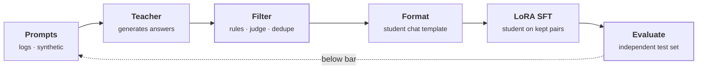
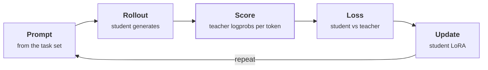

# Distillation

> **Customer framing:** A customer needed a large hosted model's answer quality from a small open-weight model running on their own hardware. Here is the architecture and the tradeoffs.

**Official docs:**
- [Distilling the Knowledge in a Neural Network (Hinton et al., 2015)](https://arxiv.org/abs/1503.02531)
- [Distilling Step-by-Step (Hsieh et al., 2023)](https://arxiv.org/abs/2305.02301)
- [OpenAI model distillation guide](https://platform.openai.com/docs/guides/distillation)
- [Fireworks: distillation cookbook](https://docs.fireworks.ai/fine-tuning/training-api/cookbook/distillation)

---

## What it is

A large **teacher** model's behaviour is transferred to a smaller **student**. The student is fine-tuned to do what the teacher does on one task.

| Why | Gain |
|---|---|
| Cost | A smaller model per request |
| Latency | Fewer parameters to read per token |
| Hosting | Runs on-prem or on smaller GPUs |
| Lock-in | The student's weights are yours |

### A separate axis from LoRA

| Question | Answered by |
|---|---|
| Which weights get trained? | Full fine-tuning, [LoRA](./lora.md), QLoRA |
| Where does the training signal come from? | Human labels, or a teacher model (distillation) |

The two stack. The usual recipe is distillation for the data and LoRA for the training.

## Types

| Type | Student learns from | Needs | Use when |
|---|---|---|---|
| Sequence-level (response) | Teacher's final answers, as ordinary SFT pairs | Only API access to the teacher | Default. The only option with a closed teacher. |
| Logit-level | Teacher's token probabilities | Teacher logprobs and a compatible tokenizer | You can query the teacher's logprobs, and teacher and student share a model family |
| Rationale | Teacher's answers plus its reasoning steps | A teacher that explains its steps | The task needs multi-step reasoning, not just a format |

:::info Best practice
Check the teacher's terms of use before distilling from a hosted model. Some providers restrict training competing models on their outputs.
:::

---

## Sequence-level distillation with LoRA

The common recipe. A stronger teacher answers your prompts, you filter the answers, and you run ordinary LoRA or QLoRA SFT on a small student. **It is SFT with a model as the data source.** The teacher only builds the training set; it is not involved in training.

For Meridian, the teacher is the hosted model that serves cloud tenants. The student is the open-weight model already running on vLLM in the [airgapped tenants](../rag/production.md#airgapped-and-on-prem). The task: given a question and retrieved chunks, write a grounded, cited answer, or say the context doesn't cover it.

*Amber marks the two stages that decide the student's quality: filtering and evaluation. The dashed edge loops back for more or better data.*

| # | Stage | Job | Failure if skipped |
|---|---|---|---|
| 1 | Collect prompts | Inputs that represent the real task: production logs first, synthetic generation to fill gaps | A student that is good at the wrong distribution |
| 2 | Teacher generates | One answer per prompt, from the same RAG context the student will see | Answers that rely on context the student never gets |
| 3 | Filter | Rule checks, an LLM judge, dedupe | Bad teacher outputs become bad student habits |
| 4 | Format | Render each pair with the student's chat template | The student learns a format it never sees at inference |
| 5 | LoRA SFT | Train an adapter on the kept pairs | n/a |
| 6 | Evaluate | Score against a test set independent of the teacher: human labels or programmatic checks | You measure imitation, not correctness |

For Meridian, filtering is mostly code: every citation must point at a chunk that was in the context, and "not covered" answers must have a context that really lacks the answer. The [RAG guardrails](../rag/evaluation.md#faithfulness-and-the-escalation-threshold) double as the filter. Deploy the result as an adapter, with multi-LoRA if there are several tasks.

### Why LoRA fits distillation

| Property of distillation | Why LoRA suits it |
|---|---|
| The task is narrow | A small update is enough |
| Iteration is the norm (filter, retrain, re-evaluate) | Each run is cheap |
| Several tasks get distilled over time | One base model serves every task adapter |

→ See [LoRA](./lora.md#deployment-merge-or-keep-separate)

---

## On-policy logit distillation

Sequence-level distillation trains on the teacher's answers. On-policy distillation trains on the **student's own** answers: the student generates, a frozen teacher from the same model family scores each token, and the student is pushed toward what the teacher would have said.

*Amber is the teacher's only job: scoring tokens the student wrote. The student fixes its own mistakes, not mistakes it would never make.*

| Mode | Teacher returns | Training signal | Behaviour |
|---|---|---|---|
| Sampled reverse KL | The logprob of the one token the student sampled | Teacher logprob minus student logprob, per token | Mode-seeking: commits to the teacher's top answer |
| Top-K forward KL | Its top-K tokens and their probabilities as soft labels (K capped at 5 on Fireworks) | Cross-entropy against that sparse target | Mass-covering: keeps the teacher's spread of plausible tokens |

**Worked example.** At one position the teacher's probabilities are Paris 0.90, Lyon 0.03, "the" 0.02. The student sampled "Paris".

| Mode | What the student learns at this position |
|---|---|
| Sampled reverse KL | Only about "Paris": raise or lower it by the gap to the teacher's 0.90 |
| Top-K forward KL | Move toward all three: Paris 0.90, Lyon 0.03, "the" 0.02 |

| Use | When |
|---|---|
| Sequence-level | Closed teacher, or the first version of anything. Simpler and usually enough. |
| On-policy logit | Same-family teacher with logprob access, and sequence-level has plateaued |

---

## Design choices

| Choice | Options | Decide by |
|---|---|---|
| Student size | Smallest to largest that fits the hardware | The smallest model that clears the quality bar on the held-out set |
| Data volume vs quality | More pairs vs stricter filtering | Filtering usually matters more. Add volume only after the filter is strict. |
| Sequence vs logit | Answers only vs token probabilities | Teacher access: a closed API means sequence-level |
| Merge vs adapter | Merged model vs served adapter | One latency-critical task: merge. Several tasks or tenants: adapter. |

:::info Best practice
Set the quality bar in numbers, against the independent test set, before the first training run. Otherwise every run looks promising.
:::
