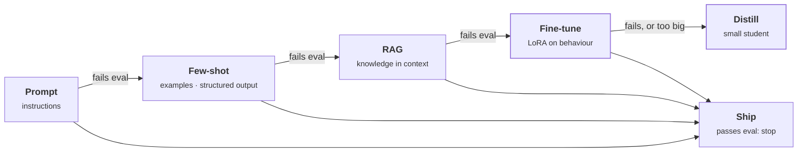

# Fine-Tuning

> **Customer framing:** A customer's assistant answers well on a large hosted model, but three regulated tenants need the same behaviour from a small model on their own GPUs. Here is when fine-tuning is the answer, and which kind.

**Official docs:**
- [Hugging Face PEFT](https://huggingface.co/docs/peft/index)
- [LoRA paper (Hu et al., 2021)](https://arxiv.org/abs/2106.09685)
- [OpenAI model distillation guide](https://platform.openai.com/docs/guides/distillation)

---

## TL;DR

- **Fine-tuning changes behaviour, not knowledge.** Use it for format, tone, tool calling, and narrow tasks. Use RAG for facts.
- **It is the last rung, not the first.** Move up from prompting only when the rung below fails your eval.
- **LoRA is the default method.** Freeze the model and train a small add-on: under 1% of the weights, megabytes per task.
- **Distillation is where the training data comes from.** A big teacher model generates or scores the data; LoRA trains a small student on it. The two stack.

---

## Running example

This section reuses **Meridian Support Assist** from the [RAG track](../rag/index.md#running-example). Cloud tenants get answers from a large hosted model. The three [airgapped tenants](../rag/production.md#airgapped-and-on-prem) run an open-weight model on vLLM, and its answers are worse: citations are missing, the format drifts, and it guesses when the context is thin.

The fix is not more knowledge. RAG already supplies the documents. The fix is behaviour, which is what fine-tuning changes.

| Page | Answers |
|---|---|
| This page | Should we fine-tune at all, what does it cost, and full or parameter-efficient? |
| [LoRA](./lora.md) | How the default method works, its knobs, QLoRA, and how to deploy it |
| [Distillation](./distillation.md) | How to copy the hosted model's behaviour into the on-prem model |

---

## When to fine-tune

Climb the ladder one rung at a time. Move up only when the rung below fails your eval.

*Each rung either passes the eval and ships, or fails it and moves right. Amber marks the rungs this section covers. The eval must exist before the first rung.*

| Fine-tune when | Don't fine-tune when |
|---|---|
| You need consistent format, tone, or structured output | Knowledge changes often: use [RAG](../rag/index.md#do-you-need-rag-at-all) |
| You need reliable tool calling | You have no eval, or no quality data |
| A narrow, high-volume task needs a small model to match a big one | Prompting already works |
| Long prompts or few-shot examples should be baked into the weights | You want to inject facts: fine-tuning does this unreliably |
| Latency, cost, privacy, or on-prem rules out the big model | The task definition is still changing |
| You have quality examples and an eval | |

For Meridian, the left column fits. The on-prem model fails the same way every time, the few-shot prompt that patches it costs 3k tokens per answer, and the hosted model can't run in the airgapped tenants.

:::info Best practice
Write the eval set before the training set. If you can't measure the failure, you can't tell whether fine-tuning fixed it.
:::

---

## Benefits and costs

| Benefits | Costs |
|---|---|
| Higher quality on a narrow task | Data and eval effort, up front and ongoing |
| Lower cost per call: smaller model, shorter prompts | Retraining when the base model changes |
| Lower latency | Possible regression on general ability |
| More consistent outputs | Overfitting to the training set |
| Cheap swappable adapters: one base model, one adapter per task or tenant | Maintenance: a model artifact to version, test, and own |

---

## Full fine-tuning vs PEFT

| | Full fine-tuning | PEFT (parameter-efficient) |
|---|---|---|
| What trains | Every weight | A small add-on; the base stays frozen |
| Quality ceiling | Highest | Close to full on narrow tasks |
| GPU memory | Weights + gradients + optimizer state for the whole model | Frozen weights + a small add-on's training state |
| Artifact per task | A full model copy (gigabytes) | An adapter (megabytes) |
| Forgetting general skills | Real risk | Low: the base is untouched |
| Use when | A large shift in behaviour across many tasks, with the budget for it | Almost everything else |

**Default to PEFT, and LoRA within PEFT.** Full fine-tuning earns its cost only when PEFT has been tried and measurably falls short.

PEFT is both the umbrella term and the name of [Hugging Face's library](https://huggingface.co/docs/peft/index). LoRA is one method among several:

| Method | Trains |
|---|---|
| [LoRA](./lora.md) | A low-rank update beside each frozen weight matrix. The default. |
| [QLoRA](./lora.md#qlora) | LoRA on a base stored in 4-bit |
| DoRA | LoRA on the direction of each weight, plus a separate magnitude. Closer to full fine-tuning at the same rank. |
| IA3 | Scaling vectors on activations. Far fewer parameters than LoRA. |
| Prefix tuning | Learned virtual tokens fed to every layer. No weight changes. |
| Adapters | Small bottleneck layers inserted between blocks. Adds inference latency. |

---

## Pitfalls

- **Fine-tuning when prompting or RAG would do.** A dataset and a training run to fix what one prompt change fixes.
- **Wrong chat template.** Training data formatted differently from inference prompts. The model learns a format it never sees in production.
- **No held-out eval.** Every run looks like progress.
- **Test-set leakage.** Eval prompts, or near-duplicates, in the training set. Scores go up; real quality doesn't.
- **Skipping the data filter.** Bad examples become bad habits. → See [Distillation](./distillation.md#sequence-level-distillation-with-lora)
- **Not checking the teacher's terms of service.** Some providers forbid training competing models on their outputs.

---

## Interview quick answers

**LoRA adds parameters, so why is it cheaper?**

Answer

It cuts what is trained, not what exists. The frozen weights need no gradients and no optimizer state, which is most of the training memory.

**RAG or fine-tuning?**

Answer

RAG for knowledge, fine-tuning for behaviour. Facts in the weights go stale and can't be cited; facts in the context can.

**How is distillation different from LoRA?**

Answer

They sit on different axes. LoRA decides which weights get trained; distillation decides where the training signal comes from. A distilled student is usually trained with LoRA.

