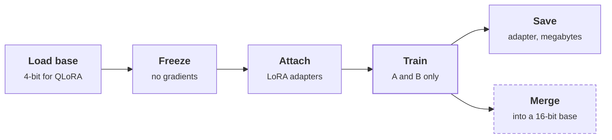

import ThemedImage from '@theme/ThemedImage';
import useBaseUrl from '@docusaurus/useBaseUrl';

# LoRA

> **Customer framing:** A customer needed to adapt one open-weight model to several narrow tasks without a GPU cluster or a full model copy per task. Here is the architecture and the tradeoffs.

**Official docs:**
- [LoRA paper (Hu et al., 2021)](https://arxiv.org/abs/2106.09685)
- [QLoRA paper (Dettmers et al., 2023)](https://arxiv.org/abs/2305.14314)
- [PEFT: LoRA conceptual guide](https://huggingface.co/docs/peft/main/en/conceptual_guides/lora)
- [PEFT: LoRA developer guide](https://huggingface.co/docs/peft/main/en/developer_guides/lora)
- [vLLM: LoRA adapters](https://docs.vllm.ai/en/latest/features/lora.html)

---

## How it works

Freeze the pretrained weight W. Next to it, add two thin matrices: A (r × d) and B (d × r). The layer's output is the frozen path plus a scaled update path.

> **Output:** what the frozen weight produces, plus (alpha / r) × B applied to A applied to the input.

<ThemedImage
  alt="One linear layer with LoRA: the input goes through the frozen weight matrix W and, in parallel, through two small trained matrices A and B of rank 8 and a scale of alpha over r; the two paths are summed to give the output"
  sources={{
    light: useBaseUrl('/img/ai-engineering/fig-lora-1-light.svg'),
    dark: useBaseUrl('/img/ai-engineering/fig-lora-1-dark.svg'),
  }}
/>

*Figure FT2-1: One linear layer with LoRA. Grey is frozen, amber is trained, blue is fixed arithmetic, green is the output. Only the amber path gets gradients.*

> **Worked example:** a 4096 × 4096 matrix holds ~16.8M weights. At r = 8, A and B add 4096 × 8 × 2 ≈ 65k trainable weights, about 0.4%.

**B starts at zero**, so the update is zero on step one and the model begins identical to the base.

### Why it's cheaper

LoRA adds parameters but cuts what is trained. Frozen weights need no gradients and no optimizer state, and those are most of the training memory, so memory drops sharply.

Inference is a different story. LoRA does not make the model faster. Merged into W, it costs exactly what the base costs. Unmerged, it adds a small overhead per request but stays small and swappable.

→ See [Deployment: merge or keep separate](#deployment-merge-or-keep-separate)

---

## Key knobs

| Knob | Controls | Typical | Higher means |
|---|---|---|---|
| Rank (`r`) | Capacity of the update | 8 to 64 | Learns more, costs more memory, risks overfitting |
| Alpha (`lora_alpha`) | How strongly the update applies (scale = alpha / r) | Often 2 × `r` | A larger step away from the base |
| Target modules | Which weight matrices get an adapter | All linear layers | More capacity, more parameters |
| Learning rate | Step size for A and B | 1e-4 to 2e-4 | Faster learning, less stable |
| Dropout | Regularisation on the update path | 0.05 | Less overfitting on small datasets |

| Target modules | Result |
|---|---|
| Attention query and value only | Cheapest. Fine for light style changes; the original paper's setting. |
| All linear layers (attention + MLP) | Usually best; the QLoRA paper's finding. The common default. |
| Norms and biases | Skip. Tiny, and rarely worth an adapter. |

:::info Best practice
Data quality matters more than any hyperparameter. Fix the dataset before tuning `r`.
:::

---

## QLoRA

QLoRA is LoRA with the frozen base stored in 4-bit (NF4). The adapters stay in 16-bit. Two extras keep memory down further: **double quantization** (the quantization constants are themselves quantized) and **paged optimizers** (optimizer state spills to CPU memory during spikes instead of crashing).

| | LoRA | QLoRA |
|---|---|---|
| Base precision | 16-bit | 4-bit (NF4) |
| 7B base weight memory | ~14 GB | ~4 GB |
| Speed per step | Baseline | Roughly 20–30% slower: weights are dequantized on the fly |
| Quality | Baseline | Very close to LoRA |
| Typical GPU for 7B | 24 GB or more | A single 16 GB card |
| Use when | The base fits in 16-bit on your GPUs | It doesn't |

→ See [Quantization](../llm-inference/vllm-serving.md#quantization) for the same memory trade-off at serving time.

### Order of operations

*Amber is the only stage that updates weights. Dashed is optional: merge only when you need a standalone model.*

| Stage | Failure if done wrong |
|---|---|
| Load base | Wrong revision: the adapter only works on the exact base it was trained on |
| Freeze | Base weights drift: you are doing full fine-tuning by accident |
| Attach | Wrong target modules: too little capacity, or wasted memory |
| Train | Overfitting: watch held-out loss, not training loss |
| Save or merge | Merging into 4-bit weights: reload the base in 16-bit and merge into that |

---

## Deployment: merge or keep separate

| | Merge into the base | Keep as a separate adapter |
|---|---|---|
| Latency | Same as the base | Small overhead per request |
| Models in memory | One full model per task | One base shared by many adapters |
| Artifact | Gigabytes per task | Megabytes per adapter |
| Swapping | Redeploy the model | Choose the adapter per request |
| Use when | One task, latency-critical | Several tasks or tenants on one GPU pool |

**Multi-LoRA serving** keeps one base model in GPU memory and applies a different adapter per request. vLLM supports it natively. For Meridian, each task (answer drafting, ticket triage) gets its own adapter, and every on-prem tenant shares one base model.

→ See [Sizing a deployment](../llm-inference/vllm-serving.md#sizing-a-deployment)

---

## Limits

| Limit | What to do |
|---|---|
| Poor at teaching large amounts of new knowledge | Put knowledge in [RAG](../rag/index.md); use LoRA for behaviour |
| Rank and target modules need tuning per task | Start at the typical values; change one knob per run against a fixed eval set |
| An adapter only works on the exact base it was trained on | Version the adapter with its base model; retrain when the base changes |
