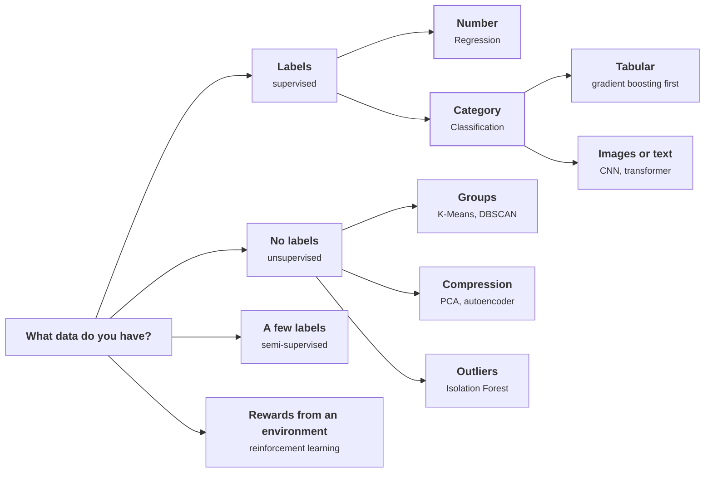

# Model Landscape

> Docs: [scikit-learn user guide](https://scikit-learn.org/stable/user_guide.html) · [Clustering](https://scikit-learn.org/stable/modules/clustering.html) · [Decomposition](https://scikit-learn.org/stable/modules/decomposition.html) · [Outlier detection](https://scikit-learn.org/stable/modules/outlier_detection.html) · [Spinning Up in Deep RL](https://spinningup.openai.com/)

## Overview

This page is the map of model families beyond the two supervised pages: unsupervised methods, deep learning and reinforcement learning. Use it to name the paradigm before picking a model, because the paradigm narrows the choice immediately. The failure people hit is forcing a familiar paradigm onto the wrong data: training a classifier with 40 labelled failures when an anomaly detector needs none.

*Figure M3-1: Choosing a paradigm. Amber marks the two problems this section covers in depth: [Regression](./supervised/regression.md) and [Classification](./supervised/classification.md).*

## Key concepts

### Learning paradigms

| Paradigm | Data you have | Goal |
|---|---|---|
| **Supervised** | Labelled input-output pairs | Predict a label or value for new inputs |
| **Unsupervised** | Unlabelled data only | Find structure, groups or outliers |
| **Semi-supervised** | Mostly unlabelled plus a small labelled set | Use unlabelled data to improve a supervised model (self-training, pseudo-labelling) |
| **Self-supervised** | Unlabelled data with labels made from the data itself | Pre-train representations (foundation models) |
| **Reinforcement** | Rewards from interacting with an environment | Learn a policy that maximises cumulative reward |

Supervised learning has its own section: → See [Supervised Learning](./supervised/index.md).

### Clustering

| Algorithm | Use when |
|---|---|
| **K-Means** | Known number of clusters, roughly spherical, large data |
| **DBSCAN** | Unknown number, arbitrary shapes, noise to ignore |
| **Hierarchical (agglomerative)** | Small data, want a dendrogram, unknown number |
| **Gaussian Mixture** | Soft assignments, elliptical clusters |

### Dimensionality reduction

| Algorithm | Use when | Avoid when |
|---|---|---|
| **PCA** | Linear compression, removing correlated features before a model | Structure is non-linear |
| **t-SNE** | 2-D or 3-D pictures of high-dimensional data | You need distances between clusters to mean something |
| **UMAP** | Same as t-SNE, faster, keeps more global structure | Feeding the output to a model without validation |
| **Autoencoder** | Non-linear compression; anomaly scores from reconstruction error | Small data |

### Anomaly detection

Use anomaly detection when failures are too rare to label, or when you want "unusual" rather than "known failure".

| Algorithm | Use when |
|---|---|
| **Isolation Forest** | Default. Fast, scales, no distribution assumptions |
| **One-Class SVM** | High-dimensional data with a clean "normal" training set |
| **Autoencoder (reconstruction error)** | Images, sequences, raw sensor waveforms |
| **LOF (Local Outlier Factor)** | Density-based, local anomalies |

On the plant data, multivariate detectors catch impossible combinations a univariate rule misses: high load with zero vibration is a dead sensor ([outliers](./ml-lifecycle/data-preprocessing.md#outliers)).

### Ensembles

| Method | Mechanism | Fixes | Examples |
|---|---|---|---|
| **Bagging** | Models in parallel on random subsets; average | Variance | Random Forest |
| **Boosting** | Models in sequence, each on the last one's errors | Bias | XGBoost, LightGBM, CatBoost |
| **Stacking** | A meta-model learns from base models' predictions | Both, at a complexity cost | Competition pipelines |

→ See [bagging vs boosting](./supervised/index.md#ensembles-bagging-vs-boosting).

### Deep learning

Use deep learning when inputs are unstructured (images, text, audio, raw waveforms) or tabular accuracy has plateaued on very large data.

| Architecture | Best for |
|---|---|
| **MLP** | Tabular data with rich features → [MLP classifier](./supervised/classification.md#neural-network-mlp-classifier) |
| **CNN** | Images, spatial data, local patterns in time series |
| **RNN / LSTM / GRU** | Sequences; mostly replaced by transformers |
| **Transformer** | Text, vision, multimodal; state of the art for most tasks |
| **GAN** | Image synthesis, data augmentation |
| **VAE** | Generation with a controllable latent space |
| **Diffusion** | High-quality image and audio generation |

### Reinforcement learning

Use RL when a reward signal exists, the environment can be simulated, and the best policy isn't known up front.

| Algorithm class | Approach | Examples |
|---|---|---|
| **Value-based** | Learn action values; act greedily on them | DQN, Double DQN |
| **Policy-based** | Optimise the policy directly | REINFORCE, PPO |
| **Actor-critic** | Combine value and policy for lower variance | A2C, SAC, TD3 |
| **Model-based** | Learn a world model, plan inside it | AlphaZero, Dreamer |

### Roadmap

Planned deep-dive pages, in priority order: anomaly detection and clustering on plant sensor data, time-series forecasting, neural networks and deep learning, and dimensionality reduction.

## Gotchas

- **Classifying with a handful of labels.** 40 failures can't train a reliable classifier. Try anomaly detection, or semi-supervised learning.
- **Reading t-SNE distances.** Cluster sizes and gaps in a t-SNE plot aren't meaningful. Use it to look, not to measure.
- **K-Means on non-spherical clusters.** It splits elongated groups and merges nearby ones. Use DBSCAN or a Gaussian mixture.
- **Deep learning on small tabular data.** Gradient boosting usually wins. Earn the network with data volume or unstructured inputs.
- **RL without a simulator.** Learning by trial and error on real equipment is expensive and unsafe. Start with supervised or rule-based control.

## Scenario questions

**Q1 ★ You have 10,000 machines' sensor data but only 40 labelled failures. What approach?**

Model answer

- **Clarify:** do we need "will it fail" or "is it behaving unusually"?
- **Observe:** 40 positives are too few for a classifier to learn stable boundaries.
- **Hypothesise:** most machines are normal, so an anomaly detector can learn "normal" without failure labels.
- **Fix:** Isolation Forest on the sensor features; check whether the 40 failures score as anomalous.
- **Prevent:** collect labels as alarms are investigated, then move to supervised. The trade-off is alarms that are unusual but harmless.

**Q2 ★★ When would you choose a neural network over gradient boosting?**

Model answer

- **Clarify:** what's the input type, and how much data?
- **Observe:** on 10,000 tabular rows the MLP scored 0.85 AUC against tuned XGBoost's 0.87.
- **Hypothesise:** boosting dominates small and medium tabular data; networks win on unstructured inputs or very large data.
- **Fix:** boosting for the tabular failure model; a network if inputs become raw vibration waveforms or the fleet grows to hundreds of thousands.
- **Prevent:** benchmark against tuned boosting before committing to a network. The trade-off is giving up end-to-end feature learning.

## Summary

- **Name the paradigm first.** Labels, no labels, few labels or rewards decide the model family.
- **Few labels point to anomaly detection.** Learn "normal" when failures are too rare to learn from.
- **Bagging fixes variance, boosting fixes bias.** Stacking trades complexity for a little of both.
- **Deep learning earns its place with unstructured data or scale.** On small tabular data, boosting wins.
- **RL needs a reward and a simulator.** Without both, it isn't the tool.

---

**Next →** [Predictive Maintenance scenario](./scenarios/predictive-maintenance.md)
