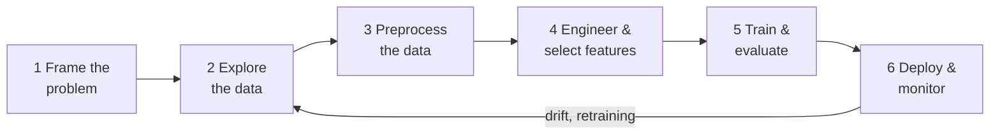

# ML Project Lifecycle

The model is the easy part.

In a real project, model training is one afternoon out of weeks of work. The time goes into framing the problem, wrangling the data, and keeping the thing alive in production. This section walks the full lifecycle on one problem from the factory floor: **predicting machine breakdowns before they happen**. It's the same problem the [Classification](../supervised/classification.md) page uses to compare models, so the model you already know how to pick now gets a before and an after.



| Stage | Page | The one mistake that kills projects at this stage |
|---|---|---|
| Frame the problem | This page, below | Building a model nobody asked a decision of |
| Explore | [Exploratory Data Analysis](./eda.md) | Plots without decisions; a broken label discovered in week three |
| Preprocess | [Data Preprocessing](./data-preprocessing.md) | Leaking the future into training data |
| Features | [Feature Engineering & Selection](./feature-engineering.md) | Adding features instead of deleting them |
| Train & evaluate | [Model Training & Evaluation](./model-training.md) | Validating on data the model couldn't have at prediction time |
| Deploy & monitor | [Inference & Production](./inference-and-production.md) | Shipping the model and walking away |

Where the time actually goes: roughly 80% of a project is stages 1–4 and 6. If your plan allocates most of the schedule to "modelling", the plan is wrong.

---

## Frame the Problem First

> **Remember one thing:** a model predicts; a project changes a decision. If no decision changes, don't build the model.

Before any data work, four questions must have written-down answers. For our running example:

### 1. What decision does the prediction drive?

"Predict failures" is not a goal. The goal is: *every month, give the maintenance planners a ranked list of at-risk machines so they spend their limited inspection hours on the right ones.* That single sentence fixes your metric (precision/recall at a budget-driven threshold, per the [worked threshold example](../supervised/classification.md#evaluation-metrics)), your cadence (monthly batch), and your deliverable (a ranked list, not an API).

### 2. What exactly is the label?

"Failed" sounds obvious and isn't. Our definition:

> A machine has failed if it has an **unplanned breakdown** at any point in the **30 days after the snapshot date**. Planned maintenance stops don't count.

Every word is load-bearing. Count planned stops as failures and the model learns your maintenance schedule. Change "30 days" to "7 days" and you have a different problem, different base rate, different model.

### 3. What is the snapshot date?

The **snapshot date** is the moment you freeze time: every feature must be computable using only data from *before* it, and the label comes from the window *after* it.

```
        observation window          prediction window
  |──────── 90 days ────────|───────── 30 days ─────────|
  sensor history lives here ↑       breakdown or not,
                       snapshot date  decided here
```

This diagram prevents the most expensive bug in applied ML: leakage. Every later page refers back to it. Training data is built by taking many historical snapshot dates, computing features as-of each one, and labelling from the 30 days that followed.

### 4. Is ML even needed?

If "machines with an active temperature alarm or over 5,000 hours since last service" catches most breakdowns, a CMMS query beats a model: explainable, free, ships today. Build the rule-based baseline first. The model must beat it to earn its complexity. Same logic as "start with logistic regression", one level up.

**Business metric ↔ ML metric.** Agree the mapping up front: the plant manager cares about *downtime hours prevented per $1,000 of inspection budget*; the model optimises *PR-AUC*, and the threshold converts one into the other. If you can't write this mapping down, you'll ship a model with a great AUC that nobody uses.

---

## The Running Example, End to End

Same numbers as the [Classification](../supervised/classification.md) page: 10,000 machines across the plant network, ~300 unplanned breakdowns per 30-day window (3%), with features from vibration, temperature, load cycles, service history, and maintenance work orders. Across this section that problem goes from raw sensor tables to a monitored production model:

1. **[EDA](./eda.md)** — the label audit, the failure-rate-by-segment table, and the leak scan that should have caught the 0.99 bug.
2. **[Preprocessing](./data-preprocessing.md)** — missing oil-analysis scores, 24/7-line outliers, and one catastrophic leakage bug that scores AUC 0.99.
3. **[Features](./feature-engineering.md)** — rolling sensor windows relative to the snapshot date, then deleting most of what we built.
4. **[Training](./model-training.md)** — why random k-fold lies on this problem and a time-based split doesn't.
5. **[Production](./inference-and-production.md)** — monthly batch scoring, drift after a rush order doubles shifts, and proving it worked when labels arrive 30 days late.

Where this section ends, [ML Engineering](../../ml-engineering/index.md) begins: serving the model behind an API, background jobs, streaming. This section owns the *decisions*; that one owns the FastAPI code.
