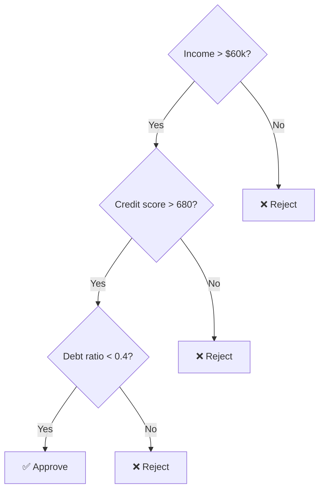
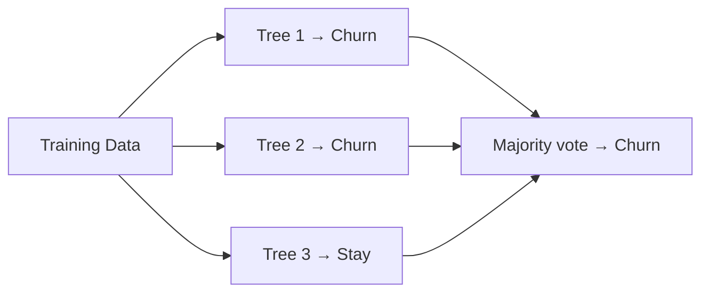
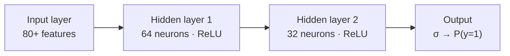

# Classification Models

You're predicting a category. Spam or not. Fraud or legit. Which product a customer will buy. The right model depends on how complex the boundary between your classes actually is.

The mistake most people make is jumping straight to gradient boosting. Start with logistic regression. If it's good enough, you're done.

---

## Cheatsheet

| Model | Reach for it when | Avoid when | Scaling? | Key knobs | #1 failure mode |
|---|---|---|---|---|---|
| **Logistic Regression** | Default first model; need calibrated probabilities | Boundary is clearly non-linear | Yes | `C`, `class_weight` | Trusting the 0.5 threshold |
| **Decision Tree** | Humans must audit the rules | Accuracy is the goal | No | `max_depth` | Unconstrained depth → memorisation |
| **Random Forest** | Strong baseline, mixed features, no tuning budget | Need calibrated probabilities out of the box | No | `n_estimators`, `class_weight` | Trusting biased `feature_importances_` |
| **Gradient Boosting** | Best tabular accuracy | Tiny data, no tuning time | No | `learning_rate`, `max_depth`, `scale_pos_weight` | No early stopping |
| **SVM** | High-dim sparse features (text) | More than ~50k rows | Yes (critical) | `C`, kernel, `gamma` | Unscaled features |
| **KNN** | Small data, "similar → same class" holds | High dimensions, large data, latency matters | Yes | `k` | Irrelevant features poisoning distances |
| **Naive Bayes** | Text, small data, need it *now* | You need calibrated probabilities | No | `alpha` | Trusting the raw probability output |
| **MLP** | Large data, boosting has plateaued | Small data, need interpretability | Yes | layers, `early_stopping` | Unscaled inputs → won't converge |

---

## Running Example: Customer Churn

Every model below is applied to the same problem: **predict which subscribers will churn next month** from tier, usage metrics, support-ticket counts, and payment history. 10,000 customers, 800 churners. An 8% positive class, because real classification problems are imbalanced.

First, the trap. A model that predicts "nobody churns" scores **92% accuracy** and catches zero churners. That single fact drives everything else on this page: the metric is PR-AUC (or recall at a chosen precision), never accuracy.

Illustrative results (typical pattern, not one specific run):

| Model | ROC-AUC | PR-AUC | Notes |
|---|---|---|---|
| Predict "no churn" always | 0.50 | 0.08 | 92% accuracy. Useless. |
| Logistic Regression | 0.79 | 0.31 | 2 minutes of work; coefficients explain *why* people churn |
| Decision Tree (depth 4) | 0.75 | 0.26 | Weakest, but the retention team can read it |
| Random Forest | 0.84 | 0.40 | Big jump: churn drivers interact |
| **XGBoost (tuned)** | **0.87** | **0.46** | Best; needed `scale_pos_weight` and early stopping |
| SVM (RBF) | 0.80 | 0.33 | Slowest to train; not its home turf (that's text) |
| KNN (k=15) | 0.77 | 0.28 | OK, but 50ms per prediction at serving time |
| Naive Bayes | 0.72 | 0.22 | Features aren't independent; wrong tool here (its home is also text) |
| MLP (2 layers) | 0.85 | 0.42 | Close to XGBoost, needed the most babysitting |

Same story as regression: linear gets you most of the way instantly, boosting wins if you tune it. Two models (SVM, Naive Bayes) underperform here because churn isn't their turf. Knowing where each model wins is the whole game.

---

## Evaluation Metrics

Stop reporting accuracy. On imbalanced datasets it's meaningless: see the churn table above.

| Metric | Formula | Reach for it when |
|---|---|---|
| **Precision** | `TP / (TP + FP)` | False positives are expensive (flagging innocent users as fraud) |
| **Recall** | `TP / (TP + FN)` | False negatives are expensive (missing a cancer diagnosis) |
| **F1 Score** | `2 × P × R / (P + R)` | You need a single number that balances both |
| **ROC-AUC** | Area under ROC curve | Comparing models without committing to a threshold |
| **PR-AUC** | Area under Precision-Recall curve | Your positive class is rare: ROC-AUC flatters bad models here |

|  | Predicted Positive | Predicted Negative |
|---|---|---|
| **Actual Positive** | TP ✓ | FN: missed it |
| **Actual Negative** | FP: false alarm | TN ✓ |

**Worked example: the threshold is a business decision.** Take the XGBoost churn model on a 2,000-customer test set containing 160 real churners:

At the default **threshold 0.5** it flags 90 customers:

|  | Predicted churn | Predicted stay |
|---|---|---|
| **Actually churned (160)** | TP = 70 | FN = 90 |
| **Actually stayed (1,840)** | FP = 20 | TN = 1,820 |

Precision = 70/90 ≈ **0.78**, Recall = 70/160 ≈ **0.44**. The model is right when it speaks up, but it misses more than half the churners.

Lower the **threshold to 0.25** and it flags 240 customers:

|  | Predicted churn | Predicted stay |
|---|---|---|
| **Actually churned (160)** | TP = 120 | FN = 40 |
| **Actually stayed (1,840)** | FP = 120 | TN = 1,720 |

Precision = 120/240 = **0.50**, Recall = 120/160 = **0.75**. Now you catch three-quarters of churners, but half your retention offers go to people who were staying anyway.

Which threshold is right? That's not an ML question. If a retention offer costs \$10 and a lost customer costs \$200, the 0.25 threshold wins easily. The model produces scores; *you* pick the operating point.

---

## Linear vs Non-Linear Classifiers

Same decision as regression: start linear, go non-linear only when the data forces you to.

| | Linear Classifiers | Non-Linear Classifiers |
|---|---|---|
| **Examples** | Logistic Regression, Linear SVM, Naive Bayes (approx) | Decision Tree, Random Forest, Gradient Boosting, KNN, MLP |
| **Decision boundary** | Straight hyperplane | Arbitrary shape |
| **Interpretability** | Coefficients directly readable | Black box (trees are a partial exception) |
| **Scaling required** | Yes | No (tree models) |
| **Works well when** | Classes are roughly linearly separable | Complex, non-linear boundaries |
| **Probability output** | Calibrated (Logistic Regression) | Needs calibration wrapper for trees |

**Start linear when:**
- A scatter plot suggests the classes can be separated by a line or plane
- You need to explain the model to a regulator or auditor
- Your dataset is small: linear models generalise better with limited data
- You're building a fast baseline (logistic regression trains in seconds)

**Go non-linear when:**
- Linear model accuracy has plateaued and residuals show systematic errors
- Class boundaries depend on feature interactions (e.g. churn that's only likely given *both* low usage and a recent support ticket)
- You have enough data to support a more complex model without overfitting

---

## Logistic Regression

> **Remember one thing:** a linear model pushed through a sigmoid. The only model here whose probabilities are calibrated out of the box.

Despite the name, this is a classifier. It runs your features through a linear combination, then squashes the output through a sigmoid to get a probability between 0 and 1.

<svg className="ml-diagram" viewBox="0 0 480 260" role="img" aria-label="Logistic regression: sigmoid curve maps linear score to probability with 0.5 threshold">
  <line className="axis-line" x1="50" y1="230" x2="450" y2="230" strokeWidth="1.5" />
  <line className="axis-line" x1="50" y1="20"  x2="50"  y2="230" strokeWidth="1.5" />
  <line className="margin-line" x1="50" y1="125" x2="450" y2="125" strokeWidth="1" strokeDasharray="5,4" opacity="0.7" />
  <text className="axis-label" x="456" y="129" fontSize="11" fontFamily="sans-serif">0.5</text>
  <text className="axis-label" x="38"  y="234" textAnchor="middle" fontSize="11" fontFamily="sans-serif">0</text>
  <text className="axis-label" x="38"  y="25"  textAnchor="middle" fontSize="11" fontFamily="sans-serif">1</text>
  <text className="axis-label" x="250" y="255" textAnchor="middle" fontSize="12" fontFamily="sans-serif">Linear score (w·X + b)</text>
  <text className="axis-label" x="18"  y="125" textAnchor="middle" fontSize="12" fontFamily="sans-serif" transform="rotate(-90,18,125)">P(y = 1)</text>
  <rect className="zone-class0" x="55" y="130" width="390" height="95" opacity="0.12" rx="3" />
  <rect className="zone-class1" x="55" y="25"  width="390" height="98" opacity="0.12" rx="3" />
  <polyline className="fit-line" points="50,229 82,228 115,225 147,219 180,205 212,178 245,125 277,72 310,45 342,31 375,25 407,22 440,21" strokeWidth="2.5" fill="none" strokeLinecap="round" strokeLinejoin="round" />
  <text className="class0-label" x="148" y="192" textAnchor="middle" fontSize="12" fontFamily="sans-serif">Class 0</text>
  <text className="class1-label" x="148" y="75"  textAnchor="middle" fontSize="12" fontFamily="sans-serif">Class 1</text>
  <circle className="highlight-pt" cx="245" cy="125" r="5" />
  <text className="highlight-label" x="255" y="112" fontSize="11" fontFamily="sans-serif">threshold</text>
</svg>

:::tip[Use this when]
The classes are roughly linearly separable and you need to understand what's driving the prediction. The coefficients tell you directly: this feature pushes toward class 1, that one pushes against it. That interpretability is genuinely valuable in production.
:::

:::note[What you need to get it right]
- Scale your features. The L2 regularisation penalises all weights equally, so a feature in thousands will dominate one in single digits.
- The default threshold is 0.5, but it's almost never optimal. Tune it on your validation set based on the precision/recall tradeoff you actually care about.
- Class imbalance? Add `class_weight="balanced"` before doing anything more complex.
:::

```python
from sklearn.linear_model import LogisticRegression
from sklearn.pipeline import make_pipeline
from sklearn.preprocessing import StandardScaler

model = make_pipeline(
    StandardScaler(),
    LogisticRegression(class_weight="balanced", max_iter=1000)
)
model.fit(X_train, y_train)
proba = model.predict_proba(X_test)[:, 1]  # tune YOUR threshold on these
```

**On the churn data:** ROC-AUC 0.79 in two minutes, and the coefficients are the deliverable. Support tickets in the last 30 days is the strongest churn signal, annual billing the strongest retention signal. When the retention team asks "why was this customer flagged?", you have an answer. No other model on this page gives you that plus honest probabilities for free.

---

## Decision Tree Classifier

> **Remember one thing:** the model *is* the documentation. And it should almost never be the final model.

At each node, the tree picks the feature and threshold that best separates your classes (Gini impurity or entropy). It keeps splitting until leaves are pure or you hit a depth limit.



:::tip[Use this when]
You need to hand a printed rule set to a compliance team, a regulator, or a domain expert who needs to verify the logic. A depth-3 tree fits on a whiteboard. No other model gives you that.
:::

:::note[What you need to get it right]
- Constrain `max_depth` to 3–5. An unconstrained tree memorises training data and fails on anything new.
- No feature scaling needed: splits work on rank thresholds.
- Never use a single decision tree as your final model if accuracy matters. Use it to understand your data, then move to Random Forest.
:::

```python
from sklearn.tree import DecisionTreeClassifier, export_text

tree = DecisionTreeClassifier(max_depth=4, class_weight="balanced")
tree.fit(X_train, y_train)
print(export_text(tree, feature_names=list(X_train.columns)))
```

**On the churn data:** weakest scores (AUC 0.75), but the printed rules ("monthly billing AND >2 tickets AND usage down 50% → churn") became the retention team's manual playbook. That rule set delivered more business value than the 0.12 AUC the tuned XGBoost added on top. Sometimes the diagnostic *is* the product.

---

## Random Forest Classifier

> **Remember one thing:** hundreds of overfit trees, majority vote. Bagging kills the variance that kills single trees.

Hundreds of decision trees, each on a different random bootstrap sample with a random subset of features. Final prediction is majority vote.



:::tip[Use this when]
You need a strong baseline fast. Random Forest is robust, handles mixed feature types without much preprocessing, and rarely collapses completely even with mediocre hyperparameters. It's your first non-linear move.
:::

:::note[What you need to get it right]
- Start with 100 trees. Enable `oob_score=True`: each tree is validated on the data it didn't see, so you get a free accuracy estimate.
- The built-in `feature_importances_` attribute is biased toward high-cardinality features. Use permutation importance for honest rankings.
- For imbalanced data, set `class_weight="balanced"` before anything else.
:::

```python
from sklearn.ensemble import RandomForestClassifier

rf = RandomForestClassifier(
    n_estimators=300, class_weight="balanced", oob_score=True, n_jobs=-1
)
rf.fit(X_train, y_train)
print(f"OOB accuracy: {rf.oob_score_:.3f}")
```

**On the churn data:** AUC jumps from 0.79 to 0.84 with no tuning. Evidence that churn drivers interact: a support ticket only predicts churn when usage is also declining. The one catch: its probability outputs cluster around the middle. If you need honest probabilities for the threshold math above, wrap it in `CalibratedClassifierCV`.

---

## Gradient Boosting Classifiers

> **Remember one thing:** each tree trains on the previous ensemble's mistakes. Boosting kills bias, and early stopping is non-negotiable.

Each tree corrects the residual errors of the ensemble so far. Sequential and slow by design, and that's what makes it accurate.

```mermaid
graph TD
    T1["Tree 1: Coarse classification"] --> E1["Misclassified examples"]
    E1 --> T2["Tree 2: Focus on hard cases"]
    T2 --> E2["Remaining errors"]
    E2 --> T3["Tree 3: Refine boundary"]
    T1 & T2 & T3 --> F["Final = weighted vote"]
```



| Library | Reach for it when |
|---|---|
| **XGBoost** | General purpose, strong regularisation, widely supported |
| **LightGBM** | Large datasets (100k+ rows), need speed |
| **CatBoost** | Many categorical features, minimal preprocessing |

:::tip[Use this when]
Accuracy is what matters and your data is tabular. Gradient boosting is the dominant algorithm in production classification: e-commerce, credit scoring, fraud detection. When Random Forest isn't good enough, this is where you go.
:::

:::note[What you need to get it right]
- Use early stopping with a validation set. The model knows when to stop. Don't guess the number of rounds.
- Low `learning_rate` (0.01–0.05) with more rounds beats high LR with fewer every single time.
- For imbalanced classes: `scale_pos_weight = n_negatives / n_positives` (XGBoost) or `is_unbalance=True` (LightGBM).
- Tune order: `max_depth` (3–6) → `learning_rate` + `n_estimators` → sampling params last.
:::

```python
import xgboost as xgb

model = xgb.XGBClassifier(
    n_estimators=2000, learning_rate=0.03, max_depth=4,
    scale_pos_weight=9200 / 800,  # n_negatives / n_positives
    early_stopping_rounds=50, eval_metric="aucpr"
)
model.fit(X_train, y_train, eval_set=[(X_val, y_val)], verbose=False)
```

**On the churn data:** best model (AUC 0.87, PR-AUC 0.46), but only after setting `scale_pos_weight` and letting early stopping pick ~700 rounds. Without `scale_pos_weight`, the first run barely beat Random Forest. That PR-AUC gap over logistic regression means catching ~30 more churners per 2,000 customers at the same precision. That's the number that justifies the tuning time, or doesn't, depending on your business.

---

## Support Vector Machine (SVM)

> **Remember one thing:** only the support vectors, the points at the margin, define the boundary. Everything else could be deleted.

Finds the hyperplane that maximises the margin between classes. The kernel trick lets it draw non-linear boundaries in the original feature space without you defining them.

<svg className="ml-diagram" viewBox="0 0 480 260" role="img" aria-label="SVM: two classes separated by a hyperplane with maximum margin; support vectors are highlighted">
  <line className="axis-line" x1="50" y1="240" x2="450" y2="240" strokeWidth="1.5" />
  <line className="axis-line" x1="50" y1="20"  x2="50"  y2="240" strokeWidth="1.5" />
  <circle className="pt-blue"   cx="85"  cy="65"  r="6" opacity="0.85" />
  <circle className="pt-blue"   cx="110" cy="45"  r="6" opacity="0.85" />
  <circle className="pt-blue"   cx="130" cy="88"  r="6" opacity="0.85" />
  <circle className="pt-blue"   cx="158" cy="55"  r="6" opacity="0.85" />
  <circle className="pt-blue"   cx="95"  cy="110" r="6" opacity="0.85" />
  <circle className="pt-blue"   cx="145" cy="35"  r="6" opacity="0.85" />
  <circle className="pt-blue"   cx="118" cy="130" r="6" opacity="0.85" />
  <circle className="pt-orange" cx="310" cy="168" r="6" opacity="0.85" />
  <circle className="pt-orange" cx="335" cy="195" r="6" opacity="0.85" />
  <circle className="pt-orange" cx="362" cy="172" r="6" opacity="0.85" />
  <circle className="pt-orange" cx="290" cy="192" r="6" opacity="0.85" />
  <circle className="pt-orange" cx="385" cy="185" r="6" opacity="0.85" />
  <circle className="pt-orange" cx="318" cy="215" r="6" opacity="0.85" />
  <circle className="pt-orange" cx="410" cy="195" r="6" opacity="0.85" />
  <circle className="sv-ring-blue"   cx="170" cy="80"  r="10" strokeWidth="2" />
  <circle className="pt-blue"        cx="170" cy="80"  r="6"  opacity="0.85" />
  <circle className="sv-ring"        cx="355" cy="148" r="10" strokeWidth="2" />
  <circle className="pt-orange"      cx="355" cy="148" r="6"  opacity="0.85" />
  <line className="fit-line"    x1="200" y1="20"  x2="280" y2="240" strokeWidth="2.5" />
  <line className="margin-line" x1="170" y1="20"  x2="250" y2="240" strokeWidth="1.2" strokeDasharray="5,4" opacity="0.6" />
  <line className="margin-line" x1="230" y1="20"  x2="310" y2="240" strokeWidth="1.2" strokeDasharray="5,4" opacity="0.6" />
  <text className="axis-label" x="120" y="175" fontSize="11" fontFamily="sans-serif">margin</text>
  <line className="axis-line" x1="168" y1="168" x2="210" y2="155" strokeWidth="1" opacity="0.6" />
  <text className="axis-label" x="340" y="100" fontSize="11" fontFamily="sans-serif">support</text>
  <text className="axis-label" x="340" y="113" fontSize="11" fontFamily="sans-serif">vectors</text>
  <line className="axis-line" x1="338" y1="103" x2="177" y2="82"  strokeWidth="1" strokeDasharray="3,2" opacity="0.5" />
  <line className="axis-line" x1="338" y1="103" x2="352" y2="150" strokeWidth="1" strokeDasharray="3,2" opacity="0.5" />
</svg>

:::tip[Use this when]
Your features are high-dimensional and sparse: TF-IDF text vectors are the canonical case. A linear SVM on text features is fast, effective, and beats fancier models more often than people expect. Also strong on small datasets where margin maximisation is a meaningful inductive bias.
:::

:::note[What you need to get it right]
- Scale with `StandardScaler`. SVM is more sensitive to feature scale than almost any other model.
- For text with large vocabularies, use `LinearSVC`: it's much faster than `SVC(kernel='linear')`.
- Training scales as O(n²) to O(n³). Above 50k samples it becomes impractical.
- Tune `C` first: `[0.01, 0.1, 1, 10, 100]`. For RBF kernel, also tune `gamma`.
:::

```python
# SVM's home turf: sparse text, not tabular churn
from sklearn.feature_extraction.text import TfidfVectorizer
from sklearn.svm import LinearSVC

model = make_pipeline(TfidfVectorizer(), LinearSVC(C=1.0))
model.fit(texts_train, y_train)
```

**On the churn data:** AUC 0.80. Slightly better than logistic regression, worse than every tree ensemble, slowest to train. Expected: dense tabular data with 20 features is not SVM territory. Where it wins is the opposite regime, the free text of those support tickets. TF-IDF them into 30,000 sparse dimensions and a `LinearSVC` classifying complaint topics beats the tree models that choke on sparse input.

---

## K-Nearest Neighbours (KNN)

> **Remember one thing:** there is no model. The training set *is* the model, and all cost is paid at prediction time.

No training. At prediction time: find the k most similar examples in your training set by distance, return the majority class. That's the whole algorithm.

<svg className="ml-diagram" viewBox="0 0 480 260" role="img" aria-label="KNN: query point finds k=3 nearest neighbours and classifies by majority vote">
  <line className="axis-line" x1="50" y1="240" x2="450" y2="240" strokeWidth="1.5" />
  <line className="axis-line" x1="50" y1="20"  x2="50"  y2="240" strokeWidth="1.5" />
  <circle className="pt-blue"   cx="90"  cy="80"  r="6" opacity="0.85" />
  <circle className="pt-blue"   cx="118" cy="58"  r="6" opacity="0.85" />
  <circle className="pt-blue"   cx="142" cy="95"  r="6" opacity="0.85" />
  <circle className="pt-blue"   cx="165" cy="68"  r="6" opacity="0.85" />
  <circle className="pt-blue"   cx="100" cy="130" r="6" opacity="0.85" />
  <circle className="pt-blue"   cx="185" cy="105" r="6" opacity="0.85" />
  <circle className="pt-blue"   cx="200" cy="50"  r="6" opacity="0.85" />
  <circle className="pt-orange" cx="295" cy="160" r="6" opacity="0.85" />
  <circle className="pt-orange" cx="322" cy="185" r="6" opacity="0.85" />
  <circle className="pt-orange" cx="350" cy="165" r="6" opacity="0.85" />
  <circle className="pt-orange" cx="275" cy="200" r="6" opacity="0.85" />
  <circle className="pt-orange" cx="380" cy="178" r="6" opacity="0.85" />
  <circle className="pt-orange" cx="310" cy="140" r="6" opacity="0.85" />
  <circle className="pt-orange" cx="360" cy="210" r="6" opacity="0.85" />
  <circle className="pt-orange" cx="415" cy="190" r="6" opacity="0.85" />
  <circle className="knn-circle" cx="245" cy="132" r="85" strokeWidth="1.5" strokeDasharray="6,4" opacity="0.6" />
  <line className="knn-line-orange" x1="245" y1="132" x2="295" y2="160" strokeWidth="1.5" strokeDasharray="4,3" opacity="0.8" />
  <line className="knn-line-orange" x1="245" y1="132" x2="310" y2="140" strokeWidth="1.5" strokeDasharray="4,3" opacity="0.8" />
  <line className="knn-line-blue"   x1="245" y1="132" x2="185" y2="105" strokeWidth="1.5" strokeDasharray="4,3" opacity="0.8" />
  <polygon className="query-pt" points="245,120 253,138 237,138" />
  <text className="highlight-label" x="258" y="118" fontSize="12" fontFamily="sans-serif" fontWeight="bold">?</text>
  <polygon className="query-pt" points="68,38 74,50 62,50" opacity="0.9" />
  <text className="highlight-label" x="82" y="44" fontSize="11" fontFamily="sans-serif">Query point</text>
  <text className="axis-label"    x="82" y="60" fontSize="11" fontFamily="sans-serif">k=3: 2 orange, 1 blue → orange</text>
</svg>

:::tip[Use this when]
Your dataset is small and "similar input → similar output" is genuinely true in your domain. KNN works well when local structure matters more than global patterns. Recommendation-style problems are a natural fit.
:::

:::note[What you need to get it right]
- Scale your features. Euclidean distance is meaningless when one feature is in thousands and another is in decimals.
- Remove irrelevant features before fitting. Every irrelevant dimension adds noise to every distance calculation.
- Use an odd `k` for binary classification to avoid ties. Tune `k` with cross-validation.
- Prediction is slow: O(n·d) per query. Use `algorithm='auto'` in sklearn for Ball Tree or KD Tree on larger sets.
:::

```python
from sklearn.neighbors import KNeighborsClassifier

model = make_pipeline(StandardScaler(), KNeighborsClassifier(n_neighbors=15))
model.fit(X_train, y_train)  # "training" just stores the data
```

**On the churn data:** AUC 0.77. "Customers similar to past churners churn" holds well enough. Two practical problems: scoring the full base means a distance computation against all 10,000 training rows per customer, and one badly-scaled feature (account age in days vs tickets in single digits) silently dominated every distance until we scaled. KNN's real niche is small datasets where "find me similar cases" is itself the product.

---

## Naive Bayes

> **Remember one thing:** assumes every feature is independent given the class. Almost always false. Works on text anyway.

Apply Bayes' theorem and assume all features are conditionally independent given the class.

| Variant | Distribution assumed | Best for |
|---|---|---|
| **GaussianNB** | Continuous, Gaussian | Sensor readings, numeric features |
| **MultinomialNB** | Count data | Text (word counts, TF-IDF) |
| **BernoulliNB** | Binary features | Text with binary term presence |

:::tip[Use this when]
You need a text classifier trained on a few thousand examples and you need it now. Naive Bayes trains in milliseconds, often punches above its weight on short-text classification, and is trivially explainable.
:::

:::note[What you need to get it right]
- For text: `MultinomialNB` on word counts or TF-IDF. For continuous features: `GaussianNB`.
- Always set `alpha > 0` (Laplace smoothing) to handle words that appear in test but not in training. Default `alpha=1.0` is usually fine.
- Do not trust the raw probability outputs: they are not calibrated. Wrap with `CalibratedClassifierCV` if you need real probabilities.
:::

```python
from sklearn.feature_extraction.text import CountVectorizer
from sklearn.naive_bayes import MultinomialNB

model = make_pipeline(CountVectorizer(), MultinomialNB(alpha=1.0))
model.fit(texts_train, y_train)  # trains in milliseconds
```

**On the churn data:** worst real model in the table (AUC 0.72). Usage, tickets, and billing are strongly correlated, exactly what Naive Bayes assumes away. But feed it the *text* of support tickets to flag cancellation intent and it trains in milliseconds on a few thousand labelled messages, hitting 90%+ before you've finished setting up XGBoost. Naive Bayes isn't a weak model. It's a specialist.

---

## Neural Network (MLP) Classifier

> **Remember one thing:** a universal approximator that boosting still usually beats on tabular data. Earn it, don't start with it.

Stack linear layers with non-linear activations (ReLU) and train with backprop. Each layer learns a progressively more abstract representation.



:::tip[Use this when]
You have a large tabular dataset (50k+ rows) and gradient boosting has plateaued. Or you need a starting point you can extend later: an MLP is the foundation for full deep learning pipelines.
:::

:::note[What you need to get it right]
- Scale all features with `StandardScaler`. Gradient descent converges poorly on unscaled inputs.
- Start simple: one hidden layer of 64–128 neurons, `relu` activation, `adam` solver. Add layers only if that plateaus.
- Set `early_stopping=True`. Without it, you will overfit.
- Switch from sklearn's `MLPClassifier` to PyTorch or TensorFlow when you need GPU training, custom architectures, or a production serving pipeline, not just because you have more layers.
:::

```python
from sklearn.neural_network import MLPClassifier

model = make_pipeline(
    StandardScaler(),  # non-negotiable for neural nets
    MLPClassifier(hidden_layer_sizes=(64, 32), early_stopping=True)
)
model.fit(X_train, y_train)
```

**On the churn data:** AUC 0.85, between Random Forest and XGBoost, and it needed the most babysitting: scaling, learning-rate warnings, two convergence failures before `early_stopping` and a smaller first layer settled it. On 10k rows it can't beat tuned boosting. The calculus flips at scale and with unstructured inputs: 500k customers, or raw ticket text fed through an embedding into the same network.

---

## Handling Class Imbalance

Don't ignore this. Most real classification problems are imbalanced: fraud is rare, churn is rare, disease is rare. A model that ignores imbalance will be confidently wrong on the class that matters.

| Technique | When to use |
|---|---|
| `class_weight="balanced"` | First thing to try: built into most sklearn models |
| SMOTE (oversampling) | Minority class is very small; synthesises new examples |
| Undersampling | Majority class is huge; faster than oversampling |
| Threshold tuning | After training: see the worked example above |
| PR-AUC as your metric | Always, when your positive class is rare |

---

## Model Selection Guide

```
Is the decision boundary probably linear?
├── Yes → Logistic Regression. Start here every time.
└── No → tree-based
    ├── Accuracy matters most? → Gradient Boosting
    ├── Want robustness without tuning? → Random Forest
    ├── Text or high-dim sparse features? → Linear SVM or Naive Bayes
    └── Tiny dataset, local structure matters? → KNN

Need to explain the model to a non-technical person?
└── Decision Tree (shallow) or Logistic Regression

50k+ rows and boosting has plateaued?
└── Try MLP
```

---

## Practical Checklist

- [ ] Scale features for Logistic Regression, SVM, KNN, and MLP. Non-negotiable
- [ ] Check class distribution before training anything
- [ ] Use stratified k-fold so each fold has the same class ratio
- [ ] Tune the decision threshold after training: 0.5 is almost never right
- [ ] Look at the confusion matrix, not just F1 or AUC
- [ ] For text: try Naive Bayes and LinearSVC before reaching for anything heavier

---

## Where the Churn Example Goes Next

Picking the model was one stage. The same 10,000-customer churn problem continues through the [ML Project Lifecycle](../ml-lifecycle/index.md): how the label and snapshot date were [defined](../ml-lifecycle/index.md#frame-the-problem-first), the [leakage bug that scored AUC 0.99](../ml-lifecycle/data-preprocessing.md), why [random k-fold lies on this problem](../ml-lifecycle/model-training.md#choosing-the-validation-split), and what happens [after it ships](../ml-lifecycle/inference-and-production.md).
