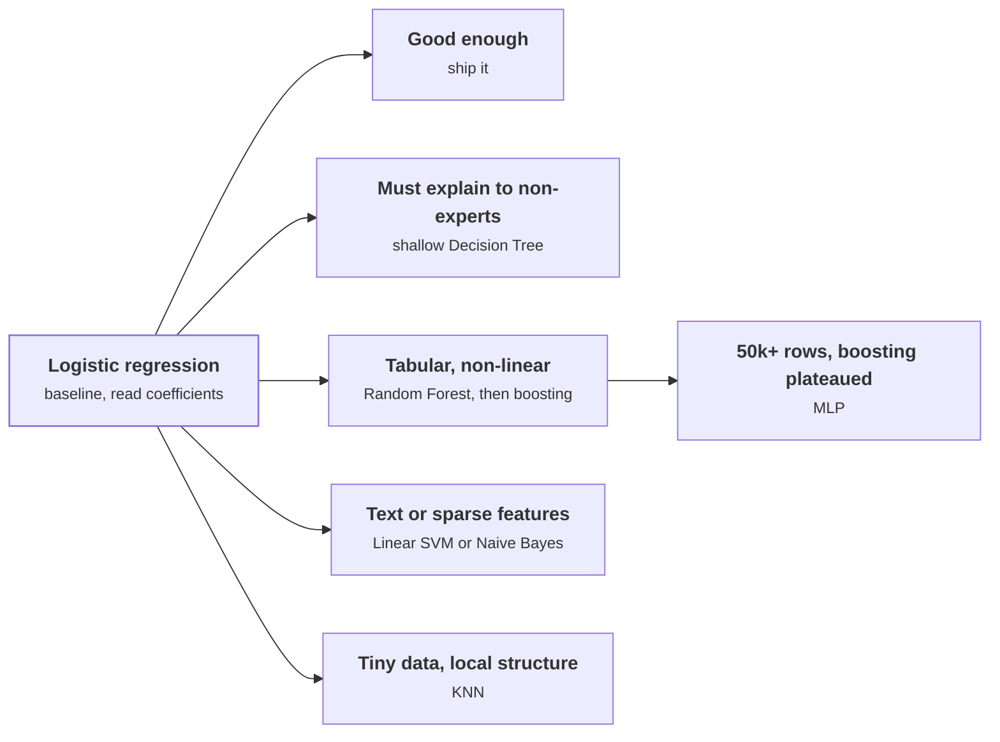
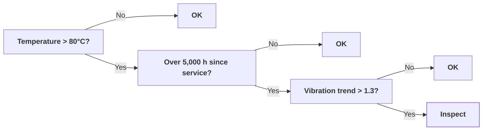

# Classification Models

> Docs: [Linear models](https://scikit-learn.org/stable/modules/linear_model.html#logistic-regression) · [Ensembles](https://scikit-learn.org/stable/modules/ensemble.html) · [SVM](https://scikit-learn.org/stable/modules/svm.html) · [Nearest neighbours](https://scikit-learn.org/stable/modules/neighbors.html) · [Naive Bayes](https://scikit-learn.org/stable/modules/naive_bayes.html) · [Classification metrics](https://scikit-learn.org/stable/modules/model_evaluation.html#classification-metrics) · [Probability calibration](https://scikit-learn.org/stable/modules/calibration.html)

## Overview

Use classification when the target is a category: fails or runs, fraud or legit, which product a customer buys. The right model depends on how complex the boundary between classes is, so start with logistic regression and move on only when it falls short. The failure people hit on real, imbalanced data is reporting accuracy: on the machine-failure problem, predicting "nothing fails" scores 97% accuracy and catches zero breakdowns.

## Key concepts

### Cheatsheet

| Model | Reach for it when | Avoid when | Scaling? | Key knobs | #1 failure mode |
|---|---|---|---|---|---|
| **Logistic Regression** | Default first model; need calibrated probabilities | Boundary is clearly non-linear | Yes | `C`, `class_weight` | Trusting the 0.5 threshold |
| **Decision Tree** | Humans must audit the rules | Accuracy is the goal | No | `max_depth` | Unconstrained depth → memorisation |
| **Random Forest** | Strong baseline, mixed features, no tuning budget | Need calibrated probabilities out of the box | No | `n_estimators`, `class_weight` | Trusting biased `feature_importances_` |
| **Gradient Boosting** | Best tabular accuracy | Tiny data, no tuning time | No | `learning_rate`, `max_depth`, `scale_pos_weight` | No early stopping |
| **SVM** | High-dim sparse features (text) | More than ~50k rows | Yes (critical) | `C`, kernel, `gamma` | Unscaled features |
| **KNN** | Small data, "similar → same class" holds | High dimensions, large data, latency matters | Yes | `k` | Irrelevant features poisoning distances |
| **Naive Bayes** | Text, small data, need it *now* | You need calibrated probabilities | No | `alpha` | Trusting the raw probability output |
| **MLP** | Large data, boosting has plateaued | Small data, need interpretability | Yes | layers, `early_stopping` | Unscaled inputs → won't converge |

### Running example: machine failure

Every model is applied to one problem: **predict which machines will have an unplanned breakdown in the next 30 days** from vibration, temperature, load cycles, service history and work orders. 10,000 machines, ~300 failures per window: a 3% positive class. The metric is [PR-AUC](../start-here/glossary.md#pr-auc), never accuracy. Numbers show the typical pattern, not one specific run.

| Model | ROC-AUC | PR-AUC | Notes |
|---|---|---|---|
| Predict "no failure" always | 0.50 | 0.03 | ❌ 97% accuracy. Useless |
| Logistic Regression | 0.79 | 0.31 | Two minutes; coefficients explain *why* machines fail |
| Decision Tree (depth 4) | 0.75 | 0.26 | Weakest, but the maintenance crew can read it |
| Random Forest | 0.84 | 0.40 | Big jump: failure drivers interact |
| **XGBoost (tuned)** | **0.87** | **0.46** | Best; needed `scale_pos_weight` and early stopping |
| SVM (RBF) | 0.80 | 0.33 | Slowest to train; its home is text |
| KNN (k = 15) | 0.77 | 0.28 | 50 ms per prediction at serving time |
| Naive Bayes | 0.72 | 0.22 | Sensors aren't independent; its home is also text |
| MLP (2 layers) | 0.85 | 0.42 | Close to XGBoost, needed the most babysitting |

Linear gets you most of the way instantly; tuned boosting wins. SVM and Naive Bayes underperform because sensor data isn't their turf.

### Evaluation metrics

| Metric | In plain words | Use when |
|---|---|---|
| **Precision** | Of the machines flagged, the share that really failed | False alarms are expensive |
| **Recall** | Of the machines that failed, the share flagged | Misses are expensive |
| **F1** | One number balancing precision and recall | You must report a single number |
| **ROC-AUC** | How well the model ranks positives above negatives, over all thresholds | Comparing models on balanced data |
| **PR-AUC** | Precision across all recall levels | Rare positive class. ROC-AUC flatters bad models here |

The threshold is a business decision. The tuned XGBoost on a 2,000-machine test set with 60 real breakdowns:

| Threshold | Flagged | Caught (TP) | False alarms (FP) | Missed (FN) | Precision | Recall |
|---|---|---|---|---|---|---|
| 0.50 (default) | 40 | 30 | 10 | 30 | 0.75 | 0.50 |
| 0.25 | 150 | 48 | 102 | 12 | 0.32 | 0.80 |

An inspection costs $500; an unplanned breakdown costs $50,000. Lowering the threshold adds 110 inspections ($55k) and prevents 18 more breakdowns ($900k). The model produces scores; the cost ratio picks the operating point.

### Handling class imbalance

A model that ignores imbalance is confidently wrong on the class that matters.

| Technique | Use when | Result |
|---|---|---|
| `class_weight="balanced"` / `scale_pos_weight` (≈ 32 here) | First thing to try; built into most models | ✅ Cheap, no new data |
| Threshold tuning | Always, after training | ✅ Matches the operating point to the cost ratio |
| PR-AUC as the metric | Always, when positives are rare | ✅ Honest ranking of models |
| SMOTE (synthetic oversampling) | Minority class is tiny | ⚠️ Inside the CV fold only, or it leaks |
| Undersampling the majority | Majority class is huge | ⚠️ Faster training, throws data away |
| Accuracy as the metric | — | ❌ 97% for a model that catches nothing |

### Linear vs non-linear

| | Linear classifiers | Non-linear classifiers |
|---|---|---|
| **Examples** | Logistic Regression, Linear SVM, Naive Bayes (approx.) | Trees, Random Forest, Gradient Boosting, KNN, MLP |
| **Boundary** | Straight hyperplane | Arbitrary shape |
| **Interpretability** | Coefficients readable | Black box (shallow trees excepted) |
| **Scaling required** | Yes | Not for trees |
| **Probabilities** | Calibrated (logistic regression) | Need a calibration wrapper |

Go non-linear when the linear model plateaus and the boundary depends on interactions. Here, rising vibration predicts failure only when temperature is also climbing.

### Choosing a model

```mermaid
flowchart LR
    S["<b>Logistic regression</b><br/><small>baseline, read coefficients</small>"]
    S --> A["<b>Good enough</b><br/><small>ship it</small>"]
    S --> B["<b>Must explain to non-experts</b><br/><small>shallow Decision Tree</small>"]
    S --> C["<b>Tabular, non-linear</b><br/><small>Random Forest, then boosting</small>"]
    S --> D["<b>Text or sparse features</b><br/><small>Linear SVM or Naive Bayes</small>"]
    S --> E["<b>Tiny data, local structure</b><br/><small>KNN</small>"]
    C --> F["<b>50k+ rows, boosting plateaued</b><br/><small>MLP</small>"]

    classDef accent stroke-width:1.5px
    class S accent
```

*Figure M2-1: Classification model selection. Amber is the starting point for every classification problem.*

### Logistic regression

A linear model pushed through a sigmoid. The only model here whose probabilities are calibrated out of the box.

<svg className="ml-diagram" viewBox="0 0 480 260" role="img" aria-label="Logistic regression: sigmoid curve maps linear score to probability with 0.5 threshold">
  <line className="axis-line" x1="50" y1="230" x2="450" y2="230" strokeWidth="1.5" />
  <line className="axis-line" x1="50" y1="20"  x2="50"  y2="230" strokeWidth="1.5" />
  <line className="margin-line" x1="50" y1="125" x2="450" y2="125" strokeWidth="1" strokeDasharray="5,4" opacity="0.7" />
  <text className="axis-label" x="456" y="129" fontSize="11" fontFamily="sans-serif">0.5</text>
  <text className="axis-label" x="38"  y="234" textAnchor="middle" fontSize="11" fontFamily="sans-serif">0</text>
  <text className="axis-label" x="38"  y="25"  textAnchor="middle" fontSize="11" fontFamily="sans-serif">1</text>
  <text className="axis-label" x="250" y="255" textAnchor="middle" fontSize="12" fontFamily="sans-serif">Linear score (w·X + b)</text>
  <text className="axis-label" x="18"  y="125" textAnchor="middle" fontSize="12" fontFamily="sans-serif" transform="rotate(-90,18,125)">P(y = 1)</text>
  <rect className="zone-class0" x="55" y="130" width="390" height="95" opacity="0.12" rx="3" />
  <rect className="zone-class1" x="55" y="25"  width="390" height="98" opacity="0.12" rx="3" />
  <polyline className="fit-line" points="50,229 82,228 115,225 147,219 180,205 212,178 245,125 277,72 310,45 342,31 375,25 407,22 440,21" strokeWidth="2.5" fill="none" strokeLinecap="round" strokeLinejoin="round" />
  <text className="class0-label" x="148" y="192" textAnchor="middle" fontSize="12" fontFamily="sans-serif">Class 0</text>
  <text className="class1-label" x="148" y="75"  textAnchor="middle" fontSize="12" fontFamily="sans-serif">Class 1</text>
  <circle className="highlight-pt" cx="245" cy="125" r="5" />
  <text className="highlight-label" x="255" y="112" fontSize="11" fontFamily="sans-serif">threshold</text>
</svg>

*Figure M2-2: The sigmoid turns a linear score into a probability. Green is the curve, amber marks the default 0.5 threshold, which is almost never the right one.*

| | |
|---|---|
| **Use when** | Always first. Also when you need honest probabilities for threshold maths |
| **Get it right** | Scale features: L2 penalises all weights equally. Add `class_weight="balanced"` before anything more complex. Tune the threshold on validation, using `predict_proba` scores |
| **On the plant data** | ROC-AUC 0.79 in two minutes. Rising vibration trend is the strongest failure signal, a recent service the strongest protective one. That's the answer when a planner asks "why was this machine flagged?" |

### Decision tree classifier

The model is the documentation, and it should almost never be the final model.

```mermaid
flowchart LR
    A["<b>Temperature > 80°C?</b>"] -->|No| C["<b>OK</b>"]
    A -->|Yes| B["<b>Over 5,000 h since service?</b>"]
    B -->|No| E["<b>OK</b>"]
    B -->|Yes| D["<b>Vibration trend > 1.3?</b>"]
    D -->|No| G["<b>OK</b>"]
    D -->|Yes| F["<b>Inspect</b>"]

    classDef accent stroke-width:1.5px
    class F accent
```

*Figure M2-3: The depth-3 tree that became the crew's walk-down checklist. Amber is the leaf that sends a technician.*

| | |
|---|---|
| **Use when** | A compliance team, regulator or domain expert must verify the logic |
| **Get it right** | `max_depth` 3–5. No scaling. Use it to understand the data, then move to an ensemble |
| **On the plant data** | AUC 0.75, the weakest. But the printed rules became the walk-down checklist, worth more to the business than the 0.12 AUC that tuned XGBoost added |

### Random forest classifier

Hundreds of overfit trees and a majority vote. → See [bagging vs boosting](./index.md#ensembles-bagging-vs-boosting).

| | |
|---|---|
| **Use when** | You need a strong non-linear baseline fast |
| **Get it right** | Start at 100–300 trees with `oob_score=True` for a free validation estimate. Set `class_weight="balanced"` first. Built-in `feature_importances_` favour high-cardinality features: use [permutation importance](../ml-lifecycle/feature-engineering.md#selecting-features). Probabilities cluster mid-range: wrap in `CalibratedClassifierCV` for threshold maths |
| **On the plant data** | AUC 0.79 → 0.84 with no tuning: failure drivers interact |

### Gradient boosting classifiers

Each tree trains on the previous ensemble's mistakes. [Early stopping](../start-here/glossary.md#early-stopping) is non-negotiable. → See [bagging vs boosting](./index.md#ensembles-bagging-vs-boosting).

| Library | Reach for it when |
|---|---|
| **XGBoost** | General purpose, strong regularisation |
| **LightGBM** | 100k+ rows, need speed (`is_unbalance=True` for imbalance) |
| **CatBoost** | Many categorical features, minimal preprocessing |

The settings for the failure model live in [hyperparameter search](../ml-lifecycle/model-training.md#hyperparameter-search). On the plant data: AUC 0.87, PR-AUC 0.46, with early stopping picking ~700 rounds. Without `scale_pos_weight` the first run barely beat the forest. The PR-AUC gap over logistic regression is ~18 more breakdowns caught per 2,000 machines at the same precision, about $900k.

### Support vector machine (SVM)

Only the support vectors, the points at the margin, define the boundary. The kernel trick draws non-linear boundaries without you building the features.

<svg className="ml-diagram" viewBox="0 0 480 260" role="img" aria-label="SVM: two classes separated by a hyperplane with maximum margin; support vectors are highlighted">
  <line className="axis-line" x1="50" y1="240" x2="450" y2="240" strokeWidth="1.5" />
  <line className="axis-line" x1="50" y1="20"  x2="50"  y2="240" strokeWidth="1.5" />
  <circle className="pt-blue"   cx="85"  cy="65"  r="6" opacity="0.85" />
  <circle className="pt-blue"   cx="110" cy="45"  r="6" opacity="0.85" />
  <circle className="pt-blue"   cx="130" cy="88"  r="6" opacity="0.85" />
  <circle className="pt-blue"   cx="158" cy="55"  r="6" opacity="0.85" />
  <circle className="pt-blue"   cx="95"  cy="110" r="6" opacity="0.85" />
  <circle className="pt-blue"   cx="145" cy="35"  r="6" opacity="0.85" />
  <circle className="pt-blue"   cx="118" cy="130" r="6" opacity="0.85" />
  <circle className="pt-orange" cx="310" cy="168" r="6" opacity="0.85" />
  <circle className="pt-orange" cx="335" cy="195" r="6" opacity="0.85" />
  <circle className="pt-orange" cx="362" cy="172" r="6" opacity="0.85" />
  <circle className="pt-orange" cx="290" cy="192" r="6" opacity="0.85" />
  <circle className="pt-orange" cx="385" cy="185" r="6" opacity="0.85" />
  <circle className="pt-orange" cx="318" cy="215" r="6" opacity="0.85" />
  <circle className="pt-orange" cx="410" cy="195" r="6" opacity="0.85" />
  <circle className="sv-ring-blue"   cx="170" cy="80"  r="10" strokeWidth="2" />
  <circle className="pt-blue"        cx="170" cy="80"  r="6"  opacity="0.85" />
  <circle className="sv-ring"        cx="355" cy="148" r="10" strokeWidth="2" />
  <circle className="pt-orange"      cx="355" cy="148" r="6"  opacity="0.85" />
  <line className="fit-line"    x1="200" y1="20"  x2="280" y2="240" strokeWidth="2.5" />
  <line className="margin-line" x1="170" y1="20"  x2="250" y2="240" strokeWidth="1.2" strokeDasharray="5,4" opacity="0.6" />
  <line className="margin-line" x1="230" y1="20"  x2="310" y2="240" strokeWidth="1.2" strokeDasharray="5,4" opacity="0.6" />
  <text className="axis-label" x="120" y="175" fontSize="11" fontFamily="sans-serif">margin</text>
  <line className="axis-line" x1="168" y1="168" x2="210" y2="155" strokeWidth="1" opacity="0.6" />
  <text className="axis-label" x="340" y="100" fontSize="11" fontFamily="sans-serif">support</text>
  <text className="axis-label" x="340" y="113" fontSize="11" fontFamily="sans-serif">vectors</text>
  <line className="axis-line" x1="338" y1="103" x2="177" y2="82"  strokeWidth="1" strokeDasharray="3,2" opacity="0.5" />
  <line className="axis-line" x1="338" y1="103" x2="352" y2="150" strokeWidth="1" strokeDasharray="3,2" opacity="0.5" />
</svg>

*Figure M2-4: The maximum-margin boundary. Blue and orange are the two classes, the green line is the boundary, dashed lines are the margin, and circled points are the support vectors.*

| | |
|---|---|
| **Use when** | High-dimensional sparse features. TF-IDF text is the canonical case; `LinearSVC` is fast there |
| **Get it right** | Standardise features. Training cost grows with the square of the rows or worse: impractical above ~50k. Tune `C` over 0.01–100, and `gamma` for RBF |
| **On the plant data** | AUC 0.80, slowest to train. Where it wins: classifying failure modes from technicians' work-order text, 30,000 sparse dimensions where trees choke |

### K-nearest neighbours (KNN)

There is no model. The training set is the model, and all cost is paid at prediction time.

<svg className="ml-diagram" viewBox="0 0 480 260" role="img" aria-label="KNN: query point finds k=3 nearest neighbours and classifies by majority vote">
  <line className="axis-line" x1="50" y1="240" x2="450" y2="240" strokeWidth="1.5" />
  <line className="axis-line" x1="50" y1="20"  x2="50"  y2="240" strokeWidth="1.5" />
  <circle className="pt-blue"   cx="90"  cy="80"  r="6" opacity="0.85" />
  <circle className="pt-blue"   cx="118" cy="58"  r="6" opacity="0.85" />
  <circle className="pt-blue"   cx="142" cy="95"  r="6" opacity="0.85" />
  <circle className="pt-blue"   cx="165" cy="68"  r="6" opacity="0.85" />
  <circle className="pt-blue"   cx="100" cy="130" r="6" opacity="0.85" />
  <circle className="pt-blue"   cx="185" cy="105" r="6" opacity="0.85" />
  <circle className="pt-blue"   cx="200" cy="50"  r="6" opacity="0.85" />
  <circle className="pt-orange" cx="295" cy="160" r="6" opacity="0.85" />
  <circle className="pt-orange" cx="322" cy="185" r="6" opacity="0.85" />
  <circle className="pt-orange" cx="350" cy="165" r="6" opacity="0.85" />
  <circle className="pt-orange" cx="275" cy="200" r="6" opacity="0.85" />
  <circle className="pt-orange" cx="380" cy="178" r="6" opacity="0.85" />
  <circle className="pt-orange" cx="310" cy="140" r="6" opacity="0.85" />
  <circle className="pt-orange" cx="360" cy="210" r="6" opacity="0.85" />
  <circle className="pt-orange" cx="415" cy="190" r="6" opacity="0.85" />
  <circle className="knn-circle" cx="245" cy="132" r="85" strokeWidth="1.5" strokeDasharray="6,4" opacity="0.6" />
  <line className="knn-line-orange" x1="245" y1="132" x2="295" y2="160" strokeWidth="1.5" strokeDasharray="4,3" opacity="0.8" />
  <line className="knn-line-orange" x1="245" y1="132" x2="310" y2="140" strokeWidth="1.5" strokeDasharray="4,3" opacity="0.8" />
  <line className="knn-line-blue"   x1="245" y1="132" x2="185" y2="105" strokeWidth="1.5" strokeDasharray="4,3" opacity="0.8" />
  <polygon className="query-pt" points="245,120 253,138 237,138" />
  <text className="highlight-label" x="258" y="118" fontSize="12" fontFamily="sans-serif" fontWeight="bold">?</text>
  <text className="axis-label"    x="250" y="256" textAnchor="middle" fontSize="11" fontFamily="sans-serif">▲ query · 3 nearest: 2 orange, 1 blue → orange</text>
</svg>

*Figure M2-5: KNN with k = 3. The amber triangle is the machine to classify; the dashed circle holds its three nearest neighbours, and the majority (orange) wins.*

| | |
|---|---|
| **Use when** | Small data where "similar input → same class" is true, or where "find similar cases" is itself the product |
| **Get it right** | Scale features: one unscaled column dominates every distance. Drop irrelevant features. Odd `k` for binary problems, tuned with CV. Prediction compares against every training row |
| **On the plant data** | AUC 0.77. Machine age in days dominated every distance until scaling. Its real niche: pulling comparable historical breakdowns for a technician |

### Naive Bayes

Assumes every feature is independent given the class. Almost always false. Works on text anyway.

| Variant | Assumes | Best for |
|---|---|---|
| **GaussianNB** | Continuous, bell-shaped features | Numeric features |
| **MultinomialNB** | Counts | Word counts, TF-IDF |
| **BernoulliNB** | Binary features | Word presence |

Keep `alpha` above 0 (default 1.0) so unseen words don't zero a probability. Raw probabilities are not calibrated. On the plant data it scores AUC 0.72, the worst real model, because vibration, temperature and load are strongly correlated. On work-order text it trains in milliseconds and flags bearing problems at 90%+.

### Neural network (MLP) classifier

A universal approximator that boosting still usually beats on tabular data. Earn it, don't start with it.

| | |
|---|---|
| **Use when** | 50k+ rows and boosting has plateaued, or you'll extend to deep learning later |
| **Get it right** | Scale all features. One hidden layer of 64–128 ReLU units with Adam to start. `early_stopping=True`. Move to PyTorch for GPUs or custom architectures, not just for more layers |
| **On the plant data** | AUC 0.85, between the forest and XGBoost, after two convergence failures. It wins with scale or unstructured inputs: 500k machines, or raw vibration waveforms |

## Gotchas

- **Reporting accuracy on imbalanced data.** A do-nothing model scores 97%. Report PR-AUC and the confusion matrix.
- **Keeping the 0.5 threshold.** It ignores what a miss and a false alarm cost. Pick the threshold from the cost ratio.
- **Unscaled features for logistic regression, SVM, KNN or MLP.** The largest units dominate. Scale inside the pipeline.
- **Oversampling before the split.** Synthetic rows leak into validation. Resample inside each training fold only.
- **Trusting tree or Naive Bayes probabilities.** They're not calibrated. Wrap with `CalibratedClassifierCV` before threshold maths.

## Scenario questions

**Q1 ★ Your failure model is 97% accurate. Is that good?**

Model answer

- **Clarify:** what's the [base rate](../start-here/glossary.md#base-rate) of failures?
- **Observe:** 3%. Predicting "no failure" for every machine also scores 97%.
- **Hypothesise:** accuracy is dominated by the majority class and says nothing about catching failures.
- **Fix:** report PR-AUC (0.46 for tuned XGBoost against 0.03 for the do-nothing model) and precision and recall at the chosen threshold.
- **Prevent:** agree the metric before modelling. The trade-off is a less familiar number for stakeholders.

**Q2 ★★ How do you choose the decision threshold?**

Model answer

- **Clarify:** what does an inspection cost, and what does a missed breakdown cost?
- **Observe:** $500 vs $50,000. At 0.5 the model catches 30 of 60 breakdowns; at 0.25 it catches 48, with 110 more inspections.
- **Hypothesise:** with a 100:1 cost ratio, recall is worth a lot of false alarms.
- **Fix:** pick 0.25: $55k of extra inspections prevents ~$900k of downtime. Check the inspection budget can absorb 150 flags.
- **Prevent:** the threshold is reviewed with the business whenever costs or capacity change. The trade-off is many inspections that find nothing.

**Q3 ★★ Logistic regression scores 0.79 AUC, Random Forest 0.84. What does the gap tell you?**

Model answer

- **Clarify:** same features, same split?
- **Observe:** the forest's gain comes mostly from vibration and temperature together.
- **Hypothesise:** failure drivers interact. Rising vibration matters only when temperature also climbs, which a linear model can't express without an explicit interaction term.
- **Fix:** move to tree ensembles, or add the interaction term if the linear model's explainability matters.
- **Prevent:** compare linear and forest baselines on every new problem. The trade-off is less readable coefficients.

**Q4 ★★★ The plant wants to classify failure modes from technicians' free-text notes. Which model?**

Model answer

- **Clarify:** how many labelled notes, how many classes, and how fast is it needed?
- **Observe:** a few thousand notes; TF-IDF gives ~30,000 sparse dimensions.
- **Hypothesise:** tree ensembles struggle on sparse text. Linear SVM and Naive Bayes are built for it.
- **Fix:** Naive Bayes as a same-day baseline, then `LinearSVC` on TF-IDF. A transformer only if they plateau and there's enough data.
- **Prevent:** match the model family to the data shape before tuning. The trade-off is uncalibrated scores that need calibration before threshold maths.

## Summary

- **Accuracy lies on imbalanced data.** Report PR-AUC and the confusion matrix.
- **The threshold is a business decision.** The cost ratio of misses to false alarms picks it, not 0.5.
- **Start with logistic regression.** Calibrated probabilities and readable coefficients in two minutes.
- **Tuned boosting wins on tabular data.** `scale_pos_weight` and early stopping, or it barely beats the forest.
- **Match the model to the data shape.** SVM and Naive Bayes lose on sensors and win on text.

---

**Next →** [Model Landscape](../landscape.md)
