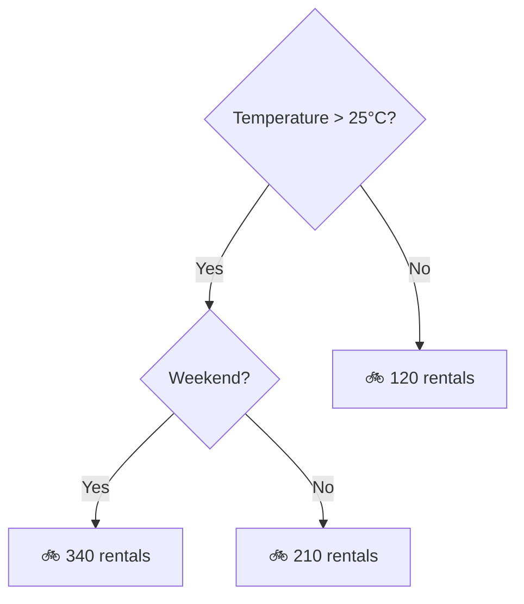
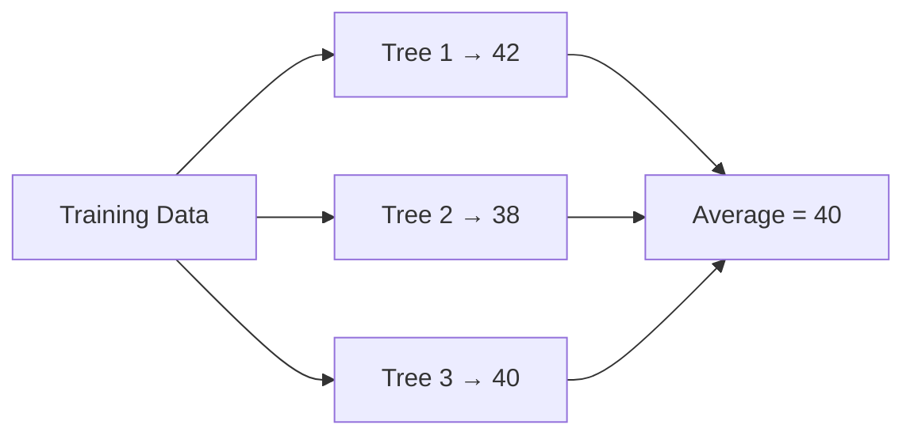
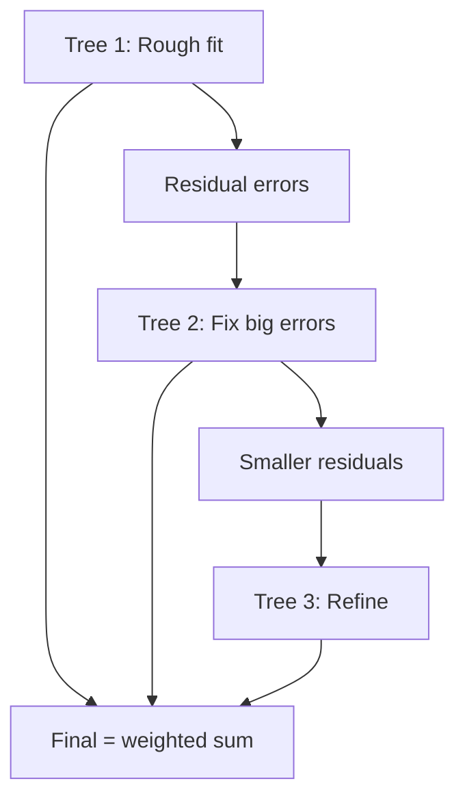

# Regression Models

You're predicting a number. House price, energy output, tomorrow's demand. The question is which tool fits.

Start simple. A linear model that explains 80% of variance is better than a gradient boosted monster you can't debug. Complexity is a last resort, not a first move.

---

## Cheatsheet

| Model | Reach for it when | Avoid when | Scaling? | Key knobs | #1 failure mode |
|---|---|---|---|---|---|
| **Linear Regression** | Relationship looks straight, need interpretability | Curved residuals, correlated features | Yes | — | Fitting a line through a curve |
| **Ridge (L2)** | Correlated features, keep them all | You need feature selection | Yes | `alpha` | Untuned alpha (use `RidgeCV`) |
| **Lasso (L1)** | Many features, most are noise | Features come in correlated groups | Yes | `alpha` | Randomly dropping one of a correlated pair |
| **ElasticNet** | Feature selection + correlated groups | Simple problems (overkill) | Yes | `alpha`, `l1_ratio` | Tuning only one of the two knobs |
| **Polynomial + Ridge** | One clear curve (peak/trough) | Degree > 3 needed | Yes | `degree`, `alpha` | Extrapolating beyond training range |
| **Decision Tree** | Humans must read the rules | Accuracy is the goal | No | `max_depth` | Unconstrained depth → memorisation |
| **Random Forest** | Strong baseline, no tuning budget | Need best accuracy or extrapolation | No | `n_estimators` | Trusting biased `feature_importances_` |
| **Gradient Boosting** | Best tabular accuracy | Tiny data, no time to tune | No | `learning_rate`, `max_depth`, early stopping | No early stopping → overfit |
| **SVR** | Small data, high-dim, non-linear | More than ~50k rows | Yes (critical) | `C`, `epsilon`, kernel | Unscaled features |

---

## Running Example: Bike-Rental Demand

Every model below is applied to the same problem so the trade-offs are directly comparable: **predict hourly bike rentals** from temperature, humidity, wind, hour-of-day, day-of-week, and season, plus ~100 engineered features (lags, rolling means, weather interactions) for the feature-selection models.

The numbers are illustrative of the typical pattern on a dataset like this, not from one specific run:

| Model | Test RMSE | Notes |
|---|---|---|
| Predict-the-mean baseline | 165 | The number to beat |
| Linear Regression | 102 | Residuals show a hump around commute hours: linearity is wrong |
| Polynomial (deg 2) + Ridge | 88 | Captures the temperature curve |
| Ridge on all features | 84 | Correlated lag features handled |
| Lasso on 120 features | 86 | Keeps only 18 features. Nearly as good, far simpler |
| Decision Tree (depth 4) | 95 | Worst accuracy, but the rules fit on a whiteboard |
| Random Forest (300 trees) | 61 | Big jump: the interactions are non-linear |
| **XGBoost (tuned)** | **55** | Best, but took 10× the tuning time of Random Forest |
| SVR (RBF) | 70 | Fine, but slowest to train and pickiest about inputs |

That table *is* the story of tabular regression: linear gets you 60% of the way in 2 minutes, trees buy accuracy with opacity, and boosting wins if you pay the tuning cost.

---

## Evaluation Metrics

| Metric | Formula | When to use |
|---|---|---|
| **MAE** | `mean(\|y - ŷ\|)` | Robust to outliers, easy to explain to stakeholders |
| **RMSE** | `√mean((y - ŷ)²)` | Same units as target: penalises large errors more |
| **R²** | `1 - SS_res/SS_tot` | How much variance your model explains (1 = perfect) |
| **MAPE** | `mean(\|y - ŷ\| / y) × 100` | Percentage error: useful for forecasting |

**Worked example: why RMSE and MAE disagree.** Five predictions with errors `[10, 10, 10, 10, 100]`:

- MAE = (10+10+10+10+100) / 5 = **28**
- RMSE = √((100+100+100+100+10000) / 5) = √2080 ≈ **45.6**

One bad miss dragged RMSE to nearly double the MAE. If that 100-unit miss is a data-entry error you shouldn't be punished for, report MAE. If it's a real blown forecast that costs real money, RMSE is telling you the truth.

RMSE is your default. Switch to MAE when outliers are real data points you don't want to punish heavily. Use MAPE when your stakeholders think in percentages, but never when `y` can be near zero: the division explodes.

---

## Linear vs Non-Linear Models

Before picking a specific model, decide which family you're in.

| | Linear Models | Non-Linear Models |
|---|---|---|
| **Examples** | Linear/Ridge/Lasso, SVR (linear kernel) | Decision Tree, Random Forest, Gradient Boosting, SVR (RBF) |
| **Decision boundary** | Straight hyperplane | Arbitrary shape |
| **Interpretability** | Coefficients directly readable | Black box (trees are partial exception) |
| **Data needed** | Works well with small datasets | Benefits from more data |
| **Feature scaling** | Required | Not required (tree models) |
| **Extrapolation** | Reasonable beyond training range | Dangerous: trees predict the last seen value |
| **Training speed** | Fast | Slower (especially boosting) |

**Start linear when:**
- You can visually see a roughly straight relationship in the data
- Interpretability matters: someone needs to audit the coefficients
- Your dataset is small (under a few thousand rows)
- You're building a baseline before investing in tuning

**Go non-linear when:**
- Your residuals show a systematic pattern (curve, clusters): the linear assumption is wrong
- Feature interactions are important (e.g. temperature × day-of-week for demand forecasting)
- You've tried linear and accuracy isn't good enough
- Your target variable has complex, discontinuous behaviour

The honest truth: for most tabular regression problems, the answer is gradient boosting. Start linear anyway. It takes 2 minutes, and you'll learn something about your data even if you move on.

---

## Linear Models

These models fit a weighted sum of your features: fast to train, interpretable by design, often good enough. Always start here.

## Linear Regression

> **Remember one thing:** the coefficients *are* the model. Nothing else on this page gives you that for free.

The simplest model there is: fit a straight line through your data. If that line explains the variance, you're done. Don't reach for something fancier.

<svg className="ml-diagram" viewBox="0 0 480 260" role="img" aria-label="Linear regression: scatter plot with fitted line">
  <line className="axis-line" x1="50" y1="230" x2="450" y2="230" strokeWidth="1.5" />
  <line className="axis-line" x1="50" y1="20"  x2="50"  y2="230" strokeWidth="1.5" />
  <text className="axis-label" x="250" y="255" textAnchor="middle" fontSize="12" fontFamily="sans-serif">temperature (°C)</text>
  <text className="axis-label" x="18"  y="125" textAnchor="middle" fontSize="12" fontFamily="sans-serif" transform="rotate(-90,18,125)">rentals</text>
  <circle className="pt-blue" cx="75"  cy="208" r="5" opacity="0.85" />
  <circle className="pt-blue" cx="95"  cy="192" r="5" opacity="0.85" />
  <circle className="pt-blue" cx="115" cy="200" r="5" opacity="0.85" />
  <circle className="pt-blue" cx="135" cy="178" r="5" opacity="0.85" />
  <circle className="pt-blue" cx="155" cy="185" r="5" opacity="0.85" />
  <circle className="pt-blue" cx="175" cy="162" r="5" opacity="0.85" />
  <circle className="pt-blue" cx="195" cy="155" r="5" opacity="0.85" />
  <circle className="pt-blue" cx="215" cy="168" r="5" opacity="0.85" />
  <circle className="pt-blue" cx="235" cy="138" r="5" opacity="0.85" />
  <circle className="pt-blue" cx="255" cy="128" r="5" opacity="0.85" />
  <circle className="pt-blue" cx="275" cy="118" r="5" opacity="0.85" />
  <circle className="pt-blue" cx="295" cy="105" r="5" opacity="0.85" />
  <circle className="pt-blue" cx="315" cy="112" r="5" opacity="0.85" />
  <circle className="pt-blue" cx="335" cy="88"  r="5" opacity="0.85" />
  <circle className="pt-blue" cx="355" cy="78"  r="5" opacity="0.85" />
  <circle className="pt-blue" cx="375" cy="65"  r="5" opacity="0.85" />
  <circle className="pt-blue" cx="395" cy="55"  r="5" opacity="0.85" />
  <circle className="pt-blue" cx="415" cy="42"  r="5" opacity="0.85" />
  <line className="fit-line" x1="60" y1="222" x2="435" y2="32" strokeWidth="2.5" />
  <text className="fit-label" x="360" y="75" fontSize="13" fontFamily="monospace">ŷ = wx + b</text>
</svg>

:::tip[Use this when]
You can plot your features against the target and it looks roughly straight. Always try this first. If it's good enough, stop here. There's no prize for using a fancier model.
:::

:::note[What you need to get it right]
- Check your residuals vs fitted values. A curve means the relationship isn't linear. A funnel means your errors grow with the prediction.
- Highly correlated features? Coefficients become unstable and uninterpretable. Use Ridge instead.
- Scale features if you want to compare coefficient magnitudes across features with different units.
:::

```python
from sklearn.linear_model import LinearRegression
from sklearn.pipeline import make_pipeline
from sklearn.preprocessing import StandardScaler

model = make_pipeline(StandardScaler(), LinearRegression())
model.fit(X_train, y_train)
```

**On the bike data:** RMSE 102 against a mean baseline of 165. Two minutes of work explains most of the variance, and the coefficients read cleanly: +9 rentals per °C, −40 when raining. But the residual plot shows a hump around 8am and 6pm. Rentals depend on hour-of-day in a way no straight line can express. The signal to move on is the residual pattern, not the RMSE.

---

## Ridge Regression (L2)

> **Remember one thing:** correlated features → Ridge shrinks and *keeps all of them*, sharing the credit.

Linear regression with a penalty that shrinks all weights toward zero: `loss = MSE + λ Σ wᵢ²`. No weight reaches zero. Everything is kept, just smaller. The more correlated your features, the more Ridge outperforms plain OLS.

:::tip[Use this when]
Your features are correlated with each other. Plain linear regression will assign wild coefficients to correlated features because it can't tell which one is "really" doing the work. Ridge stabilises this by sharing credit across them.
:::

:::note[What you need to get it right]
- Scale your features first. The penalty hits all weights equally, so a feature in thousands will dominate one in single digits.
- Tune `alpha` with `RidgeCV`. Higher alpha = more shrinkage = simpler model. It's a dial, not a guess.
:::

```python
import numpy as np
from sklearn.linear_model import RidgeCV

model = make_pipeline(
    StandardScaler(),
    RidgeCV(alphas=np.logspace(-3, 3, 13))  # tunes alpha via CV, no guessing
)
model.fit(X_train, y_train)
```

**On the bike data:** the lag features (rentals 1h ago, 2h ago, same hour yesterday) are heavily correlated. Plain OLS gives one lag a coefficient of +85 and its neighbour −79: nonsense that cancels out. Ridge shares the credit across the lag group and drops RMSE to 84, with coefficients you can actually present.

---

## Lasso Regression (L1)

> **Remember one thing:** Lasso is feature selection built into the loss function. Some weights go to exactly zero.

Same penalty idea as Ridge, but L1 `loss = MSE + λ Σ |wᵢ|` actually drives some coefficients to exactly zero.

<svg className="ml-diagram" viewBox="0 0 480 200" role="img" aria-label="Ridge keeps all coefficients; Lasso zeroes some out">
  <text className="axis-label" x="120" y="22" textAnchor="middle" fontSize="13" fontFamily="sans-serif">Ridge (L2)</text>
  <text className="axis-label" x="360" y="22" textAnchor="middle" fontSize="13" fontFamily="sans-serif">Lasso (L1)</text>
  <line className="axis-line" x1="20"  y1="170" x2="230" y2="170" strokeWidth="1" />
  <line className="axis-line" x1="250" y1="170" x2="460" y2="170" strokeWidth="1" />
  <rect className="pt-blue" x="35"  y="80"  width="22" height="90" opacity="0.85" rx="2" />
  <rect className="pt-blue" x="70"  y="100" width="22" height="70" opacity="0.85" rx="2" />
  <rect className="pt-blue" x="105" y="115" width="22" height="55" opacity="0.85" rx="2" />
  <rect className="pt-blue" x="140" y="95"  width="22" height="75" opacity="0.85" rx="2" />
  <rect className="pt-blue" x="175" y="125" width="22" height="45" opacity="0.85" rx="2" />
  <text className="axis-label" x="46"  y="185" textAnchor="middle" fontSize="10" fontFamily="sans-serif">w1</text>
  <text className="axis-label" x="81"  y="185" textAnchor="middle" fontSize="10" fontFamily="sans-serif">w2</text>
  <text className="axis-label" x="116" y="185" textAnchor="middle" fontSize="10" fontFamily="sans-serif">w3</text>
  <text className="axis-label" x="151" y="185" textAnchor="middle" fontSize="10" fontFamily="sans-serif">w4</text>
  <text className="axis-label" x="186" y="185" textAnchor="middle" fontSize="10" fontFamily="sans-serif">w5</text>
  <text className="axis-label" x="60"  y="65"  fontSize="10" fontFamily="sans-serif">all kept, shrunk</text>
  <rect className="pt-blue" x="270" y="60"  width="22" height="110" opacity="0.85" rx="2" />
  <rect className="zero-bar" x="305" y="168" width="22" height="2"   strokeWidth="1.5" strokeDasharray="3,3" rx="2" />
  <rect className="pt-blue" x="340" y="100" width="22" height="70"  opacity="0.85" rx="2" />
  <rect className="zero-bar" x="375" y="168" width="22" height="2"   strokeWidth="1.5" strokeDasharray="3,3" rx="2" />
  <rect className="pt-blue" x="410" y="145" width="22" height="25"  opacity="0.85" rx="2" />
  <text className="axis-label" x="281" y="185" textAnchor="middle" fontSize="10" fontFamily="sans-serif">w1</text>
  <text className="axis-label" x="316" y="185" textAnchor="middle" fontSize="10" fontFamily="sans-serif">w2</text>
  <text className="axis-label" x="351" y="185" textAnchor="middle" fontSize="10" fontFamily="sans-serif">w3</text>
  <text className="axis-label" x="386" y="185" textAnchor="middle" fontSize="10" fontFamily="sans-serif">w4</text>
  <text className="axis-label" x="421" y="185" textAnchor="middle" fontSize="10" fontFamily="sans-serif">w5</text>
  <text className="axis-label" x="315" y="48"  fontSize="10" fontFamily="sans-serif">w2, w4 zeroed out</text>
  <text className="zero-label" x="316" y="165" textAnchor="middle" fontSize="11" fontFamily="sans-serif">0</text>
  <text className="zero-label" x="386" y="165" textAnchor="middle" fontSize="11" fontFamily="sans-serif">0</text>
</svg>

:::tip[Use this when]
You have more features than you need and you suspect most of them are noise. Lasso throws out the irrelevant ones automatically: you get a lean, interpretable model without manually engineering feature selection.
:::

:::note[What you need to get it right]
- Scale features. The L1 penalty is magnitude-sensitive.
- If your features come in correlated groups, Lasso picks one from each group at random and drops the rest. Use ElasticNet instead.
- Tune with `LassoCV`. Crank alpha too high and everything zeroes out.
:::

```python
from sklearn.linear_model import LassoCV

model = make_pipeline(StandardScaler(), LassoCV(cv=5))
model.fit(X_train, y_train)

lasso = model.named_steps["lassocv"]
print(f"{(lasso.coef_ != 0).sum()} of {len(lasso.coef_)} features kept")
```

**On the bike data:** we engineered 120 features: lags, rolling means, weather × hour interactions. Most are noise. Lasso keeps 18 and hits RMSE 86, barely worse than Ridge on all 120. That's the trade: a slightly worse number for a model you can list on one slide.

---

## ElasticNet

> **Remember one thing:** Lasso with a safety net. Sparsity from L1, and correlated groups survive thanks to L2.

Lasso and Ridge combined: `loss = MSE + λ₁ Σ |wᵢ| + λ₂ Σ wᵢ²`. You get sparsity from L1 and stability across correlated groups from L2. It won't silently drop half a correlated feature group.

:::tip[Use this when]
You need feature selection but your features come in correlated groups (genomics, sensor arrays, text embeddings). Lasso picks one from each group arbitrarily and zeros the rest. ElasticNet keeps the group coherent while still pruning the truly irrelevant features. If you're unsure whether to use Lasso or Ridge, ElasticNet with tuned `l1_ratio` lets the data decide.
:::

:::note[What you need to get it right]
- Two hyperparameters to tune: `alpha` (overall regularisation strength) and `l1_ratio` (the L1/L2 mix). Use `ElasticNetCV`: it searches both jointly.
- `l1_ratio=1.0` is pure Lasso. `l1_ratio=0.0` is pure Ridge. Start your search at `[0.1, 0.5, 0.7, 0.9, 0.95, 1.0]`.
- Scale features before fitting: both penalties are magnitude-sensitive.
- If `ElasticNetCV` consistently picks `l1_ratio` near 1, just use Lasso. If it picks near 0, use Ridge.
:::

```python
from sklearn.linear_model import ElasticNetCV

model = make_pipeline(
    StandardScaler(),
    ElasticNetCV(l1_ratio=[0.1, 0.5, 0.7, 0.9, 0.95, 1.0], cv=5)
)
model.fit(X_train, y_train)
```

**On the bike data:** the lag features form a correlated group. Lasso arbitrarily kept `lag_1h` and dropped `lag_2h`, and which lag survives changes between train splits. That makes the "selected features" story unstable. ElasticNet keeps the lag group together while still zeroing the junk interactions. Same RMSE as Lasso, but the selection is reproducible.

---

## Non-Linear Models

These models learn arbitrary relationships, no linearity assumed. More powerful, but harder to interpret and slower to tune. Go here after linear models fail.

## Polynomial Regression

> **Remember one thing:** it's still a linear model. Linear in the parameters, curved in the features. All linear-model rules apply.

Not a separate model: you generate polynomial features (`x², x³, x·z`) and feed them into linear regression. The parameters are still estimated with OLS. That distinction matters: the model can fit curves, but it behaves like a linear model in every other way (coefficient estimation, regularisation, extrapolation danger).

<svg className="ml-diagram" viewBox="0 0 480 260" role="img" aria-label="Polynomial regression: degree 1 underfits, degree 2 fits the curve, high degree overfits">
  <line className="axis-line" x1="50" y1="230" x2="450" y2="230" strokeWidth="1.5" />
  <line className="axis-line" x1="50" y1="20"  x2="50"  y2="230" strokeWidth="1.5" />
  <text className="axis-label" x="250" y="255" textAnchor="middle" fontSize="12" fontFamily="sans-serif">speed</text>
  <text className="axis-label" x="18"  y="125" textAnchor="middle" fontSize="12" fontFamily="sans-serif" transform="rotate(-90,18,125)">efficiency</text>
  <circle className="pt-blue" cx="80"  cy="172" r="5" opacity="0.8" />
  <circle className="pt-blue" cx="105" cy="138" r="5" opacity="0.8" />
  <circle className="pt-blue" cx="130" cy="108" r="5" opacity="0.8" />
  <circle className="pt-blue" cx="158" cy="88"  r="5" opacity="0.8" />
  <circle className="pt-blue" cx="185" cy="72"  r="5" opacity="0.8" />
  <circle className="pt-blue" cx="215" cy="58"  r="5" opacity="0.8" />
  <circle className="pt-blue" cx="245" cy="52"  r="5" opacity="0.8" />
  <circle className="pt-blue" cx="275" cy="60"  r="5" opacity="0.8" />
  <circle className="pt-blue" cx="305" cy="80"  r="5" opacity="0.8" />
  <circle className="pt-blue" cx="335" cy="108" r="5" opacity="0.8" />
  <circle className="pt-blue" cx="362" cy="140" r="5" opacity="0.8" />
  <circle className="pt-blue" cx="390" cy="178" r="5" opacity="0.8" />
  <circle className="pt-blue" cx="415" cy="185" r="5" opacity="0.8" />
  <line className="underfit-line" x1="60" y1="118" x2="440" y2="118" strokeWidth="1.8" strokeDasharray="6,4" />
  <polyline className="fit-line"     points="65,178 130,105 215,55 245,50 275,58 335,105 400,178 440,210" strokeWidth="2.5" fill="none" />
  <polyline className="overfit-line" points="65,168 95,105 120,155 150,75 185,80 210,42 245,68 270,38 300,90 325,60 355,115 385,85 415,155 440,105" strokeWidth="1.8" fill="none" strokeDasharray="4,2" />
  <line className="underfit-line" x1="65" y1="40" x2="95" y2="40" strokeWidth="1.8" strokeDasharray="5,4" />
  <text className="underfit-label" x="105" y="44" fontSize="11" fontFamily="sans-serif">Degree 1 — underfits</text>
  <line className="fit-line" x1="65" y1="58" x2="95" y2="58" strokeWidth="2.5" />
  <text className="fit-label" x="105" y="62" fontSize="11" fontFamily="sans-serif">Degree 2 — just right</text>
  <line className="overfit-line" x1="65" y1="76" x2="95" y2="76" strokeWidth="1.8" strokeDasharray="4,2" />
  <text className="overfit-label" x="105" y="80" fontSize="11" fontFamily="sans-serif">High degree — overfits</text>
</svg>

:::tip[Use this when]
There's a clear curve in your scatter plot, like a physical process with a peak or trough. Degree 2 or 3 covers almost every real-world case. If you need degree 5+, a tree model is probably a better call.
:::

:::note[What you need to get it right]
- Always pair with Ridge or Lasso. High-degree polynomials overfit violently without regularisation.
- Never extrapolate beyond your training range. Polynomial curves diverge wildly outside the data.
- If training error is very low but validation error is high, your degree is too high.
:::

```python
from sklearn.preprocessing import PolynomialFeatures

model = make_pipeline(
    PolynomialFeatures(degree=2, include_bias=False),
    StandardScaler(),
    RidgeCV(alphas=np.logspace(-3, 3, 13))  # never run high-degree poly unregularised
)
model.fit(X_train, y_train)
```

**On the bike data:** rentals vs temperature is a curve. Demand rises to about 27°C, then falls as it gets uncomfortably hot. Adding a `temperature²` term lets the linear model bend, dropping RMSE from 102 to 88. One squared term fixed the biggest residual pattern. No black box needed.

---

## Decision Tree Regressor

> **Remember one thing:** the only model whose entire logic a human can read, and the worst one to ship alone.

Splits your data into regions based on feature thresholds, then predicts the mean value in each region. No equations. Just a cascade of if-else rules.



:::tip[Use this when]
You need to hand someone a printed decision chart they can actually understand. Operations teams, compliance reviewers, domain experts who don't trust black boxes. A shallow tree gives you something you can draw on a whiteboard.
:::

:::note[What you need to get it right]
- Set `max_depth` to 3–5. Let it grow unconstrained and it memorises your training data.
- No scaling needed. Splits are based on rank thresholds, not magnitudes.
- Treat this as a diagnostic tool as much as a final model. It reveals which features and thresholds the data actually cares about.
:::

```python
from sklearn.tree import DecisionTreeRegressor, export_text

tree = DecisionTreeRegressor(max_depth=4).fit(X_train, y_train)
print(export_text(tree, feature_names=list(X_train.columns)))
```

**On the bike data:** RMSE 95, worse than everything except plain linear. But the printed rules ("if temp > 25 and weekend → ~340 rentals") convinced the operations team the model wasn't hallucinating. And the tree splits hour-of-day at 7am, 9am, and 5pm: exactly the commute structure the linear residuals hinted at. Use it to understand the data, then move on.

---

## Random Forest Regressor

> **Remember one thing:** average hundreds of overfit trees and the overfitting cancels out. Bagging kills variance.

Train hundreds of trees, each on a different random bootstrap sample with a random subset of features. Average their predictions.



:::tip[Use this when]
You want a strong non-linear baseline without spending time tuning. Random Forest is hard to break, works on mixed feature types, and doesn't need scaling. It's the right first move before reaching for gradient boosting.
:::

:::note[What you need to get it right]
- Start with 100 trees. Go to 300–500 if you're still seeing variance. Beyond 500, returns diminish fast.
- Turn on `oob_score=True`: each tree is validated on data it didn't see during training, so you get a free validation estimate.
- The built-in `feature_importances_` is biased toward high-cardinality features. Use permutation importance for honest rankings.
:::

```python
from sklearn.ensemble import RandomForestRegressor

rf = RandomForestRegressor(n_estimators=300, oob_score=True, n_jobs=-1)
rf.fit(X_train, y_train)
print(f"OOB R²: {rf.oob_score_:.3f}")  # free validation estimate
```

**On the bike data:** RMSE drops from 88 (best linear) to 61 with zero feature engineering and zero tuning. The temperature × hour × weekend interactions we hand-built for the linear models come free. That gap between the best linear model and an untuned forest is the clearest evidence the problem is genuinely non-linear.

---

## Gradient Boosting (XGBoost / LightGBM / CatBoost)

> **Remember one thing:** each tree is trained on the *errors* of the ensemble so far. Boosting kills bias, sequentially.

Trees built one at a time. Each new tree learns to correct the errors of the ensemble so far. Slow and sequential by design, and that's what makes it accurate.



| Library | Pick it when |
|---|---|
| **XGBoost** | Standard choice, strong regularisation, works everywhere |
| **LightGBM** | Dataset is large (100k+ rows) and you need speed |
| **CatBoost** | Many categorical features, want minimal preprocessing |

:::tip[Use this when]
Accuracy is the priority and your data is tabular. Gradient boosting wins on structured data consistently. If Random Forest isn't quite good enough, this is where you go next.
:::

:::note[What you need to get it right]
- Always use early stopping. Pass a validation set and set `early_stopping_rounds=50`: the model stops when it stops improving.
- Low learning rate (0.01–0.05) + many rounds (500–2000) beats high learning rate + few rounds every time.
- Tune `max_depth` (3–6) first, then `learning_rate` and `n_estimators` together, then sampling parameters last.
:::

```python
import xgboost as xgb

model = xgb.XGBRegressor(
    n_estimators=2000, learning_rate=0.03, max_depth=5,
    early_stopping_rounds=50
)
model.fit(X_train, y_train, eval_set=[(X_val, y_val)], verbose=False)
```

**On the bike data:** RMSE 55, the best of the lot. But getting there took a depth/learning-rate/subsample search that ran longer than every other model on this page combined, and the untuned first attempt (61) was no better than the forest. Boosting earns its reputation only after you pay the tuning bill.

---

## Support Vector Regression (SVR)

> **Remember one thing:** only points *outside* the ε-tube contribute to the loss. Everything inside is free.

Fits an ε-tube around the data. Points inside the tube incur no penalty; only points outside do. The kernel trick lets you model non-linear relationships without explicitly engineering features.

**Note on grouping:** SVR spans both families. `kernel='linear'` makes it a fast linear model (a solid alternative to Ridge on high-dimensional data). `kernel='rbf'` makes it non-linear. The default is RBF, which is why it lives here.

<svg className="ml-diagram" viewBox="0 0 480 240" role="img" aria-label="SVR epsilon-tube: only points outside the tube are penalised; support vectors are circled">
  <line className="axis-line" x1="50" y1="210" x2="450" y2="210" strokeWidth="1.5" />
  <line className="axis-line" x1="50" y1="20"  x2="50"  y2="210" strokeWidth="1.5" />
  <text className="axis-label" x="250" y="232" textAnchor="middle" fontSize="12" fontFamily="sans-serif">x (feature)</text>
  <circle className="pt-blue" cx="80"  cy="175" r="5" opacity="0.8" />
  <circle className="pt-blue" cx="110" cy="158" r="5" opacity="0.8" />
  <circle className="pt-blue" cx="140" cy="140" r="5" opacity="0.8" />
  <circle className="pt-blue" cx="170" cy="128" r="5" opacity="0.8" />
  <circle className="pt-blue" cx="200" cy="112" r="5" opacity="0.8" />
  <circle className="pt-blue" cx="230" cy="100" r="5" opacity="0.8" />
  <circle className="pt-blue" cx="260" cy="88"  r="5" opacity="0.8" />
  <circle className="pt-blue" cx="290" cy="75"  r="5" opacity="0.8" />
  <circle className="pt-blue" cx="320" cy="62"  r="5" opacity="0.8" />
  <circle className="pt-blue" cx="350" cy="50"  r="5" opacity="0.8" />
  <circle className="pt-blue" cx="380" cy="40"  r="5" opacity="0.8" />
  <circle className="pt-blue" cx="410" cy="30"  r="5" opacity="0.8" />
  <circle className="sv-ring" cx="150" cy="112" r="8" strokeWidth="2" />
  <circle className="sv-ring" cx="300" cy="48"  r="8" strokeWidth="2" />
  <circle className="sv-ring" cx="380" cy="72"  r="8" strokeWidth="2" />
  <circle className="pt-blue" cx="150" cy="112" r="5" opacity="0.8" />
  <circle className="pt-blue" cx="300" cy="48"  r="5" opacity="0.8" />
  <circle className="pt-blue" cx="380" cy="72"  r="5" opacity="0.8" />
  <line className="fit-line"    x1="62"  y1="188" x2="430" y2="18" strokeWidth="2" />
  <line className="margin-line" x1="62"  y1="208" x2="430" y2="38" strokeWidth="1.2" strokeDasharray="5,4" opacity="0.6" />
  <line className="margin-line" x1="62"  y1="168" x2="430" y2="2"  strokeWidth="1.2" strokeDasharray="5,4" opacity="0.6" />
  <text className="fit-label"  x="340" y="58" fontSize="11" fontFamily="sans-serif">ε-tube</text>
  <text className="axis-label" x="255" y="140" fontSize="11" fontFamily="sans-serif">support vectors</text>
  <line className="axis-line" x1="253" y1="133" x2="160" y2="116" strokeWidth="1" opacity="0.7" />
  <line className="axis-line" x1="253" y1="133" x2="300" y2="55"  strokeWidth="1" opacity="0.7" />
</svg>

:::tip[Use this when]
Your dataset is small (under 10k rows), your feature space is high-dimensional, and the relationship is non-linear. SVR finds structure that simpler models miss. But it doesn't scale, and it's picky about inputs.
:::

:::note[What you need to get it right]
- Standardise your features. SVR is more sensitive to scale than almost any other model.
- Training is O(n²) to O(n³). Above 50k rows, find a different model.
- Tune `C`, `epsilon`, and kernel. RBF is the right default unless you have reason to believe otherwise.
:::

```python
from sklearn.svm import SVR

model = make_pipeline(StandardScaler(), SVR(kernel="rbf", C=10, epsilon=0.1))
model.fit(X_train, y_train)  # keep n under ~50k: training is O(n²)+
```

**On the bike data:** RMSE 70 on a 10k-row subsample. Respectable, but it trained slowest, demanded careful scaling, and got worse on the full 100k rows the trees happily ate. Wrong tool for this problem. Its real home is small, high-dimensional datasets (spectroscopy, sensor calibration, lab measurements) where trees have too little data to shine.

---

## Model Selection Guide

```
Start here → try Linear Regression
├── Residuals random? → ship it
├── Residuals show a curve?
│   ├── Mild curve → Polynomial + Ridge
│   └── Complex non-linear → go tree-based
├── Many correlated features? → Ridge
├── Most features are probably noise? → Lasso
├── Correlated feature groups? → ElasticNet
├── Non-linear, need accuracy? → Gradient Boosting
└── Non-linear, want robustness without tuning? → Random Forest
```

---

## Practical Checklist

- [ ] Try linear regression first and look at the residual plot before moving on
- [ ] Scale features for linear models and SVR. Skipping this ruins your results
- [ ] Use early stopping for gradient boosting, not a fixed number of rounds
- [ ] Use OOB score in Random Forest to avoid burning your validation set
- [ ] A pattern in residuals vs fitted values means your model is structurally wrong, not just inaccurate
