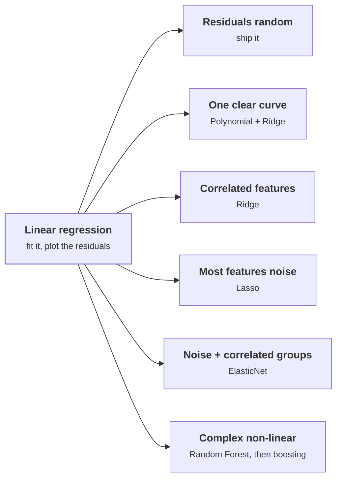
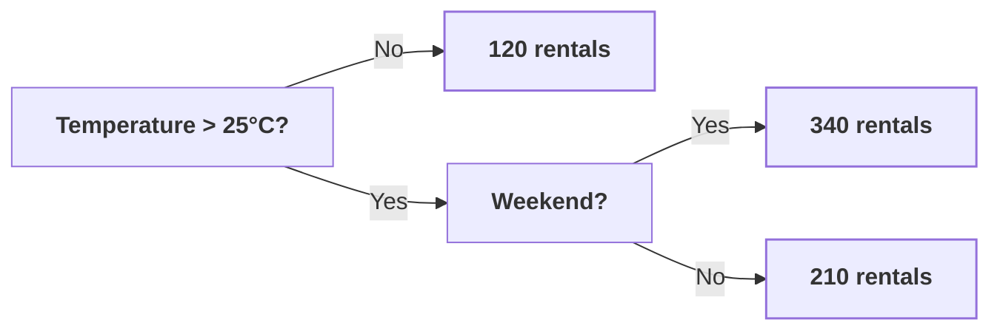

# Regression Models

> Docs: [Linear models](https://scikit-learn.org/stable/modules/linear_model.html) · [Trees](https://scikit-learn.org/stable/modules/tree.html) · [Ensembles](https://scikit-learn.org/stable/modules/ensemble.html) · [SVR](https://scikit-learn.org/stable/modules/svm.html#regression) · [Regression metrics](https://scikit-learn.org/stable/modules/model_evaluation.html#regression-metrics) · [XGBoost](https://xgboost.readthedocs.io/)

## Overview

Use regression when the target is a number: hourly demand, a price, a sensor reading. The question is which model fits, and the answer is almost always "start linear". A linear model that explains most of the variance beats a boosted model you can't debug. The failure people hit is the opposite: reaching for gradient boosting first, then having no baseline to say whether its RMSE is any good.

## Key concepts

### Cheatsheet

| Model | Reach for it when | Avoid when | Scaling? | Key knobs | #1 failure mode |
|---|---|---|---|---|---|
| **Linear Regression** | Relationship looks straight, need interpretability | Curved residuals, correlated features | Yes | — | Fitting a line through a curve |
| **Ridge (L2)** | Correlated features, keep them all | You need feature selection | Yes | `alpha` | Untuned alpha (use `RidgeCV`) |
| **Lasso (L1)** | Many features, most are noise | Features come in correlated groups | Yes | `alpha` | Randomly dropping one of a correlated pair |
| **ElasticNet** | Feature selection + correlated groups | Simple problems (overkill) | Yes | `alpha`, `l1_ratio` | Tuning only one of the two knobs |
| **Polynomial + Ridge** | One clear curve (peak or trough) | Degree above 3 needed | Yes | `degree`, `alpha` | Extrapolating beyond training range |
| **Decision Tree** | Humans must read the rules | Accuracy is the goal | No | `max_depth` | Unconstrained depth → memorisation |
| **Random Forest** | Strong baseline, no tuning budget | Need best accuracy or extrapolation | No | `n_estimators` | Trusting biased `feature_importances_` |
| **Gradient Boosting** | Best tabular accuracy | Tiny data, no time to tune | No | `learning_rate`, `max_depth`, early stopping | No early stopping → overfit |
| **SVR** | Small data, high-dim, non-linear | More than ~50k rows | Yes (critical) | `C`, `epsilon`, kernel | Unscaled features |

### Running example: bike-rental demand

Every model is applied to one problem: **predict hourly bike rentals** from temperature, humidity, wind, hour of day, day of week and season, plus ~100 engineered features (lags, rolling means, weather × hour interactions). Numbers show the typical pattern, not one specific run.

| Model | Test RMSE | Notes |
|---|---|---|
| Predict-the-mean baseline | 165 | The number to beat |
| Linear Regression | 102 | Residuals show a hump at commute hours: linearity is wrong |
| Polynomial (deg 2) + Ridge | 88 | Captures the temperature curve |
| Ridge on all features | 84 | Correlated lag features handled |
| Lasso on 120 features | 86 | Keeps 18 features. Nearly as good, far simpler |
| Decision Tree (depth 4) | 95 | Worst accuracy, but the rules fit on a whiteboard |
| Random Forest (300 trees) | 61 | Big jump: the interactions are non-linear |
| **XGBoost (tuned)** | **55** | Best, but took 10× the tuning time of the forest |
| SVR (RBF) | 70 | Slowest to train, pickiest about inputs |

Linear gets you 60% of the way in two minutes, trees buy accuracy with opacity, and boosting wins if you pay the tuning cost.

### Evaluation metrics

| Metric | In plain words | Use when |
|---|---|---|
| **MAE** | Average size of a miss | Outliers are noise you shouldn't be punished for; easy to explain |
| **RMSE** | Square root of the average squared miss: big misses count extra | Default. Same units as the target |
| **R²** | Share of the target's variance the model explains (1 = perfect) | Comparing fit across targets |
| **MAPE** | Average miss as a percentage of the true value | Stakeholders think in percent. Never when the target can be near zero |

Five predictions with misses of 10, 10, 10, 10 and 100:

| Metric | Value | Why |
|---|---|---|
| MAE | 28 | Each miss counts by its size |
| RMSE | 45.6 | The single 100 is squared, so it dominates |

If that 100 is a data-entry error, report MAE. If it's a real blown forecast that cost money, RMSE is telling the truth.

### Linear vs non-linear

| | Linear models | Non-linear models |
|---|---|---|
| **Examples** | Linear, Ridge, Lasso, ElasticNet, SVR (linear kernel) | Decision Tree, Random Forest, Gradient Boosting, SVR (RBF) |
| **Shape learned** | Straight hyperplane | Arbitrary |
| **Interpretability** | Coefficients readable | Black box (shallow trees are the exception) |
| **Data needed** | Works on small data | Benefits from more data |
| **Feature scaling** | Required | Not for trees |
| **Extrapolation** | Reasonable beyond the training range | Trees predict the last value they saw |

| Signal | Move |
|---|---|
| Roughly straight relationship, someone must audit coefficients, or under a few thousand rows | Stay linear |
| Residuals show a pattern (curve, clusters) | ❌ Linear assumption is wrong. Add a curve term or go non-linear |
| Interactions matter (temperature × weekend) | Go to trees |
| Linear is accurate enough | ✅ Stop. There's no prize for a fancier model |

### Choosing a model

```mermaid
flowchart LR
    S["<b>Linear regression</b><br/><small>fit it, plot the residuals</small>"]
    S --> A["<b>Residuals random</b><br/><small>ship it</small>"]
    S --> B["<b>One clear curve</b><br/><small>Polynomial + Ridge</small>"]
    S --> C["<b>Correlated features</b><br/><small>Ridge</small>"]
    S --> D["<b>Most features noise</b><br/><small>Lasso</small>"]
    S --> E["<b>Noise + correlated groups</b><br/><small>ElasticNet</small>"]
    S --> F["<b>Complex non-linear</b><br/><small>Random Forest, then boosting</small>"]

    classDef accent stroke-width:1.5px
    class S accent
```

*Figure M1-1: Regression model selection. Amber is the starting point for every regression problem; the residual plot picks the branch.*

### Linear regression

The coefficients are the model. Fit a straight line; if it explains the variance, stop.

<svg className="ml-diagram" viewBox="0 0 480 260" role="img" aria-label="Linear regression: scatter plot with fitted line">
  <line className="axis-line" x1="50" y1="230" x2="450" y2="230" strokeWidth="1.5" />
  <line className="axis-line" x1="50" y1="20"  x2="50"  y2="230" strokeWidth="1.5" />
  <text className="axis-label" x="250" y="255" textAnchor="middle" fontSize="12" fontFamily="sans-serif">temperature (°C)</text>
  <text className="axis-label" x="18"  y="125" textAnchor="middle" fontSize="12" fontFamily="sans-serif" transform="rotate(-90,18,125)">rentals</text>
  <circle className="pt-blue" cx="75"  cy="208" r="5" opacity="0.85" />
  <circle className="pt-blue" cx="95"  cy="192" r="5" opacity="0.85" />
  <circle className="pt-blue" cx="115" cy="200" r="5" opacity="0.85" />
  <circle className="pt-blue" cx="135" cy="178" r="5" opacity="0.85" />
  <circle className="pt-blue" cx="155" cy="185" r="5" opacity="0.85" />
  <circle className="pt-blue" cx="175" cy="162" r="5" opacity="0.85" />
  <circle className="pt-blue" cx="195" cy="155" r="5" opacity="0.85" />
  <circle className="pt-blue" cx="215" cy="168" r="5" opacity="0.85" />
  <circle className="pt-blue" cx="235" cy="138" r="5" opacity="0.85" />
  <circle className="pt-blue" cx="255" cy="128" r="5" opacity="0.85" />
  <circle className="pt-blue" cx="275" cy="118" r="5" opacity="0.85" />
  <circle className="pt-blue" cx="295" cy="105" r="5" opacity="0.85" />
  <circle className="pt-blue" cx="315" cy="112" r="5" opacity="0.85" />
  <circle className="pt-blue" cx="335" cy="88"  r="5" opacity="0.85" />
  <circle className="pt-blue" cx="355" cy="78"  r="5" opacity="0.85" />
  <circle className="pt-blue" cx="375" cy="65"  r="5" opacity="0.85" />
  <circle className="pt-blue" cx="395" cy="55"  r="5" opacity="0.85" />
  <circle className="pt-blue" cx="415" cy="42"  r="5" opacity="0.85" />
  <line className="fit-line" x1="60" y1="222" x2="435" y2="32" strokeWidth="2.5" />
  <text className="fit-label" x="330" y="200" fontSize="13" fontFamily="monospace">ŷ = wx + b</text>
</svg>

*Figure M1-2: Linear regression. Blue points are observed hours, the green line is the fit.*

| | |
|---|---|
| **Use when** | A feature-vs-target plot looks roughly straight. Always try it first |
| **Get it right** | Plot residuals against fitted values: a curve means non-linear, a funnel means errors grow with the prediction. Correlated features make coefficients unstable: use Ridge. Scale features to compare coefficient sizes |
| **On the bike data** | RMSE 102 vs 165 baseline. Coefficients read cleanly: +9 rentals per °C, −40 when raining. The residual hump at 8am and 6pm is the signal to move on, not the RMSE |

### Ridge regression (L2)

Ridge shrinks every weight toward zero and keeps all of them, sharing credit across correlated features.

| | |
|---|---|
| **Penalty** | Sum of squared weights. No weight reaches zero |
| **Use when** | Features are correlated. Plain linear regression gives them wild, cancelling coefficients |
| **Get it right** | Scale first: the penalty hits all weights equally. Tune `alpha` with `RidgeCV` over a log-spaced grid (0.001–1000) |
| **On the bike data** | Plain OLS gave one lag +85 and its neighbour −79. Ridge shares credit across the lag group: RMSE 84, presentable coefficients |

### Lasso regression (L1)

Lasso is feature selection built into the loss: some weights go to exactly zero.

<svg className="ml-diagram" viewBox="0 0 480 200" role="img" aria-label="Ridge keeps all coefficients; Lasso zeroes some out">
  <text className="axis-label" x="120" y="22" textAnchor="middle" fontSize="13" fontFamily="sans-serif">Ridge (L2)</text>
  <text className="axis-label" x="360" y="22" textAnchor="middle" fontSize="13" fontFamily="sans-serif">Lasso (L1)</text>
  <line className="axis-line" x1="20"  y1="170" x2="230" y2="170" strokeWidth="1" />
  <line className="axis-line" x1="250" y1="170" x2="460" y2="170" strokeWidth="1" />
  <rect className="pt-blue" x="35"  y="80"  width="22" height="90" opacity="0.85" rx="2" />
  <rect className="pt-blue" x="70"  y="100" width="22" height="70" opacity="0.85" rx="2" />
  <rect className="pt-blue" x="105" y="115" width="22" height="55" opacity="0.85" rx="2" />
  <rect className="pt-blue" x="140" y="95"  width="22" height="75" opacity="0.85" rx="2" />
  <rect className="pt-blue" x="175" y="125" width="22" height="45" opacity="0.85" rx="2" />
  <text className="axis-label" x="46"  y="185" textAnchor="middle" fontSize="10" fontFamily="sans-serif">w1</text>
  <text className="axis-label" x="81"  y="185" textAnchor="middle" fontSize="10" fontFamily="sans-serif">w2</text>
  <text className="axis-label" x="116" y="185" textAnchor="middle" fontSize="10" fontFamily="sans-serif">w3</text>
  <text className="axis-label" x="151" y="185" textAnchor="middle" fontSize="10" fontFamily="sans-serif">w4</text>
  <text className="axis-label" x="186" y="185" textAnchor="middle" fontSize="10" fontFamily="sans-serif">w5</text>
  <text className="axis-label" x="60"  y="65"  fontSize="10" fontFamily="sans-serif">all kept, shrunk</text>
  <rect className="pt-blue" x="270" y="60"  width="22" height="110" opacity="0.85" rx="2" />
  <rect className="zero-bar" x="305" y="168" width="22" height="2"   strokeWidth="1.5" strokeDasharray="3,3" rx="2" />
  <rect className="pt-blue" x="340" y="100" width="22" height="70"  opacity="0.85" rx="2" />
  <rect className="zero-bar" x="375" y="168" width="22" height="2"   strokeWidth="1.5" strokeDasharray="3,3" rx="2" />
  <rect className="pt-blue" x="410" y="145" width="22" height="25"  opacity="0.85" rx="2" />
  <text className="axis-label" x="281" y="185" textAnchor="middle" fontSize="10" fontFamily="sans-serif">w1</text>
  <text className="axis-label" x="316" y="185" textAnchor="middle" fontSize="10" fontFamily="sans-serif">w2</text>
  <text className="axis-label" x="351" y="185" textAnchor="middle" fontSize="10" fontFamily="sans-serif">w3</text>
  <text className="axis-label" x="386" y="185" textAnchor="middle" fontSize="10" fontFamily="sans-serif">w4</text>
  <text className="axis-label" x="421" y="185" textAnchor="middle" fontSize="10" fontFamily="sans-serif">w5</text>
  <text className="axis-label" x="315" y="48"  fontSize="10" fontFamily="sans-serif">w2, w4 zeroed out</text>
  <text className="zero-label" x="316" y="165" textAnchor="middle" fontSize="11" fontFamily="sans-serif">0</text>
  <text className="zero-label" x="386" y="165" textAnchor="middle" fontSize="11" fontFamily="sans-serif">0</text>
</svg>

*Figure M1-3: The same five weights under each penalty. Ridge shrinks all of them; Lasso zeroes w2 and w4.*

| | |
|---|---|
| **Penalty** | Sum of absolute weights |
| **Use when** | Many features, most of them noise |
| **Get it right** | Scale first. Tune with `LassoCV`; too high an alpha zeroes everything. Correlated groups: Lasso keeps one at random. Use ElasticNet |
| **On the bike data** | 120 engineered features → 18 kept, RMSE 86. Slightly worse than Ridge for a model that fits on one slide |

### ElasticNet

ElasticNet is Lasso with a safety net: sparsity from L1, and correlated groups survive thanks to L2.

| Knob | Setting | Why |
|---|---|---|
| `alpha` | Searched by `ElasticNetCV` | Overall penalty strength |
| `l1_ratio` | Search 0.1, 0.5, 0.7, 0.9, 0.95, 1.0 | 1.0 is pure Lasso, 0 is pure Ridge |
| Search result near 1 or near 0 | — | Just use Lasso or Ridge |

On the bike data, Lasso kept `lag_1h` in one split and `lag_2h` in another, so the "selected features" story changed between runs. ElasticNet keeps the lag group together and still zeroes the junk interactions: same RMSE as Lasso, reproducible selection.

### Polynomial regression

Polynomial regression is still a linear model: linear in the parameters, curved in the features. Add squared or cubed terms and every linear-model rule still applies.

<svg className="ml-diagram" viewBox="0 0 480 260" role="img" aria-label="Polynomial regression: degree 1 underfits, degree 2 fits the curve, high degree overfits">
  <line className="axis-line" x1="50" y1="230" x2="450" y2="230" strokeWidth="1.5" />
  <line className="axis-line" x1="50" y1="20"  x2="50"  y2="230" strokeWidth="1.5" />
  <text className="axis-label" x="250" y="255" textAnchor="middle" fontSize="12" fontFamily="sans-serif">temperature (°C)</text>
  <text className="axis-label" x="18"  y="125" textAnchor="middle" fontSize="12" fontFamily="sans-serif" transform="rotate(-90,18,125)">rentals</text>
  <circle className="pt-blue" cx="80"  cy="172" r="5" opacity="0.8" />
  <circle className="pt-blue" cx="105" cy="138" r="5" opacity="0.8" />
  <circle className="pt-blue" cx="130" cy="108" r="5" opacity="0.8" />
  <circle className="pt-blue" cx="158" cy="88"  r="5" opacity="0.8" />
  <circle className="pt-blue" cx="185" cy="72"  r="5" opacity="0.8" />
  <circle className="pt-blue" cx="215" cy="58"  r="5" opacity="0.8" />
  <circle className="pt-blue" cx="245" cy="52"  r="5" opacity="0.8" />
  <circle className="pt-blue" cx="275" cy="60"  r="5" opacity="0.8" />
  <circle className="pt-blue" cx="305" cy="80"  r="5" opacity="0.8" />
  <circle className="pt-blue" cx="335" cy="108" r="5" opacity="0.8" />
  <circle className="pt-blue" cx="362" cy="140" r="5" opacity="0.8" />
  <circle className="pt-blue" cx="390" cy="178" r="5" opacity="0.8" />
  <circle className="pt-blue" cx="415" cy="185" r="5" opacity="0.8" />
  <line className="underfit-line" x1="60" y1="118" x2="440" y2="118" strokeWidth="1.8" strokeDasharray="6,4" />
  <polyline className="fit-line"     points="65,178 130,105 215,55 245,50 275,58 335,105 400,178 440,210" strokeWidth="2.5" fill="none" />
  <polyline className="overfit-line" points="65,168 95,105 120,155 150,75 185,80 210,42 245,68 270,38 300,90 325,60 355,115 385,85 415,155 440,105" strokeWidth="1.8" fill="none" strokeDasharray="4,2" />
  <line className="underfit-line" x1="170" y1="168" x2="200" y2="168" strokeWidth="1.8" strokeDasharray="5,4" />
  <text className="underfit-label" x="210" y="172" fontSize="11" fontFamily="sans-serif">Degree 1 — underfits</text>
  <line className="fit-line" x1="170" y1="186" x2="200" y2="186" strokeWidth="2.5" />
  <text className="fit-label" x="210" y="190" fontSize="11" fontFamily="sans-serif">Degree 2 — just right</text>
  <line className="overfit-line" x1="170" y1="204" x2="200" y2="204" strokeWidth="1.8" strokeDasharray="4,2" />
  <text className="overfit-label" x="210" y="208" fontSize="11" fontFamily="sans-serif">High degree — overfits</text>
</svg>

*Figure M1-4: Fitting a curve. Grey dashed is degree 1 (underfits), green is degree 2 (fits), red dotted is a high degree (overfits).*

| | |
|---|---|
| **Use when** | A clear curve with a peak or trough. Degree 2 or 3 covers almost every real case; needing 5+ means use a tree |
| **Get it right** | Always pair with Ridge or Lasso. Never extrapolate: polynomials diverge outside the data. Low training error with high validation error means the degree is too high |
| **On the bike data** | Demand rises to about 27°C, then falls in the heat. One temperature² term drops RMSE from 102 to 88 |

### Decision tree regressor

The only model whose whole logic a human can read, and the worst one to ship alone.

```mermaid
flowchart LR
    A["<b>Temperature > 25°C?</b>"] -->|No| C["<b>120 rentals</b>"]
    A -->|Yes| B["<b>Weekend?</b>"]
    B -->|Yes| D["<b>340 rentals</b>"]
    B -->|No| E["<b>210 rentals</b>"]

    classDef accent stroke-width:1.5px
    class C,D,E accent
```

*Figure M1-5: A depth-2 tree on the bike data. Amber nodes are leaves: the prediction is the mean of the training hours that land there.*

| | |
|---|---|
| **Use when** | Operations, compliance or domain experts need rules they can check |
| **Get it right** | `max_depth` 3–5; unconstrained trees memorise. No scaling needed. Treat it as a diagnostic, not the final model |
| **On the bike data** | RMSE 95. The splits at 7am, 9am and 5pm confirmed the commute structure the linear residuals hinted at |

### Random forest regressor

Average hundreds of overfit trees and the overfitting cancels out. → See [bagging vs boosting](./index.md#ensembles-bagging-vs-boosting).

| | |
|---|---|
| **Use when** | You want a strong non-linear baseline without tuning |
| **Get it right** | 100 trees to start, 300–500 if variance remains. `oob_score=True` gives a free validation estimate. Rank features with permutation importance, not `feature_importances_` |
| **On the bike data** | RMSE 88 (best linear) → 61 with no tuning. That gap is the evidence the problem is non-linear |

### Gradient boosting

Each tree fits the errors of the ensemble so far. Boosting removes bias, and [early stopping](../glossary.md#early-stopping) is non-negotiable. → See [bagging vs boosting](./index.md#ensembles-bagging-vs-boosting).

| Library | Pick it when |
|---|---|
| **XGBoost** | Standard choice, strong regularisation, works everywhere |
| **LightGBM** | Large data (100k+ rows), need speed |
| **CatBoost** | Many categorical features, minimal preprocessing |

| Knob | Setting | Why |
|---|---|---|
| `early_stopping_rounds` | 50, on a validation set | The model picks its own tree count |
| `learning_rate` | 0.01–0.05 with 500–2000 rounds | Beats a high rate with few rounds |
| `max_depth` | 3–6, tuned first | Main capacity control |
| Sampling params | Tuned last | Small further gains |

On the bike data: RMSE 55, the best, after a search that took longer than every other model combined. The untuned first attempt (61) was no better than the forest.

### Support vector regression (SVR)

Only points outside the ε-tube count toward the loss. Everything inside is free. `kernel="linear"` makes SVR a linear model; the default RBF kernel makes it non-linear.

<svg className="ml-diagram" viewBox="0 0 480 240" role="img" aria-label="SVR epsilon-tube: only points outside the tube are penalised; support vectors are circled">
  <line className="axis-line" x1="50" y1="210" x2="450" y2="210" strokeWidth="1.5" />
  <line className="axis-line" x1="50" y1="20"  x2="50"  y2="210" strokeWidth="1.5" />
  <text className="axis-label" x="250" y="232" textAnchor="middle" fontSize="12" fontFamily="sans-serif">x (feature)</text>
  <circle className="pt-blue" cx="80"  cy="175" r="5" opacity="0.8" />
  <circle className="pt-blue" cx="110" cy="158" r="5" opacity="0.8" />
  <circle className="pt-blue" cx="140" cy="140" r="5" opacity="0.8" />
  <circle className="pt-blue" cx="170" cy="128" r="5" opacity="0.8" />
  <circle className="pt-blue" cx="200" cy="112" r="5" opacity="0.8" />
  <circle className="pt-blue" cx="230" cy="100" r="5" opacity="0.8" />
  <circle className="pt-blue" cx="260" cy="88"  r="5" opacity="0.8" />
  <circle className="pt-blue" cx="290" cy="75"  r="5" opacity="0.8" />
  <circle className="pt-blue" cx="320" cy="62"  r="5" opacity="0.8" />
  <circle className="pt-blue" cx="350" cy="50"  r="5" opacity="0.8" />
  <circle className="pt-blue" cx="380" cy="40"  r="5" opacity="0.8" />
  <circle className="pt-blue" cx="410" cy="30"  r="5" opacity="0.8" />
  <circle className="sv-ring" cx="150" cy="112" r="8" strokeWidth="2" />
  <circle className="sv-ring" cx="300" cy="48"  r="8" strokeWidth="2" />
  <circle className="sv-ring" cx="380" cy="72"  r="8" strokeWidth="2" />
  <circle className="pt-blue" cx="150" cy="112" r="5" opacity="0.8" />
  <circle className="pt-blue" cx="300" cy="48"  r="5" opacity="0.8" />
  <circle className="pt-blue" cx="380" cy="72"  r="5" opacity="0.8" />
  <line className="fit-line"    x1="62"  y1="188" x2="430" y2="18" strokeWidth="2" />
  <line className="margin-line" x1="62"  y1="208" x2="430" y2="38" strokeWidth="1.2" strokeDasharray="5,4" opacity="0.6" />
  <line className="margin-line" x1="62"  y1="168" x2="430" y2="2"  strokeWidth="1.2" strokeDasharray="5,4" opacity="0.6" />
  <text className="fit-label"  x="390" y="205" fontSize="11" fontFamily="sans-serif">ε-tube</text>
  <text className="axis-label" x="255" y="140" fontSize="11" fontFamily="sans-serif">support vectors</text>
  <line className="axis-line" x1="253" y1="133" x2="160" y2="116" strokeWidth="1" opacity="0.7" />
  <line className="axis-line" x1="253" y1="133" x2="300" y2="55"  strokeWidth="1" opacity="0.7" />
</svg>

*Figure M1-6: The ε-tube. Blue points inside the dashed tube cost nothing; circled points outside it are the support vectors that define the fit.*

| | |
|---|---|
| **Use when** | Small (under 10k rows), high-dimensional, non-linear data: spectroscopy, lab measurements |
| **Get it right** | Standardise features. Training cost grows with the square of the rows or worse: above ~50k rows, pick another model. Tune `C`, `epsilon` and kernel |
| **On the bike data** | RMSE 70 on a 10k subsample, slowest to train, and worse on the full 100k rows the trees handled easily |

## Gotchas

- **Skipping the residual plot.** RMSE says how wrong, not why. Plot residuals against fitted values before changing models.
- **Unscaled features in linear models or SVR.** Penalties and distances are dominated by the biggest units. Scale inside the pipeline.
- **Boosting without early stopping.** A fixed round count overfits. Pass a validation set and let it stop.
- **Extrapolating with trees or polynomials.** Trees flatten at the last seen value; polynomials explode. Keep predictions inside the training range or use a linear model.
- **MAPE with targets near zero.** Division by a tiny number explodes the metric. Use MAE or RMSE for low-count hours.
- **Lasso on correlated groups.** Which feature survives changes between runs. Use ElasticNet.

## Scenario questions

**Q1 ★ Your RMSE is 45.6 but MAE is 28. What does that tell you, and which do you report?**

Model answer

- **Clarify:** what does a large miss cost the business compared to a small one?
- **Observe:** RMSE well above MAE means a few large misses dominate; here one miss of 100 among misses of 10.
- **Hypothesise:** either a data error in that row, or a real event the model can't predict.
- **Fix:** check the row. Data error: fix it and report MAE. Real miss: report RMSE, because big misses cost money.
- **Prevent:** agree the metric with stakeholders before modelling. The trade-off is that the metric choice changes which model wins.

**Q2 ★★ Linear regression gives RMSE 102 and the residuals hump at 8am and 6pm. What next?**

Model answer

- **Clarify:** is interpretability still required?
- **Observe:** residuals against hour of day show peaks at commute hours; residuals against temperature show a curve.
- **Hypothesise:** demand depends on hour and temperature non-linearly, and on interactions like hour × weekend.
- **Fix:** add a temperature² term (RMSE 88) if interpretability matters; otherwise a Random Forest (61), then tuned boosting (55).
- **Prevent:** the residual plot is the trigger for every model change. The trade-off is losing readable coefficients.

**Q3 ★★ Lasso keeps `lag_1h` in one run and `lag_2h` in another. Why, and what do you do?**

Model answer

- **Clarify:** do stakeholders rely on the list of selected features?
- **Observe:** the two lags correlate at over 0.9; which one survives depends on the split.
- **Hypothesise:** L1 picks one member of a correlated group arbitrarily.
- **Fix:** ElasticNet, with `l1_ratio` searched, keeps the group together.
- **Prevent:** check feature-to-feature correlation before trusting a selected-feature list. The trade-off is one more knob to tune.

**Q4 ★★★ Next summer may be hotter than anything in the training data. Which model do you trust for those days?**

Model answer

- **Clarify:** how far outside the training range, and what decision depends on it (bike stocking, staffing)?
- **Observe:** the tree models' predictions flatten above the hottest training day; the degree-2 polynomial keeps falling.
- **Hypothesise:** trees can't extrapolate. Polynomials extrapolate wildly. Neither knows how people behave at 40°C.
- **Fix:** flag out-of-range inputs, cap predictions with a domain rule, or fall back to a simpler model for those days.
- **Prevent:** monitor input ranges against training. The trade-off is a cruder forecast on exactly the days that matter.

## Summary

- **Start linear.** Two minutes, a baseline, and residuals that tell you what's missing.
- **The residual plot picks the next model.** A curve means a curve term; interactions mean trees.
- **Penalties have personalities.** Ridge keeps correlated features, Lasso deletes noise, ElasticNet does both.
- **Boosting wins only after tuning.** Early stopping and a low learning rate, or the forest is just as good.
- **Pick the metric by the cost of a big miss.** RMSE when large misses cost money, MAE when they're noise.

---

**Next →** [Classification](./classification.md)
