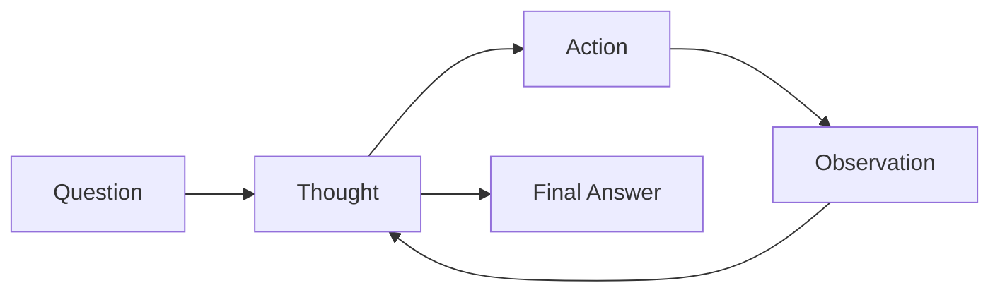
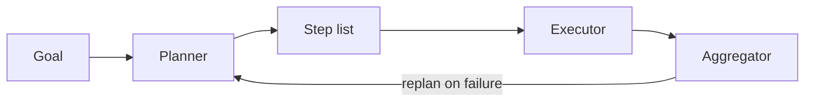
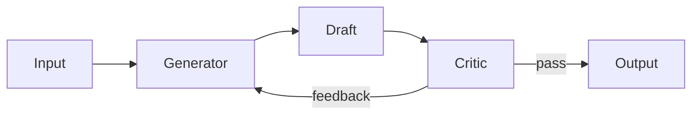
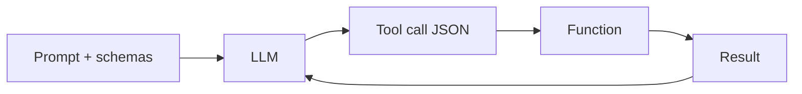
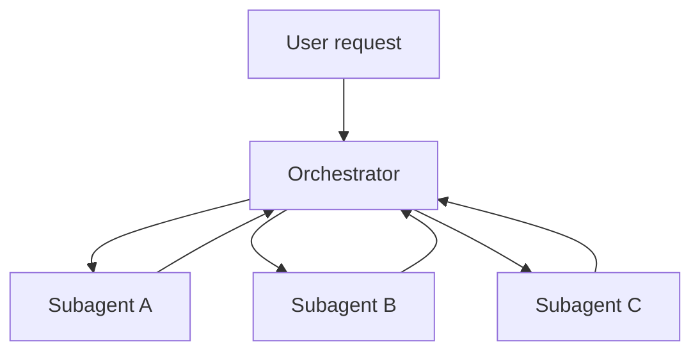
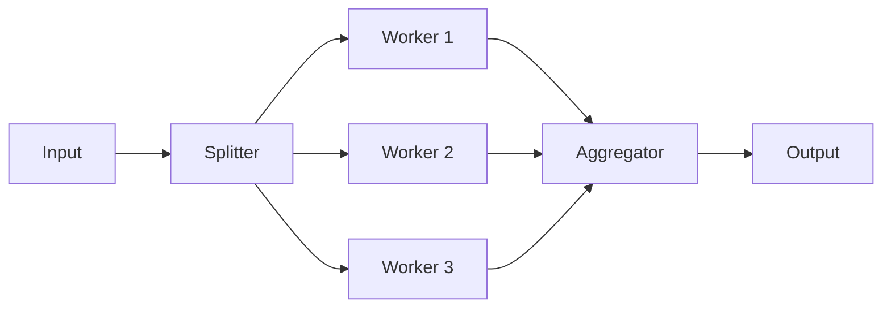
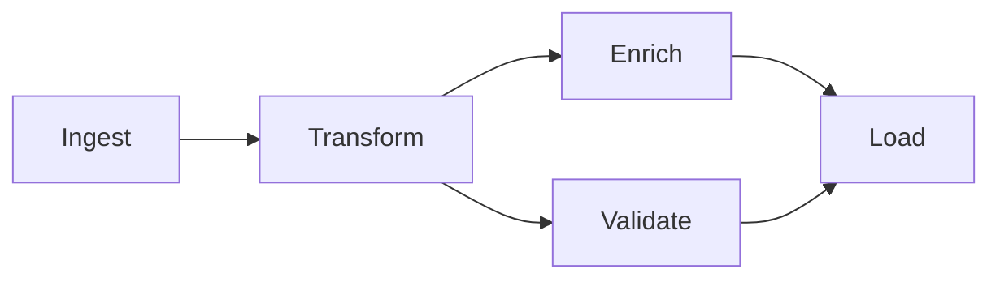
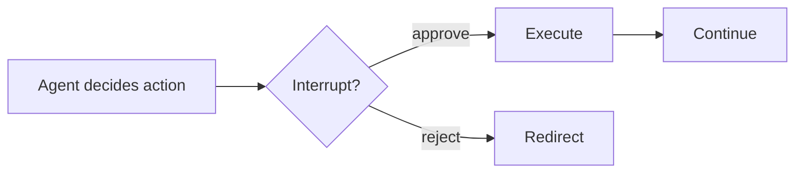
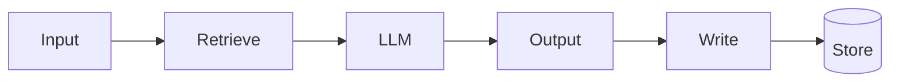
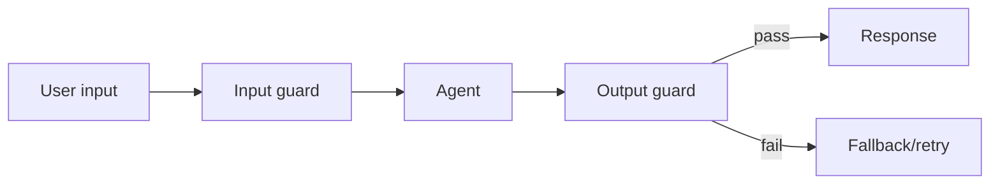

# Agent Design Patterns

> Study notes for ML engineers evaluating or building agentic workflows. Assumes Python/LLM experience. Knowledge cutoff: mid-2026.

---

## What is an agent?

```
agent = LLM + memory + tools + control flow
```

| Abstraction | Control flow | Use when |
|---|---|---|
| **LLM call** | None — one shot | Single task, no external state needed |
| **Chain** | Fixed at design time | Steps are always the same |
| **Agent** | Dynamic — LLM decides | Steps depend on intermediate results |

**Default to a chain.** Only add an agent loop when the number or sequence of steps genuinely can't be determined upfront. Agents are slower, harder to debug, and more expensive than chains.

---

## Tier 1 — Foundational (single-agent)

| Pattern | Core idea | Best signal to use it |
|---|---|---|
| **ReAct** | Think → Act → Observe loop | Task needs real-time external data |
| **Plan and Execute** | Plan once upfront, then execute | Long-horizon task with many independent steps |
| **Reflection** | Generator → Critic → Revise loop | Output quality matters more than latency |
| **Tool Use** | Structured typed tool schemas | Agent needs to read/write external state |

---

### 1. ReAct (Reason + Act)

The model alternates between *Thought* (explicit reasoning), *Action* (tool call), and *Observation* (tool result) until it has a final answer. Forcing verbalized reasoning before acting improves accuracy and debuggability.



**Use when** — the task requires real-time data (search, APIs); the number of tool calls is unknown upfront; you need an audit trail of reasoning steps.

**Skip when** — the sequence of steps is always the same (use a chain); latency is tight (each thought/action/observation adds a model round-trip).

**Example:** A research assistant asks "What are the top 3 cloud providers by market cap today?" It can't answer from training data — it reasons, calls a financial API, gets partial data, calls again, then synthesizes.

:::tip Go deeper
- Yao et al. 2022 — [ReAct: Synergizing Reasoning and Acting in Language Models](https://arxiv.org/abs/2210.03629)
- [LangGraph ReAct agent how-to](https://langchain-ai.github.io/langgraph/how-tos/create-react-agent/)
:::

---

### 2. Plan and Execute

A planner LLM produces a full step-by-step plan upfront. An executor (often a cheaper model) runs each step. Unlike ReAct, the plan is fixed before any execution begins — better for long-horizon tasks where global coherence matters.



**Use when** — tasks decompose cleanly into independent steps; you want to show users a plan before committing; you want to use Opus for planning and Sonnet/Haiku for execution.

**Skip when** — early steps reveal information that changes what later steps should be (ReAct handles this better); the task has 2–3 steps (overkill).

**Example:** Monthly investor update — planner emits *(1) pull revenue, (2) pull expenses, (3) compare to prior quarter, (4) draft commentary, (5) format.* These steps don't change based on what the numbers are, so a fixed plan works.

:::tip Go deeper
- Wang et al. 2023 — [Plan-and-Solve Prompting](https://arxiv.org/abs/2305.04091)
- [LangGraph Plan-and-Execute tutorial](https://langchain-ai.github.io/langgraph/tutorials/plan-and-execute/plan-and-execute/)
:::

---

### 3. Reflection / Self-Critique

A generator LLM produces a draft. A critic LLM evaluates it against a rubric and returns structured feedback. The generator revises. Loop until the critic passes or a max-iteration limit is hit. The critic can be a stronger (and more expensive) model than the generator.



**Use when** — output quality is hard to verify automatically (essays, plans, complex code); you have an expressible rubric; cost of a bad first draft is high.

**Skip when** — output has deterministic ground truth (just run the code and check); the generator and critic are the same model at the same temperature (it'll agree with itself); latency budget doesn't allow multiple passes.

**Example:** CI code review agent — generator writes a first-pass review, critic (prompted as a senior engineer) flags missed issues and false positives, generator revises. Two passes consistently outperform one.

:::tip Go deeper
- Shinn et al. 2023 — [Reflexion](https://arxiv.org/abs/2303.11366)
- Madaan et al. 2023 — [Self-Refine](https://arxiv.org/abs/2303.17651)
:::

---

### 4. Tool Use / Function Calling

Tools are declared as JSON schemas. The LLM returns a structured tool call object; your code executes it and feeds the result back. Modern models emit multiple tool calls in one response for parallel execution — use this aggressively.



**Use when** — the agent needs to read or write external state; you need deterministic, typed actions instead of free-text descriptions of actions; parallel tool calling can reduce latency.

**Skip when** — a plain prompt with instructions is sufficient; tool schemas are too broad or overlapping (models struggle to pick).

**⚠️ Don't give agents destructive tools** (DELETE, send email, deploy) without a HITL gate — see Pattern 8.

**Example:** Calendar scheduling agent. User: "Find a 1-hour slot for Alice and Bob this week, no mornings." Agent calls `get_availability()` in parallel for both users, reasons about overlap, calls `create_event()`.

:::tip Go deeper
- [Anthropic tool use docs](https://docs.anthropic.com/en/docs/tool-use)
- [OpenAI function calling spec](https://platform.openai.com/docs/guides/function-calling)
:::

---

## Tier 2 — Orchestration (multi-agent)

| Pattern | Core idea | Best signal to use it |
|---|---|---|
| **Orchestrator–Subagent** | Central router delegates to specialist agents | Problem has clearly separable domains |
| **Parallelization** | Fan-out independent tasks, aggregate results | Subtasks are genuinely independent; latency matters |
| **Pipeline / DAG** | Typed handoffs in a directed acyclic graph | Fixed structure, step-level retry/resume needed |

---

### 5. Orchestrator–Subagent

A central orchestrator routes tasks to specialist subagents with domain-specific prompts, tools, and optionally different models. Subagents are stateless from the orchestrator's view — they receive a task, return a result.



**Use when** — problem has clearly separable domains (billing vs. tech support vs. account management); different domains need different tools or prompts; teams want to own separate agents.

**Skip when** — domains bleed into each other (routing ambiguity causes thrash); overhead of serialization exceeds the benefit — try a single well-prompted agent first.

**Example:** SaaS customer support — orchestrator classifies tickets. Billing → Stripe API agent. Tech issues → runbook + log agent. Account changes → user DB agent. Low-confidence routes → HITL queue.

:::tip Go deeper
- Hong et al. 2023 — [MetaGPT](https://arxiv.org/abs/2308.00352)
- [Anthropic multi-agent patterns](https://docs.anthropic.com/en/docs/build-with-claude/tool-use/multi-agent-tool-use)
:::

---

### 6. Parallelization / Fan-out

Independent subtasks are dispatched concurrently and results aggregated. If 5 tasks each take 3s sequentially = 15s; in parallel ≈ 3s. Also useful for N-way voting — run the same prompt N times and take majority to improve reliability on ambiguous tasks.



**Use when** — subtasks are genuinely independent; large documents can be chunked for parallel analysis; N-way voting improves reliability.

**Skip when** — tasks have hidden dependencies; API rate limits will serialize you anyway; the aggregation step is harder than the subtasks.

**Example:** 200-page M&A due diligence doc — 6 worker agents (financials, legal, IP, HR, infrastructure, regulatory) run in parallel. Total time ≈ slowest section, not sum of all.

:::tip Go deeper
- [LangGraph fan-out/fan-in how-to](https://langchain-ai.github.io/langgraph/how-tos/map-reduce/)
:::

---

### 7. Pipeline / DAG

Each node is an agent or function with defined input/output types. Edges encode dependencies. The engine runs nodes in topological order, with parallelism where the graph allows. State is persisted at each node boundary — a failed node can be retried without re-running upstream work.



**Use when** — the workflow has a fixed structure but complex dependencies; steps need individual retry/testability; different steps need different models or environments.

**Skip when** — the graph structure changes per input (use ReAct); 2–3 steps with no branching (a chain is simpler).

**Example:** PR review pipeline — ingest diff → [lint check ‖ test run ‖ security scan] → LLM review (reads all three results) → post comment. If `test_run` fails, retry only that node.

:::tip Go deeper
- [LangGraph StateGraph docs](https://langchain-ai.github.io/langgraph/reference/graphs/)
- [LlamaIndex Workflows docs](https://docs.llamaindex.ai/en/stable/module_guides/workflow/)
:::

---

## Tier 3 — Reliability and Memory

| Pattern | Core idea | Best signal to use it |
|---|---|---|
| **HITL** | Pause before irreversible actions for human approval | Agent can send, delete, deploy, or charge |
| **Memory Management** | Persist context across sessions and context windows | Agent needs history across runs |
| **Guardrails** | Validate input/output and gate tool calls | Customer-facing or regulated domain |

---

### 8. Human in the Loop (HITL)

The agent pauses at interrupt points before irreversible actions and persists full state. A human approves, rejects, or redirects. On approval, execution resumes from the exact point of interruption.



**Use when** — any irreversible or high-value action (send email, execute payment, deploy, delete); regulated domains with mandatory human sign-off; building a ground-truth dataset from early agent runs.

**Skip when** — high-volume, low-risk, easily reversible actions (HITL becomes a bottleneck); you have automated rollback and the agent is well-validated.

**Example:** Sales email agent — drafts under $50K ARR accounts auto-send; above $50K pauses, sends Slack message with approve/reject/edit buttons, resumes on approval. The manager's edit feeds back to the agent as revision notes.

:::tip Go deeper
- [LangGraph `interrupt()` and `Command` docs](https://langchain-ai.github.io/langgraph/how-tos/human_in_the_loop/)
- [Anthropic responsible scaling policy](https://www.anthropic.com/news/anthropics-responsible-scaling-policy)
:::

---

### 9. Memory Management

Four memory types serve different purposes:

| Type | Storage | Scope | Use for |
|---|---|---|---|
| **In-context** | Active prompt | Current session | Recent turns, current task state |
| **External vector** | Vector DB | Persistent | User history, past interactions |
| **Episodic** | Structured store | Persistent | Past agent run outcomes |
| **Semantic** | Key-value / graph | Persistent | Extracted facts, user preferences |



**Use when** — personal assistant needs user preferences across sessions; context window fills before the task completes; agent accumulates findings over multiple runs.

**Skip when** — stateless one-shot task (code review, single summarization); privacy/retention regulations prohibit storing user data.

**Rule of thumb:** If your agent regularly hits 80%+ of its context budget, you have a context management problem. Profile which turns produce the most tokens — tool outputs and long documents are the usual culprits.

:::tip Go deeper
- Packer et al. 2023 — [MemGPT: Towards LLMs as Operating Systems](https://arxiv.org/abs/2310.08560) (now Letta)
- [LangGraph memory store docs](https://langchain-ai.github.io/langgraph/how-tos/memory/manage-conversation-history/)
:::

---

### 10. Guardrails and Validation

Three layers:
- **Input**: sanitize and screen before the agent sees it (PII detection, injection, content policy)
- **Output**: enforce schema, check policy, verify groundedness before returning to user
- **Action gating**: validate tool call parameters before execution



**Use when** — any customer-facing agent; regulated domain (medical, legal, financial); structured-output agents where downstream systems depend on schema correctness.

**Skip when** — internal dev tooling where users are engineers who understand the risks; guardrails are so restrictive they trigger over-refusal (a real failure mode — ~5% bad output is better than 30% refused output).

**Example:** Medical info chatbot — input guard blocks diagnostic-advice requests; output guard checks factual groundedness against cited sources; schema guard enforces `{ disclaimer_included: bool, sources: List[str] }` and retries with validation error as feedback.

:::tip Go deeper
- [Guardrails AI docs](https://www.guardrailsai.com/docs)
- [Instructor (jxnl)](https://python.useinstructor.com/)
- Bai et al. 2022 — [Constitutional AI](https://arxiv.org/abs/2212.08073)
:::

---

## Cross-Cutting Concerns

### Context window management
Three strategies: (1) **Summarize** older turns into a compressed node injected at the top of context. (2) **Sliding window** — keep only the last N turns; works when recency matters more than full history. (3) **Eviction** — score message importance (tool calls, errors, stated facts score high; filler scores low) and drop the lowest. LangGraph's `trim_messages` and Letta's archival memory implement versions of these. For document-heavy pipelines, paginate or chunk large tool outputs before they enter context — they're almost always the primary offender.

### Model routing
Not every step deserves a frontier model. Default heuristic:

| Task type | Model tier | Signal |
|---|---|---|
| Planning, novel decomposition | Opus-class | Multi-step reasoning required |
| Execution with clear instructions | Sonnet-class | Task is well-specified |
| Classification, routing, triage | Haiku-class | Task fits in 2 sentences |

Haiku is ~30× cheaper per token than Opus. Routing even 50% of calls to Haiku materially changes unit economics at scale.

### Observability and tracing
Every agent turn should emit: request ID (propagated to all sub-calls), model used, input messages, tool calls (name + args), tool results, output, latency per step, token counts (input / output / cache hit). For multi-agent systems, trace IDs must be hierarchical — parent span for the orchestrator, child spans per subagent. **LangSmith** and **Langfuse** both offer first-class LangGraph integration. Minimum viable: log enough to replay a failed run and pinpoint exactly which node failed and why.

### Error recovery
Three error categories, three responses:

| Error type | Example | Response |
|---|---|---|
| **Transient** | API timeout, rate limit | Retry with exponential backoff, cap at 3 attempts |
| **Deterministic** | Schema mismatch, malformed tool call | Feed error back to model as observation — it often self-corrects |
| **Semantic** | Model misunderstood the task | Escalate to human; retrying reproduces the same misunderstanding |

All tool calls with external effects should be **idempotent** — use idempotency keys for API calls. Preserve partial results from failed multi-step runs for resume (LangGraph checkpointing does this).

---

## Framework Comparison

| Framework | Best for | Graph/DAG | HITL | Built-in memory | Observability | Multi-model | Maturity |
|---|---|---|---|---|---|---|---|
| **LangGraph** | Production stateful agents, HITL | Yes | Yes (interrupt + checkpoint) | Yes (MemorySaver, Postgres, Store) | LangSmith native | Yes | High |
| **CrewAI** | Role-based prototyping, fast MVP | Limited | CLI only | Basic | CrewAI+ (paid) | Yes | Medium |
| **Google ADK** | GCP/Gemini-native, multimodal, A2A | Yes (hierarchical) | Callback-based | Session state + memory service | Cloud Trace | Gemini-primary | Medium |
| **OpenAI Agents SDK** | Minimal surface area, strong tracing | Handoff graph | Manual loop | No (bring your own) | Built-in traces dashboard | Yes | Medium |
| **Microsoft Agent Framework** | Azure/enterprise, Python + .NET | Yes (GroupChat, Swarm) | Yes (human proxy) | Yes | Azure Monitor | Yes | Medium-High |
| **Anthropic Claude SDK** | Claude-first, close-to-metal, MCP | Manual | Manual | No (bring your own) | Pair with Langfuse/OTEL | Claude only | High for tool use |
| **LlamaIndex Workflows** | Document/RAG pipelines | Yes (event-driven) | No | Yes (vector + chat memory) | LlamaTrace / Arize | Yes | Medium |

### How to choose

- **LangGraph** — need production stateful graphs with checkpointing and first-class HITL
- **CrewAI** — want role-based prototyping speed with minimal setup
- **Google ADK** — GCP-native, need multimodal or A2A cross-framework communication
- **OpenAI Agents SDK** — want minimal surface area and strong built-in tracing
- **Microsoft Agent Framework** — Azure / .NET enterprise stack, or migrating from AutoGen / Semantic Kernel
- **Anthropic Claude SDK** — Claude-first, staying close to the metal with MCP integration
- **LlamaIndex** — workload is primarily document ingestion, retrieval, and synthesis

---

## Use Case Deep Dives

The patterns above are building blocks. The pages below walk through end-to-end implementations for specific use cases, mapping each use case to the relevant patterns and showing concrete code.

| Use Case | Patterns used | Status |
|---|---|---|
| [Data Validation Agent](./use_cases/data-validation-agent/index.md) | Tool Use, ReAct, HITL, Parallelization | Done |
