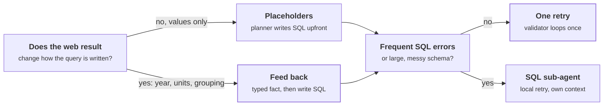

import ThemedImage from '@theme/ThemedImage';
import useBaseUrl from '@docusaurus/useBaseUrl';

# Case Study: Adding Web Search to Text-to-SQL

> Builds on: [Agent Design Patterns](../agent_design_patterns.md) ([ReAct](../agent_design_patterns.md#1-react-reason--act), [Plan-and-Execute](../agent_design_patterns.md#2-plan-and-execute), [Tool Use](../agent_design_patterns.md#4-tool-use--function-calling), [Guardrails](../agent_design_patterns.md#10-guardrails-and-validation)) · [SQL cheatsheet](../../database/sql-cheatsheet.mdx) · [Accident Case Management](./accident-case-management.md)

An existing text-to-SQL system can only answer from its own database. The ask is to add web search. This breakdown works through it as a forward deployed engineer would, and avoids the most common failure: wiring a search tool into the agent loop and letting the model paste whatever it finds into SQL.

## The brief

> An existing system lets users ask questions in plain English and answers them with SQL over an internal database. Extend it so it can also use web search when the database does not have what is needed.
>
> Example question: "Find all districts with income lower than the country average, and give me their loan amount."

:::warning[Gaps in the brief]
Which questions need the web? How much should it be trusted? How is "average" defined? What does "loan amount" mean? Framing closes these gaps.
:::

## How to approach it

<ThemedImage
  alt="Five areas in order: problem framing, decomposition, architecture, guardrails and evaluation, delivery, each with the output it produces; framing and decomposition are highlighted"
  sources={{
    light: useBaseUrl('/img/case-studies/fig-text-to-sql-1-light.svg'),
    dark: useBaseUrl('/img/case-studies/fig-text-to-sql-1-dark.svg'),
  }}
/>

*Figure C2-1: The order to work through the case study. Amber marks the two areas most often skipped. The other figures on this page use amber for LLM steps.*

| Area | Output | Failure if skipped |
|---|---|---|
| [Problem framing](#problem-framing) | Definitions and constraints | A correct query answering the wrong question |
| [Decomposition](#decomposition) | Required facts mapped to sources | A web search for data the database already has, or a missed reference value |
| [Architecture](#architecture) | Components and control flow | The LLM deciding what runs and pasting web text into SQL |
| [Guardrails and evaluation](#guardrails-and-evaluation) | Checks and success measures | Silent mismatches in year, unit, or definition |
| [Delivery](#delivery) | v1 scope and upgrade triggers | An over-engineered first version |

## Problem framing

Ask, record the answer, and note how it changes the design. Where the client can't answer, state an assumption and move on.

| Area | Question | Answer | Design impact |
|---|---|---|---|
| Definition | What does "country average" mean? | Median household income* | Fixes what the external fact must be |
| Time | Which year? | Latest year in the database* | The external fact must match that year |
| Loan amount | Total, average, or count per district? | Total outstanding per district* | Aggregation in SQL |
| Data | What does the database hold? | Income per district by year, loans | National figure is missing |
| Trust | Which web sources are acceptable? | Official statistics only* | Source allowlist |
| Access | Read only? | Yes | Read-only DB role |
| Users | Who reads the answer? | Analysts who act on the numbers* | Provenance and assumptions must be visible |

\* Working assumption, not confirmed by the client.

:::danger[The trap]
Averaging district incomes in SQL looks like it answers the question. It doesn't: the result is not the national average, because it is not population-weighted. The system must recognise that the database cannot answer this part.
:::

### Refined problem statement

> A text-to-SQL assistant that answers from the database whenever it can, fetches a missing reference fact from trusted web sources when it cannot, aligns that fact with the database on definition, year, and units, and shows the source and every assumption in its answer.

:::tip[In the interview]
State the refined problem statement and the assumptions out loud, and get agreement before designing. Then: "Let me break this into the facts the answer needs, then go through the architecture."
:::

## Decomposition

Before anything runs, the planner breaks the question into required facts. It identifies the output target, entities, metrics, operations, implicit facts, ambiguities, and dependencies.

| # | Required fact | Source | Why |
|---|---|---|---|
| 1 | District median income, latest year | SQL | In the database |
| 2 | National median household income, same year | Web | No national rows; averaging districts is wrong |
| 3 | Total loans per district | SQL | In the database, needs aggregation |
| 4 | Districts below fact 2, joined with fact 3 | SQL, depends on fact 2 | Filter and join belong in the database |

:::info[Key insight]
Comparisons imply a reference value. "Lower than country average" makes the national average its own required fact. Missing it is the most common decomposition failure.
:::

What makes this hard:

- **Capability awareness:** the system must know what the database cannot answer.
- **Alignment:** the web fact must match the database on definition, year, and units.
- **Untrusted input:** web pages are attacker-controllable text.
- **Ambiguity:** "average" and "loan amount" each have several valid meanings.
- **Multi-part questions:** one sentence holds a lookup, a filter, a join, and an aggregation.

## Architecture

### Choosing the agent pattern

<ThemedImage
  alt="ReAct loop: the user query goes to a Thought step, which picks an Action, web search or run SQL; the Observation returns to Thought until the model is done or hits the step cap, then it answers"
  sources={{
    light: useBaseUrl('/img/case-studies/fig-text-to-sql-2-light.svg'),
    dark: useBaseUrl('/img/case-studies/fig-text-to-sql-2-dark.svg'),
  }}
/>

*Figure C2-2: ReAct. Amber is an LLM step, blue is code, green is what a tool returns, grey is the user. The LLM picks every next step.*

<ThemedImage
  alt="Plan-and-execute: the planner writes the full plan upfront, code validates it, and the executor runs steps by dependency, the web fact first and then the SQL that uses it; a failed step goes to a replanner"
  sources={{
    light: useBaseUrl('/img/case-studies/fig-text-to-sql-3-light.svg'),
    dark: useBaseUrl('/img/case-studies/fig-text-to-sql-3-dark.svg'),
  }}
/>

*Figure C2-3: Plan-and-execute. Amber is an LLM step, blue is code, grey is the user. Dashed grey is the failure path to a replanner.*

| | Plan-and-execute | ReAct |
|---|---|---|
| Decides next step | Upfront, whole plan | Each step, from the last result |
| Adaptability | Low, needs replan | High |
| Predictability | High | Low |
| Parallelism | Yes, from the plan | Sequential by default |
| Latency, multi-step | Lower | Higher |
| Auditability | Plan is inspectable | Reconstruct from trace |
| Evaluation | Per stage | Mostly end to end |
| Failure mode | Wrong plan from the start | Loops, drifts, quits early |
| Best for | Known, decomposable questions | Exploratory questions |

**Choice: plan-and-execute.** The dependency is known upfront (national figure first), and people act on these numbers, so auditability wins. A bounded adaptive loop can be added later where needed.

→ See [ReAct](../agent_design_patterns.md#1-react-reason--act) and [Plan and Execute](../agent_design_patterns.md#2-plan-and-execute)

### How the agent knows what is queryable

- The planner has schema tools only: list tables and describe table. Coverage and distinct values come later.
- It maps each required fact to a verified column, or marks it external with a reason.
- Code verifies that every cited column exists in what the planner actually retrieved.
- Routing to the web is computed from the fact list, not from a free-form LLM flag.
- The planner ends by submitting its plan; code routes from it. The planner never searches and never executes.

### Where the SQL gets written

<ThemedImage
  alt="Two options side by side: in option A the planner writes SQL with a placeholder upfront and code binds the checked web value; in option B a separate SQL writer LLM step writes the query after seeing the checked fact's metadata"
  sources={{
    light: useBaseUrl('/img/case-studies/fig-text-to-sql-4-light.svg'),
    dark: useBaseUrl('/img/case-studies/fig-text-to-sql-4-dark.svg'),
  }}
/>

*Figure C2-4: Two places to write the SQL. Amber is an LLM step, blue is code. Option B adds one LLM call, the SQL writer, after the checks.*

| | Placeholder | Feed back |
|---|---|---|
| LLM calls | Fewer | One extra |
| Plan reviewable upfront | Yes | No |
| Adapts to what the web returned | No, mismatch caught late | Yes: year, units, grouping |
| Web content near SQL generation | Never | Only if done naively |

**Choice: the middle ground.** Feed back only the **typed fact metadata** (value, year, unit, definition, source), never raw page text. The value is still **bound as a parameter** in code, never pasted into SQL.

*Figure C2-5: Where to write the SQL, and when to promote it. Amber marks the v1 choice for this brief.*

### Direct tools vs sub-agents

| | Direct tools | Sub-agents |
|---|---|---|
| Complexity and latency | Lower | Higher |
| Context | Shared, but bloats | Isolated, clean results |
| Error recovery | Main agent retries | Local retry |
| Untrusted web text | In main context | Contained |
| Evaluation | Mostly end to end | Per component |

**Choice:** direct SQL execution, and a "smart tool" for the web that searches, fetches, and extracts internally and returns only a typed fact. Promote to sub-agents only when evals show context bloat, query errors, or a need for parallelism.

→ See [Tool Use](../agent_design_patterns.md#4-tool-use--function-calling)

### System overview

<ThemedImage
  alt="System overview: the user's question goes to the planner, which reads the database schema; when it needs the web, the web fact step searches trusted sources and extracts one typed fact, checks verify it, and the SQL writer, validator and execute steps run the query on the read-only database; failed checks or an invalid query after one retry go to the answer as a caveat; shared state and an audit log sit under every step"
  sources={{
    light: useBaseUrl('/img/case-studies/fig-text-to-sql-6-light.svg'),
    dark: useBaseUrl('/img/case-studies/fig-text-to-sql-6-dark.svg'),
  }}
/>

*Figure C2-6: The full system. Amber is an LLM step, blue is code, green is the database, grey is external (user, web). Dashed grey paths end in the answer as a caveat, never in silence.*

| Design principle | Failure it prevents |
|---|---|
| The LLM decides what is needed; code decides what runs. | Unpredictable tool calls and unchecked steps |
| Raw web text stops at one LLM call. | Prompt injection steering the SQL |
| External values are bound as parameters. | Hallucinated or injected values in queries |
| The database does joins and math, never the LLM. | Wrong merges and arithmetic |
| Assumptions and failures are shown, not hidden. | A confident answer to a different question |

### Component walkthrough

| Component | Type | Does |
|---|---|---|
| Planner | Agent, schema tools | Explores schema, decomposes, maps facts. Outputs SQL intent, external fact specs, assumptions. |
| Web fact | Code + one LLM call | Code searches and fetches from an allowlist. The LLM extracts a typed fact against the spec and returns "not found" instead of guessing. One broadened retry. |
| Checks | Code | Found, trusted source, definition match, year acceptable, unit match, plausible range |
| SQL writer | LLM | Parameterized SQL from intent, schema, and fact metadata. Joins and aggregation in SQL. |
| SQL validator | Code | Read-only, columns exist, placeholder used rather than a pasted value |
| Execute | Code | Binds the verified value, runs on a read-only connection |
| Answer | LLM | Results with source, year, and every assumption |

### Tracing the example

1. **Planner.** Finds the income and loans tables, notes there are no national rows, and marks the national average external. Assumptions: median household income, latest year, total loans.
2. **Web fact.** Returns the national median household income with year, unit, and source.
3. **Checks.** All pass.
4. **SQL writer.** Joins income and loans, filters below the placeholder, and aligns to the fact's year. Sums loans per district with a left join, so districts without loans show explicitly.
5. **Validator and execute.** The validator passes; execute binds the value.
6. **Answer.** Returns the table with "compared against national median household income, [year], [source]" and the assumptions.

:::note[What if the web only has last year's figure?]
The extractor returns the year it found, and checks decide if it is acceptable. The SQL writer then aligns the query to that year, or the answer states the mismatch.
:::

### Multi-part questions

If both tables are in the same database, it is still one query with a join. The architecture does not change. What does change:

- **Join keys:** IDs vs names, casing.
- **Grain:** loans per borrower need aggregation to the district first.
- **Time alignment:** both sides on the same year.
- **No matches:** districts with no loans must still appear.

| Situation | Design change |
|---|---|
| Same database | One query with a join |
| Data in another system | Dependent steps, results passed as parameters |
| Independent sub-questions | Parallel steps, merged in code |
| Many chained sub-questions | Full step graph with dependencies |

**Push joins and math into the database; combine across sources in code.** The LLM never joins lists or does arithmetic.

In the [Accident Case Management](./accident-case-management.md#what-goes-where-sql-vs-vectors) case study, officers get predefined SQL tools instead of text-to-SQL.

| Approach | Suits | Made safe by |
|---|---|---|
| Predefined SQL tools | Fixed, high-risk questions from frontline users | Only anticipated queries exist; access enforced in each function |
| Text-to-SQL | Open analytical questions | Read-only access, validation, parameter binding |

## Guardrails and evaluation

| Guardrail | Rule | Failure it prevents |
|---|---|---|
| Source allowlist | Only trusted statistical sources | Low-quality or adversarial pages |
| Typed facts only | Raw web text stops at the extractor | Prompt injection into SQL generation |
| Parameter binding | Values enter SQL only through binding | Injected or invented values |
| Read-only access | Read-only role and connection | Any write to the database |
| Provenance | Every external value shows source and year | Unverifiable numbers |
| Visible caveats | Failed checks become caveats, not silence | Confident answers on bad data |

| Metric | Measures |
|---|---|
| Decomposition test set | Questions → expected fact-to-source mapping. Re-run on prompt or model changes. |
| Extraction accuracy | Right value, definition, and year from the web |
| SQL execution accuracy | Results match a reference query |
| End-to-end golden set | Hybrid questions with expected answers, including adversarial cases: definition mismatch, stale year, conflicting sources |
| Check failure rate | How often external facts fail alignment |
| Latency and cost per question | Whether the extra LLM call is worth it |

→ See [Guardrails and Validation](../agent_design_patterns.md#10-guardrails-and-validation)

## Delivery

**v1 scope:** planner with schema tools, web fact smart tool, checks, SQL writer, validator, execute, answer.

**Deliberately left out:** clarifying questions (state assumptions instead), replanning (surface failures as caveats), sub-agents, caching, parallelism.

<ThemedImage
  alt="LangGraph node graph: START to the planner agent node, which calls schema tools; a conditional edge routes to web_fact and checks when the web is needed, otherwise straight to sql_writer; sql_validator retries the writer once, then execute_sql, answer and END; failed checks or validation go to answer"
  sources={{
    light: useBaseUrl('/img/case-studies/fig-text-to-sql-7-light.svg'),
    dark: useBaseUrl('/img/case-studies/fig-text-to-sql-7-dark.svg'),
  }}
/>

*Figure C2-7: v1 as a LangGraph graph. The corner tag names the node type: agent node, LLM node, function node. Amber is an LLM, blue is code, grey is a conditional edge. Dashed grey is a failure path.*

There is only one agent node. All routing is code reading shared state.

| Trigger observed in evals or usage | Add |
|---|---|
| Answers often rest on wrong assumptions | Ask-user step for material ambiguity |
| Check failures frequent but fixable | Replan loop, capped at 1 to 2 retries |
| Repeated lookups, inconsistent answers | Fact cache with a TTL |
| Frequent SQL errors, large schema | SQL sub-agent with local retry |
| Slow multi-step questions | Parallel execution |
| Planner over- or under-explores | Separate discovery stage with a budget |

## Summary

**Decompose into required facts before choosing tools.** Comparisons imply a reference fact.

**The database first, the web only for gaps.** And never a misleading substitute like an unweighted average.

**The LLM decides what is needed; code decides what runs.** One agent node, code routing.

**Contain untrusted content.** Raw web text stops at one extraction call; everything after sees a typed fact.

**Bind, never paste.** External values enter SQL only as parameters.

**Start simple and extend on evidence.** Every addition is tied to a failure seen in evals.

One line per layer

- **Planner.** Schema tools only; maps each fact to a verified column or marks it external; submits a plan.
- **Web fact.** Code searches and fetches; one LLM call extracts a typed fact.
- **Checks.** Code verifies source, definition, year, unit, range.
- **SQL.** Written with fact metadata, validated, executed read-only with the value bound.
- **Answer.** Results with provenance and assumptions; failures shown as caveats.

## Follow-up questions

**Why not let the agent search and write SQL in one ReAct loop?**

Answer

Raw web text would flow into SQL generation, execution order would be unpredictable, and checks could be skipped. Plan-and-execute keeps the order fixed and every step testable.

**How does it know the database cannot answer?**

Answer

The planner maps each fact to a column it has actually described, and code verifies the columns exist. Only facts with no match, with a stated reason, go to the web.

**What if the web figure is for a different year?**

Answer

The extractor records the year it found, and checks decide if it is acceptable. The SQL writer aligns to it, or the answer states the mismatch.

**What if two sources disagree?**

Answer

Prefer the allowlist's primary source. Report both if they differ beyond a threshold. Never average them silently.

**How do you stop prompt injection from web pages?**

Answer

Allowlisted sources, raw text only reaches the extractor, typed output only, values bound as parameters, and a read-only database.

**When would you use sub-agents?**

Answer

When evals show context bloat, frequent SQL errors on a large schema, or a need for parallel lookups.

**How do you evaluate it?**

Answer

Per stage (decomposition, extraction, SQL) plus an end-to-end golden set with adversarial cases.

