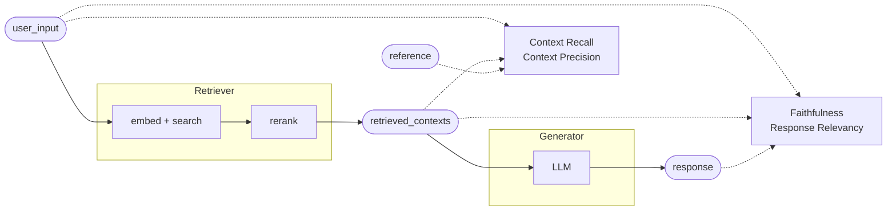

# RAG Evaluation with RAGAS

> A RAG pipeline has two places to fail and one output. Evaluation is the problem of attributing a bad answer to the retriever or the generator, before you start tuning either.

Worked example throughout: a **filings Q&A assistant** over SEC 10-K and 10-Q filings for Northwind Energy. Analysts ask questions like *"What drove the change in operating margin in FY2025?"* and the system retrieves chunks from the filing and answers over them.

---

## Should I use RAGAS?

RAGAS is a metric library for RAG pipelines. It decomposes answers into claims and scores them with a judge LLM, so you get per-component scores instead of one end-to-end "is this good" number.

| Use RAGAS when | Skip RAGAS when |
|---|---|
| You have a retriever and a generator and need to know which one is wrong | You have no retrieval step — plain LLM-as-judge is enough |
| Answers are free text, so exact match and BLEU are meaningless | Outputs are structured JSON you can assert against directly |
| You are comparing chunk sizes, embedding models, or rerankers | You are comparing prompts only — a simpler judge rubric is cheaper |
| You need scores in CI to catch regressions | You have fewer than ~20 eval questions, where score noise swamps the signal |

:::info Tradeoff
Every LLM-based metric is itself an LLM call, often several. A 100-question set with four metrics is a few hundred judge calls per run. Budget for it, and see [Cost and runtime](#cost-and-runtime).
:::

---

## What you're measuring

A RAG answer passes through two components, and each has its own failure mode.

- **Retriever** — pulls chunks for the question. Fails by missing the chunk that holds the answer, or by burying it under irrelevant ones.
- **Generator** — writes the answer from those chunks. Fails by inventing facts the chunks do not support, or by drifting off the question.



Two metrics score the chunks. Two score the answer. That split is the whole point: a low faithfulness score with high context recall means the retriever did its job and the generator hallucinated.

The `reference` — the golden answer, written once per question — is what turns retrieval scoring from "do these chunks look plausible" into "do these chunks contain the answer".

### The four core metrics

| Metric | Side | Needs | A low score means |
|---|---|---|---|
| **Context Recall** | Retriever | `user_input`, `retrieved_contexts`, `reference` | The answer-bearing chunk was never retrieved |
| **Context Precision** | Retriever | `user_input`, `retrieved_contexts`, `reference` | The right chunk was retrieved but ranked below noise |
| **Faithfulness** | Generator | `user_input`, `retrieved_contexts`, `response` | The answer states things the chunks do not support |
| **Response Relevancy** | Generator | `user_input`, `response` | The answer is grounded but does not address the question |

Start with these four. Everything else in RAGAS is a variant or a specialisation.

---

## How each metric is computed

Knowing the mechanics matters, because each metric fails in a way you can only recognise if you know what the judge is actually being asked.

### Faithfulness

The judge decomposes the response into atomic claims, then checks each claim against the retrieved contexts.

```text title="Claim decomposition — Northwind FY2025"
response: "Operating margin fell to 11.2% in FY2025 from 14.8%, driven by higher
           well servicing costs and a $40M impairment on the Permian assets."

claims:
  1. Operating margin was 11.2% in FY2025          → supported by nw10k_p42  ✅
  2. Operating margin was 14.8% in FY2024          → supported by nw10k_p42  ✅
  3. Well servicing costs increased                → supported by nw10k_p43  ✅
  4. A $40M impairment was taken on Permian assets → not in any chunk        ❌

faithfulness = 3 / 4 = 0.75
```

The score is supported claims over total claims. It says nothing about whether the answer is *correct* — only whether it is *grounded in what was retrieved*. An answer can be perfectly faithful to a chunk that itself is the wrong chunk.

:::warning
Faithfulness punishes verbosity. Every extra sentence adds claims to the denominator, and background statements the model adds from parametric knowledge ("the energy sector faced headwinds in 2025") count as unsupported. If faithfulness drops after a prompt change, check whether you made the model chattier before you blame retrieval.
:::

### Context Recall

The judge decomposes the **reference** answer into claims, then checks whether each one is attributable to the retrieved contexts.

```text title="Recall — did we retrieve enough to answer?"
reference: "Operating margin fell to 11.2% from 14.8%, driven by higher well
            servicing costs and a $40M Permian impairment."

reference claims attributable to retrieved_contexts:
  margin 11.2% / 14.8%       → nw10k_p42  ✅
  well servicing costs up    → nw10k_p43  ✅
  $40M Permian impairment    → missing    ❌

context_recall = 2 / 3 = 0.67
```

This is the metric that tells you the ceiling. No prompt engineering fixes a recall of 0.67 — the information is not in the context window.

### Context Precision

Precision@K weighted by whether each rank position holds a relevant chunk.

```text title="Precision@K"
Context Precision@K = Σ (Precision@k × v_k) / total relevant chunks

  v_k        = 1 if the chunk at rank k is relevant, else 0
  Precision@k = relevant chunks in the top k / k
```

Rank matters. Retrieving the right chunk at position 8 of 10 scores far worse than at position 1, and that reflects reality: chunks late in a long context get less attention from the generator.

RAGAS ships three variants, and the choice depends on what ground truth you have.

| Variant | Ground truth needed | Use when |
|---|---|---|
| `LLMContextPrecisionWithReference` | Golden answer | Default — you have reference answers |
| `LLMContextPrecisionWithoutReference` | None (judges against `response`) | No labels yet, want a directional signal |
| `NonLLMContextPrecisionWithReference` | Golden chunk texts | You labelled which chunks are correct; no judge calls, deterministic |

### Response Relevancy

The judge generates several questions that the response *would* be a good answer to, embeds them, and averages their cosine similarity to the real `user_input`.

```text title="Reverse-question check"
response:  "Operating margin fell to 11.2% in FY2025 from 14.8%..."

generated questions:
  "How did Northwind's operating margin change in FY2025?"   sim 0.94
  "What was Northwind's FY2025 operating margin?"            sim 0.91
  "Why did Northwind's profitability decline?"               sim 0.88

response_relevancy = mean = 0.91
```

Low scores catch evasive and padded answers: "I don't have enough information, but generally in the energy sector..." scores badly because the reverse-questions drift away from what was asked.

:::info Tradeoff
Response relevancy needs an embedding model as well as a judge LLM, and it is the metric most sensitive to embedding choice. Keep the embedding model pinned across runs or your scores are not comparable.
:::

---

## Building the eval set

The dataset is four fields per row. Field names are fixed by RAGAS.

| Field | What it holds | Who produces it |
|---|---|---|
| `user_input` | The analyst question | You (or synthetic generation) |
| `retrieved_contexts` | List of chunk texts your retriever returned | Your pipeline, at eval time |
| `response` | Your generated answer | Your pipeline, at eval time |
| `reference` | The golden answer | A human, or generated then reviewed |

Only `user_input` and `reference` are the fixed asset. The other two are regenerated every run, which is what makes the set a regression test rather than a snapshot.

### Hand-written first, synthetic second

Write 20–30 questions by hand before generating anything. You need the distribution to match real analyst usage: single-fact lookups, multi-chunk comparisons, and questions the filing genuinely cannot answer.

```python title="eval_set.py"
GOLDEN = [
    {
        "user_input": "What was Northwind's operating margin in FY2025?",
        "reference": "11.2%, down from 14.8% in FY2024.",
    },
    {
        "user_input": "How did segment revenue split between Permian and Bakken in FY2025?",
        "reference": "Permian $1.84B, Bakken $920M.",
    },
    {
        "user_input": "What is Northwind's FY2027 production guidance?",
        "reference": "The filing does not disclose FY2027 production guidance.",
    },
]
```

That third row matters. An eval set with no unanswerable questions cannot detect the failure mode that hurts most in finance: a confident number the filing never stated.

### Synthetic expansion

Once the hand-written set is stable, scale it with `TestsetGenerator`, which builds a knowledge graph over your documents and derives questions from it.

```python title="generate_testset.py"
from langchain_community.document_loaders import DirectoryLoader
from langchain_anthropic import ChatAnthropic
from ragas.llms import LangchainLLMWrapper
from ragas.testset import TestsetGenerator

docs = DirectoryLoader("filings/northwind/", glob="**/*.md").load()

generator = TestsetGenerator(
    llm=LangchainLLMWrapper(ChatAnthropic(model="claude-sonnet-5")),
    embedding_model=embeddings,
)
testset = generator.generate_with_langchain_docs(docs, testset_size=50)
testset.to_pandas().to_csv("northwind_testset.csv", index=False)
```

:::warning
Synthetic questions are unreviewed labels. The generator writes both the question and the reference from the same documents, so any chunking bug that split a table in half becomes a golden answer with half a table in it. Review the set before it becomes your regression baseline, and never let a synthetic row block a release without a human having read it.
:::

---

## Running an evaluation

The pipeline runs first, RAGAS scores the output. RAGAS does not call your retriever — you hand it the contexts your retriever already returned.

```python title="run_eval.py"
from langchain_anthropic import ChatAnthropic
from ragas import EvaluationDataset, evaluate
from ragas.llms import LangchainLLMWrapper
from ragas.metrics import (
    Faithfulness,
    LLMContextPrecisionWithReference,
    LLMContextRecall,
    ResponseRelevancy,
)

from filings_rag import answer  # your pipeline: question -> (answer, chunks)
from eval_set import GOLDEN

rows = []
for case in GOLDEN:
    response, chunks = answer(case["user_input"])
    rows.append({
        "user_input": case["user_input"],
        "retrieved_contexts": [c.text for c in chunks],
        "response": response,
        "reference": case["reference"],
    })

evaluator_llm = LangchainLLMWrapper(ChatAnthropic(model="claude-sonnet-5", temperature=0))

result = evaluate(
    dataset=EvaluationDataset.from_list(rows),
    metrics=[
        LLMContextRecall(),
        LLMContextPrecisionWithReference(),
        Faithfulness(),
        ResponseRelevancy(embeddings=embeddings),
    ],
    llm=evaluator_llm,
)

print(result)
result.to_pandas().to_csv("runs/2026-08-05.csv", index=False)
```

Always write the per-row dataframe to disk. The aggregate scores tell you something moved; only the row-level output tells you which questions moved and why.

:::tip
Pin the judge model and set `temperature=0`. A judge upgrade shifts every score at once, which is indistinguishable from a pipeline regression unless you re-baseline deliberately.
:::

---

## Reading the scores

Never read a metric alone. The diagnosis lives in the *combination*.

| Recall | Precision | Faithfulness | Diagnosis | Fix |
|---|---|---|---|---|
| Low | — | — | The chunk with the answer was never retrieved | Chunk size, embedding model, hybrid BM25, raise `k` |
| High | Low | Low/mixed | Right chunk retrieved, buried under noise | Add a reranker, lower `k`, tighten the metadata filter |
| High | High | Low | Retrieval is fine, the model is inventing | Prompt: cite chunk IDs, forbid outside knowledge; drop generation temperature |
| High | High | High, relevancy low | Grounded but answering a different question | Query rewriting, or the answer is padded with unasked-for context |
| High | High | High | Pipeline is healthy at this `k` | Tune for cost: cut `k`, try a smaller generator |

The order to act in is fixed: **recall, then precision, then faithfulness, then relevancy.** Fixing a generator prompt while recall is 0.6 is wasted work, because the ceiling has not moved.

### What counts as a good score

There is no universal threshold. Scores are only comparable within one eval set, one judge model, and one embedding model. Baseline your current pipeline, then treat every change as a delta.

| Signal | Reading |
|---|---|
| Faithfulness below ~0.8 in a finance domain | Ship-blocking. A wrong number in a filing answer is worse than no answer |
| Any single row at faithfulness 0 | Read that row by hand. Often a retrieval miss the aggregate hides |
| Aggregate moves under ~0.03 | Noise, not signal, on a set of 50 rows. See below |

:::warning
Judge scores are not deterministic even at temperature 0. Run the baseline twice before you trust a small delta, and treat anything inside that run-to-run spread as noise. Claim-decomposition metrics wobble most, because the claim count in the denominator can itself change between runs.
:::

---

## Cost and runtime

Each LLM-based metric costs at least one judge call per row, and claim-based metrics cost several.

| Lever | Effect |
|---|---|
| Use a smaller judge (Haiku-class) for CI, a larger one for release gates | Biggest cost cut; re-baseline when you switch |
| Use `NonLLMContextPrecisionWithReference` where you have labelled chunks | Removes judge calls from retrieval scoring entirely |
| Run the full set nightly, a 20-row smoke subset per PR | Keeps PR feedback fast |
| Cache pipeline outputs when only the metric config changed | Avoids re-running retrieval and generation |

Track eval spend the same way you track pipeline spend. See [Token and cost tracking](./concepts/evaluation-observability.md#token-and-cost-tracking).

---

## Wiring it into CI

Gate on deltas against a stored baseline, not absolute thresholds — absolute thresholds either block everything or nothing.

```python title="ci_gate.py"
BASELINE = {"context_recall": 0.82, "faithfulness": 0.91}
TOLERANCE = 0.03

scores = result._repr_dict
regressions = [
    f"{name}: {scores[name]:.3f} vs baseline {base:.3f}"
    for name, base in BASELINE.items()
    if scores[name] < base - TOLERANCE
]
if regressions:
    raise SystemExit("RAG regression:\n" + "\n".join(regressions))
```

Re-baseline explicitly, in its own commit, whenever you change the judge model, the embedding model, or the eval set. Otherwise the baseline drifts along with the thing it is supposed to be measuring.

---

## Before you ship

| Check | Severity | Why |
|---|---|---|
| Eval set contains unanswerable questions | **Critical** | Otherwise you cannot detect confident fabrication |
| Judge model and embedding model pinned in config | **Critical** | Unpinned models make every historical score incomparable |
| Per-row output persisted per run | **Critical** | Aggregates cannot localise a regression |
| Baseline measured twice to establish noise floor | **Should** | Prevents chasing deltas inside run-to-run variance |
| Synthetic rows human-reviewed before entering the baseline | **Should** | Generated references inherit chunking bugs |
| Eval judge is a different model from the generator | **Should** | Self-evaluation inflates faithfulness |
| Cost per eval run tracked | **Should** | Metric sets grow quietly until CI is the biggest line item |

---

## Where RAGAS stops

RAGAS scores a single question-answer pair against its retrieved contexts. It does not score a multi-step agent that retrieves, reflects, and retrieves again — for that you need trace-level evaluation over the whole run, covered in [Evaluation & Observability](./concepts/evaluation-observability.md#execution-tracing). If your filings assistant grows a planning loop, RAGAS becomes the metric for each retrieval step, not for the run.

It also does not measure latency, cost, or answer style. Those stay in your own harness alongside the RAGAS scores.

---

## Further reading

- [RAGAS documentation](https://docs.ragas.io/en/stable/) — metric reference and API
- [Available metrics](https://docs.ragas.io/en/stable/concepts/metrics/available_metrics/) — full list including entity recall, noise sensitivity, factual correctness
- [Testset generation](https://docs.ragas.io/en/stable/getstarted/rag_testset_generation/) — knowledge-graph-based synthetic question generation
- [RAGAS: Automated Evaluation of Retrieval Augmented Generation](https://arxiv.org/abs/2309.15217) — the original paper
- [Context Engineering](./concepts/context-engineering.md) — chunking and relevance scoring, the levers a low recall score sends you to
