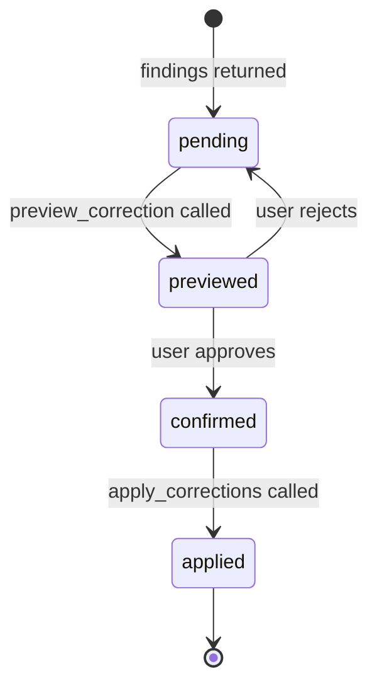
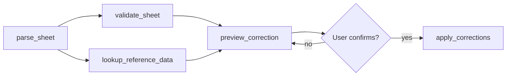

# Implementation

**Session state, tool definitions, and loop prevention**

---

## Session state

A ReAct agent without explicit state management will re-run validation on every turn — expensive and unsafe in a multi-turn correction session. Five fields cover everything the agent needs:

| Field | Type | Purpose |
|---|---|---|
| `file_ref` | string | Path or ID of the uploaded file |
| `validation_scope` | list of strings | Columns the user asked to check |
| `findings` | dict keyed by column | Per-column error list from `validate_sheet` |
| `correction_status` | dict keyed by column | One of: `pending`, `previewed`, `confirmed`, `applied` |
| `exported` | bool | Whether the corrected file has been returned |

`correction_status` per column is the key one — it's what prevents re-applying a correction that already ran and gives the HITL gate its memory.

### State machine

Each column moves through states in one direction only.

<div align="center">



</div>

### Where state lives

State is injected as a YAML block at the end of each system prompt and updated after each tool call. This is **in-context memory** — the agent's working memory for the current session, held in the active prompt rather than an external store. → [Memory Management — in-context type](../../agent_design_patterns.md#9-memory-management)

```yaml
file_ref: uploads/vendor_q2.csv
validation_scope: [product_code, sku_variant]
findings:
  product_code: 47 mismatches
  sku_variant: 12 nulls
correction_status:
  product_code: confirmed
  sku_variant: pending
exported: false
```

:::tip
For multi-session use, serialise this block to a JSON record keyed by session ID. The schema stays the same — only the persistence layer changes from in-context to external (episodic) memory.
:::

---

## Tool ordering

Not all tools are interchangeable. Some have hard dependencies; others can run in parallel.

<div align="center">



</div>

| Constraint | Rule |
|---|---|
| `parse_sheet` first | All other tools depend on the parsed file |
| `validate_sheet` ∥ `lookup_reference_data` | Independent — agent emits both as a single parallel tool call to halve validation latency |
| `preview_correction` before `apply_corrections` | Hard requirement — no skipping |
| `apply_corrections` only after confirmation | HITL gate — enforced by prompt + status check |

:::danger
The agent must never call `apply_corrections` for a column unless `correction_status[column] == "confirmed"`. Enforce this in two places: the system prompt (instruction) and the state check (mechanism). The prompt alone is not enough.
:::

**Handling ambiguous scope** — if the user says "check the product data" without specifying columns, call `parse_sheet` first, surface the column list, and confirm scope before calling `validate_sheet`. Calling on all columns by default produces noisy, wasteful responses.

---

## Tool definitions

### `parse_sheet`

Parses an uploaded file into a structured format the agent can reason about. Call once per session immediately after upload.

| | Parameter | Type | Description |
|---|---|---|---|
| **In** | `file_ref` | string | Path or ID of the uploaded file |
| **Out** | `columns` | list of strings | Column names in the file |
| | `row_count` | int | Number of data rows |
| | `sample` | list of dicts | First 5 rows |

---

### `validate_sheet`

Runs validation rules against specified columns. Can run in parallel with `lookup_reference_data`.

| | Parameter | Type | Description |
|---|---|---|---|
| **In** | `file_ref` | string | Parsed file reference |
| | `columns` | list of strings | Columns to validate |
| | `rules` | dict | Optional rule overrides (e.g. skip DRAFT rows) |
| **Out** | `findings` | dict | `{column: [{row, value, error_type}]}` |
| | `summary` | dict | `{column: error_count}` — for plain-English summaries |

---

### `lookup_reference_data`

Queries BigQuery for valid reference values. Can run in parallel with `validate_sheet`.

| | Parameter | Type | Description |
|---|---|---|---|
| **In** | `columns` | list of strings | Columns needing reference data |
| **Out** | `reference` | dict | `{column: [valid_values]}` |
| | `table_names` | dict | Which BQ table each column was looked up from |

---

### `preview_correction`

Computes what `apply_corrections` would change — without writing anything. One column at a time.

| | Parameter | Type | Description |
|---|---|---|---|
| **In** | `file_ref` | string | Parsed file reference |
| | `column` | string | Single column to preview |
| | `findings` | list | Error list for this column |
| | `reference` | list | Valid values for this column |
| **Out** | `diff` | list of dicts | `{row, old_value, new_value}` |
| | `change_count` | int | Rows that would change |
| | `unchanged_count` | int | Rows that couldn't be auto-corrected |

---

### `apply_corrections`

Writes corrections to the file. Irreversible within the session. Only callable when `correction_status[column] == "confirmed"`.

| | Parameter | Type | Description |
|---|---|---|---|
| **In** | `file_ref` | string | Parsed file reference |
| | `column` | string | Column to correct |
| | `diff` | list of dicts | The exact diff from `preview_correction` |
| **Out** | `updated_file_ref` | string | Reference to the corrected file |
| | `applied_count` | int | Rows actually changed |

---

## Schema design notes

**Keep summaries separate from details.** `validate_sheet` returns both `findings` (full list) and `summary` (counts). The agent uses `summary` for user responses and passes `findings` to downstream tools — don't force the agent to compute counts from a raw list.

**One column at a time for write-path tools.** `preview_correction` and `apply_corrections` take a single column. This keeps the HITL checkpoint unambiguous — each approval covers exactly one column — and the `correction_status` state machine simple. → [HITL](../../agent_design_patterns.md#8-human-in-the-loop-hitl)

**Pass diffs by value.** `apply_corrections` receives the full diff, not a "apply the preview" instruction. This guarantees exactly what was shown to the user is what gets written — an action-gating guardrail at the tool interface level. → [Guardrails — action gating](../../agent_design_patterns.md#10-guardrails-and-validation)

---

## Loop prevention

| Loop pattern | Cause | Fix |
|---|---|---|
| Re-validating validated columns | Agent can't tell what's already been checked | Check `findings` in state before calling `validate_sheet` — use cached result if present |
| Re-previewing after rejection | Agent calls `preview_correction` again with same inputs | On rejection, set status back to `pending` and ask what to change before re-previewing |
| Applying without confirmation | Agent treats "yes" (to a summary question) as write confirmation | System prompt must specify: confirmation only counts after a diff has been shown in the current turn |

The "re-validating" loop is a memory management problem — caching findings in session state is exactly what in-context memory is for. Without it, the agent has no way to know validation already ran and will repeat expensive tool calls. → [Memory Management](../../agent_design_patterns.md#9-memory-management)

:::warning
`apply_corrections` is not idempotent — calling it twice on the same column will attempt to re-correct an already-corrected file. Once `correction_status[column] == "applied"`, block further calls at the state layer regardless of user input. If a user asks to redo an applied correction, offer to start a new session with the corrected file as input.
:::
