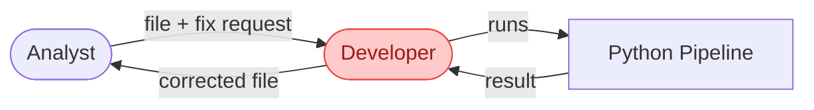
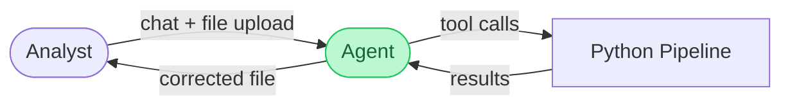
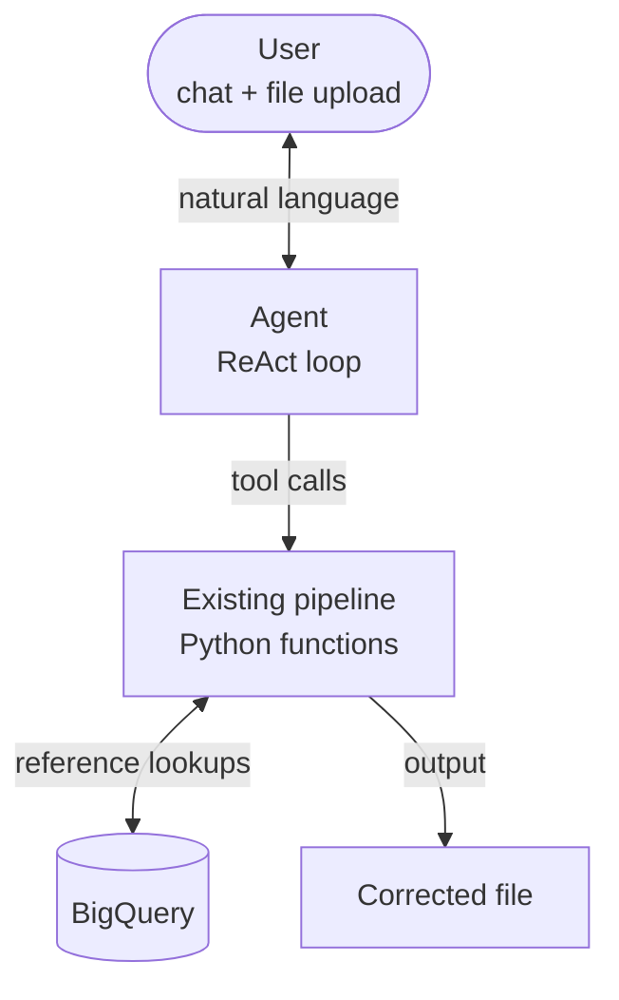
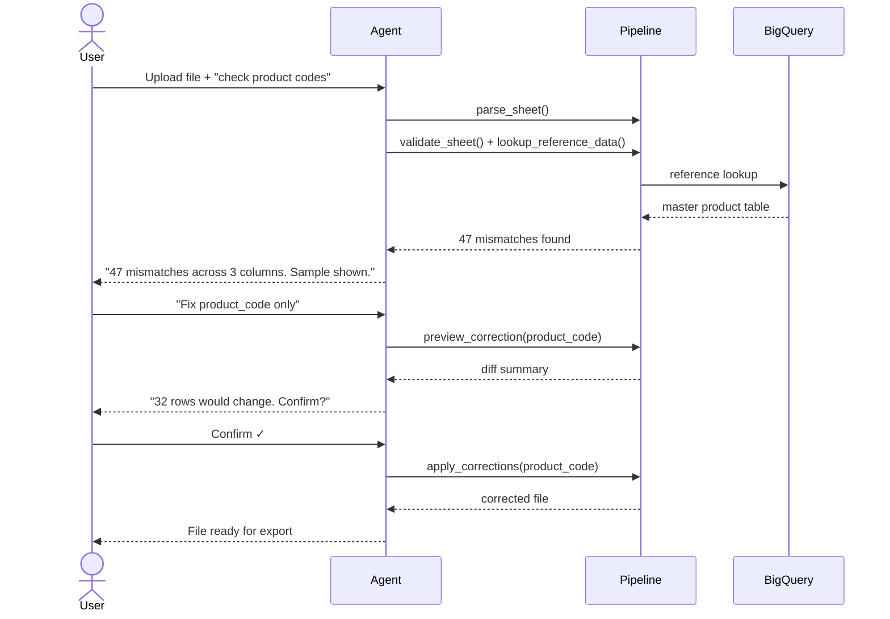
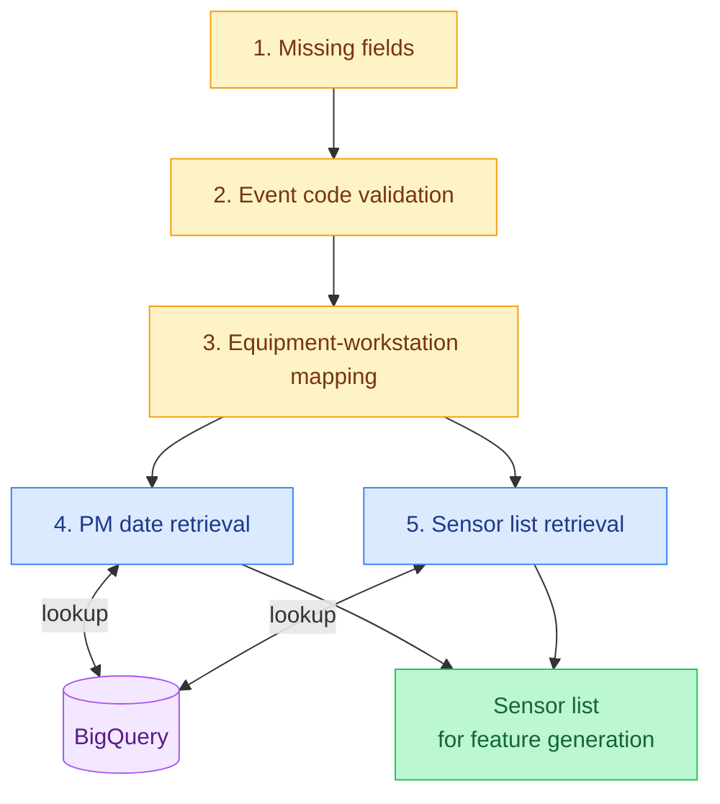
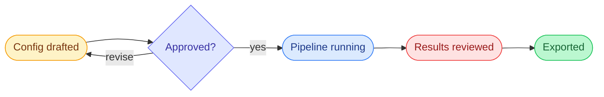
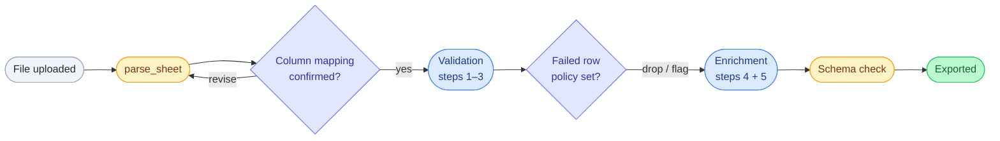

# Data validation and correction agent

:::info Prerequisite
This page applies patterns from [Agent Design Patterns](../../agent_design_patterns.md). Familiarity with ReAct, Tool Use, HITL, and Parallelization helps, but the relevant concepts are linked inline throughout.
:::

---

## The problem

A data team receives Excel/CSV files from external partners with errors: wrong types, nulls in required fields, values that don't match reference data in BigQuery. A Python validation pipeline already handles this, but a developer has to run it.

**Before: developer is the bottleneck**

<div align="center">



</div>

**After: agent removes the bottleneck**

<div align="center">



</div>

:::note Goal
Let non-technical users drive that same pipeline through chat. Upload a file, describe what to check, review findings, approve corrections, and export clean data. No code.
:::

:::tip Success criteria
An analyst takes a vendor file from raw to corrected without involving engineering. No correction is applied without explicit approval.
:::

---

## Why an agent?

**Scope varies per file.** The columns to check, reference tables to query, and rules to apply change with every request. A form or dropdown can't handle open-ended instructions like "check product codes but skip rows where status is DRAFT."

**Corrections need judgment.** A mismatched product code might be a typo, or a legitimate variant not yet in the master table. The agent surfaces findings but must not write anything back without explicit confirmation.

**Live tool calls are required.** BigQuery lookups and validation functions need to run against the actual file at runtime. A single LLM call over the file content can't do this.

:::warning
The agent is justified when all three hold. Remove any one and a simpler design wins. Agents add latency, cost, and debugging overhead. Don't reach for them by default.
:::

### Why ReAct and not a chain?

If scope were fixed (same columns, same rules every time), the tool sequence would be predetermined. That's a chain.

ReAct is justified because scope and tool order depend on the file and the user's instruction. The agent can't know upfront which columns to validate, whether to call `lookup_reference_data`, or whether a preview is needed until it sees both. The number and sequence of tool calls is unknown at design time. → [ReAct](../../agent_design_patterns.md#1-react-reason--act)

---

## Architecture

The system has three layers. The agent wraps the existing pipeline without modifying it.

<div align="center">



</div>

| Layer | What it does |
|---|---|
| Chat interface | User uploads file, types requests, reads plain-English summaries |
| Agent (ReAct loop) | Interprets intent, picks tools, tracks session state, gates writes |
| Existing pipeline | `parse_sheet`, `validate_sheet`, `lookup_reference_data`, `preview_correction`, `apply_corrections` (all unchanged) |

### Session flow

<div align="center">



</div>

`validate_sheet` and `lookup_reference_data` run concurrently since they are independent. `apply_corrections` is only reachable after explicit confirmation in the same session.

### What the ReAct loop looks like internally

Inside each agent turn, the model cycles through Thought → Action → Observation before responding. A representative turn:

| Step | Content |
|---|---|
| **Thought** | User wants product codes checked. `file_ref` is available from `parse_sheet`. Validation findings and reference data are independent, so both can be called in parallel. |
| **Action** | `validate_sheet(columns=["product_code"])` + `lookup_reference_data(columns=["product_code"])`, emitted as a single parallel tool call |
| **Observation** | `validate_sheet` → 47 mismatches · `lookup_reference_data` → 312 valid codes from `product_master` |
| **Thought** | Enough to summarize. No write action yet because the user hasn't confirmed scope. |
| **Response** | "Found 47 mismatches in product_code across 312 valid reference values. Want me to preview what a correction would change?" |

The **Thought** step is where the agent decides whether to call tools and which ones. That decision-making is what distinguishes a ReAct loop from a chain.

---

## Design patterns

| Pattern | Used? | How it applies here |
|---|---|---|
| Tool Use | Yes | Wraps existing tested pipeline functions with no reimplementation. Emits `validate_sheet` + `lookup_reference_data` as parallel calls in a single turn. → [Tool Use](../../agent_design_patterns.md#4-tool-use--function-calling) |
| ReAct | Yes | Tool order depends on file content and user intent, so it cannot be fixed upfront. → [ReAct](../../agent_design_patterns.md#1-react-reason--act) |
| HITL | Yes | Interrupt point is after `preview_correction`. `apply_corrections` is structurally unreachable until the user confirms in the same turn. → [HITL](../../agent_design_patterns.md#8-human-in-the-loop-hitl) |
| Parallelization | Partial | `validate_sheet` and `lookup_reference_data` are independent and emitted as a single parallel call, cutting validation wait roughly in half. → [Parallelization](../../agent_design_patterns.md#6-parallelization--fan-out) |
| Plan-and-Execute | Optional | Worth adding for large batch jobs; overkill for single-file sessions. → [Plan-and-Execute](../../agent_design_patterns.md#2-plan-and-execute) |
| Orchestrator-Subagent | No | Single file, single session with no domain separation needed. |
| Reflection | No | Corrections are deterministic with no generative output to critique. |

:::warning
`apply_corrections` is structurally unreachable without user confirmation. This is an architectural guarantee, not a prompt instruction.
:::

### How the gate works

Each column tracks a status: `pending → previewed → confirmed → applied`. `apply_corrections` checks `correction_status[column] == "confirmed"` before executing. A column only reaches `confirmed` after the user approves a diff in the same turn.

Three layers enforce this:

| Layer | Mechanism |
|---|---|
| State check | `apply_corrections` reads `correction_status` and refuses if the column isn't `confirmed` |
| System prompt | Agent is instructed never to call `apply_corrections` without an explicit approval |
| Pass-by-value diff | `apply_corrections` receives the exact diff object rather than a vague "apply it" instruction, so what the user approved is byte-for-byte what gets written |

The state check is the load-bearing one. Even if the model misreads a "yes" as confirmation, the column can't be `confirmed` unless the approval actually followed a previewed diff that turn. → [State machine and tool ordering](./implementation.md#tool-ordering)

---

## When to use this design

| Signal | Good fit | Consider simpler |
|---|---|---|
| Task scope | Varies per session | Same ruleset every time |
| Write risk | Consequential | Low-stakes, reversible |
| User type | Non-technical | Can run the pipeline directly |
| Pipeline | Already exists and tested | Would need to build from scratch |
| Session pattern | Multi-turn review | Upload + get report and done |

:::warning
Three or more "simpler" signals? Reconsider the agent design.
:::

**Simpler alternatives**

- **Scheduled pipeline + report**: works for fixed schemas with a consistent ruleset, but breaks down when users need to vary scope.
- **Fixed-form UI**: good for predictable tasks with a small option space, but can't handle open-ended instructions.
- **Single-shot LLM call**: sufficient for small files where findings alone are enough. Fails on live lookups and correction workflows.

**When to go more complex**

- **Orchestrator-Subagent**: use when multiple sheets need parallel validation. → [Orchestrator-Subagent](../../agent_design_patterns.md#5-orchestratorsubagent)
- **Plan-and-Execute**: use when runs are long enough that mid-run scope changes become expensive. → [Plan-and-Execute](../../agent_design_patterns.md#2-plan-and-execute)

```
Fixed scope + technical users       → scheduled pipeline
Fixed scope + non-technical users   → fixed-form UI
Variable scope + low-stakes writes  → single-shot LLM call
Variable scope + consequential writes + existing pipeline → this design
Multi-file / parallel jobs          → Orchestrator-Subagent
```

---

## Extension: equipment sensor resolution pipeline

The base design handles open-ended validation where scope varies per session. This extension covers a stricter variant: a fixed-step pipeline where the agent's primary job is config generation rather than dynamic tool selection.

**The problem:** A maintenance team receives equipment files containing equipment IDs, workstation IDs, and event codes. A 5-step pipeline validates the data and resolves each equipment ID to a sensor list for downstream feature generation, but it needs a config specifying which file columns map to which pipeline inputs. Writing that config manually is error-prone: a misconfigured run produces a sensor list that looks correct but is drawn from the wrong equipment.

### Pipeline steps

| Step | Type | What it does |
|---|---|---|
| 1. Missing fields | Validation | Required columns are present and non-null |
| 2. Event code validation | Validation | Event codes match a reference list |
| 3. Equipment-workstation mapping | Validation | Each equipment ID maps to a valid workstation |
| 4. PM date retrieval | Enrichment | Last preventive maintenance date per equipment, from BigQuery |
| 5. Sensor list retrieval | Enrichment | Sensor list for each validated equipment ID |

<div align="center">



</div>

Amber nodes are validation steps. Blue nodes are enrichment steps that only run on rows passing steps 1–3. Steps 4 and 5 are independent of each other and can run in parallel. Output is a sensor list in the shape expected by the feature generation step.

### What changes from the base design

| | Base design | This variant |
|---|---|---|
| Agent's core task | Interpret validation scope per session | Infer column mapping and generate a config |
| Tool order | Dynamic — decided at runtime by the agent | Fixed — always steps 1 through 5 |
| Primary HITL gate | Before applying corrections | Before running the pipeline (config approval) |
| Output | Corrected input file | Sensor list for feature generation |

**Session flow**

<div align="center">



</div>

### Why ReAct still applies

Tool order is fixed, so ReAct is no longer needed to decide which tools to call. It still applies for config refinement.

The agent inspects the uploaded file, infers which column maps to equipment IDs, workstation IDs, and event codes, then drafts a config. The user may push back ("use column C for equipment ID, not B"), and the agent revises and re-presents. That back-and-forth is a genuine Thought → Action → Observation loop before the pipeline runs.

The locus of dynamic reasoning shifts from tool selection to config negotiation.

### Additional constraints

| Constraint | Why it matters |
|---|---|
| Failed row policy must be in the config | If equipment-workstation mapping fails, the pipeline needs an instruction: drop the row, flag and continue, or abort. The agent surfaces this choice during config review, not after the run. |
| Enrichment steps are conditional | Steps 4 and 5 must not run on rows that failed steps 1–3. The config should make this explicit to avoid BigQuery lookups against invalid equipment IDs. |
| Output schema is fixed | Feature generation expects a specific shape. Treat it as a system prompt constraint — not something to infer per session. |

:::warning
The config gate is the higher-risk approval. A misconfigured column mapping produces a valid-looking sensor list drawn from the wrong equipment IDs. The results gate catches pipeline failures; it cannot catch a config that ran correctly against the wrong inputs.
:::

---

## Further improvements

The extension design is functional but carries three structural weaknesses. Addressing them in order of impact:

### 1. Replace the config with per-step tool calls

The config exists because the pipeline runs as a monolithic batch job. If the pipeline exposes individual step functions, the agent calls each step directly with the column mapping as parameters — no config file, no config approval gate.

| | Config-driven (current) | Per-step functions |
|---|---|---|
| Column mapping | Written into a config, reviewed as a document | Confirmed conversationally before the first tool call |
| Failed row policy | Set upfront before any results exist | Decided after validation shows failure counts |
| Partial runs | Not possible | Agent can stop after validation and ask before enrichment |
| Risk of silent error | High — correct config, wrong columns | Lower — agent states mapping inline, user corrects naturally |

This also removes the need for config negotiation in the ReAct loop. The locus of dynamic reasoning shifts from drafting and revising a document to a short, direct confirmation before tool calls begin.

### 2. Time HITL gates to when the user has the information to decide

The current design asks for both decisions — column mapping and failed row policy — upfront in the config. Neither decision should be made before the relevant information exists.

| Decision | Current timing | Better timing |
|---|---|---|
| Column mapping | Before pipeline runs | After `parse_sheet` returns actual column names |
| Failed row policy | Before validation runs | After validation shows how many rows fail and why |

Asking "should we drop failed rows?" before validation runs forces the user to guess. Asking after — "47 rows failed equipment-workstation mapping, 3% of total. Drop, flag, or abort?" — gives them the context to decide.

### 3. Parallelize steps 4 and 5 at the pipeline level

PM date retrieval and sensor list retrieval are independent BigQuery lookups. Exposing them as separate callable functions lets the agent emit both in a single parallel tool call, consistent with how `validate_sheet` and `lookup_reference_data` are handled in the base design. Running them sequentially is wasted latency.

### 4. Fetch the output schema at session start

Hardcoding the feature generation schema in the system prompt means any downstream schema change requires a manual prompt update with no guarantee they stay in sync.

Fetch the expected schema from a registry at session start and inject it into context. The agent can then validate the enriched output against it before exporting rather than assuming the shape is correct.

### Revised session flow

Applying improvements 1 and 2, the config approval gate is replaced by two lighter, better-timed confirmation points:

<div align="center">



<p align="center" style={{fontSize:"0.85em"}}>
  <span style={{background:"#f1f5f9",border:"1px solid #94a3b8",padding:"2px 10px",borderRadius:"4px",color:"#1e293b",margin:"0 4px"}}>User</span>
  <span style={{background:"#fef3c7",border:"1px solid #f59e0b",padding:"2px 10px",borderRadius:"4px",color:"#78350f",margin:"0 4px"}}>Agent</span>
  <span style={{background:"#e0e7ff",border:"1px solid #6366f1",padding:"2px 10px",borderRadius:"4px",color:"#3730a3",margin:"0 4px"}}>HITL gate</span>
  <span style={{background:"#dbeafe",border:"1px solid #3b82f6",padding:"2px 10px",borderRadius:"4px",color:"#1e3a8a",margin:"0 4px"}}>Pipeline</span>
  <span style={{background:"#bbf7d0",border:"1px solid #22c55e",padding:"2px 10px",borderRadius:"4px",color:"#166534",margin:"0 4px"}}>Output</span>
</p>

</div>

Each HITL gate is placed immediately after the step that produces the information needed to make that decision.
