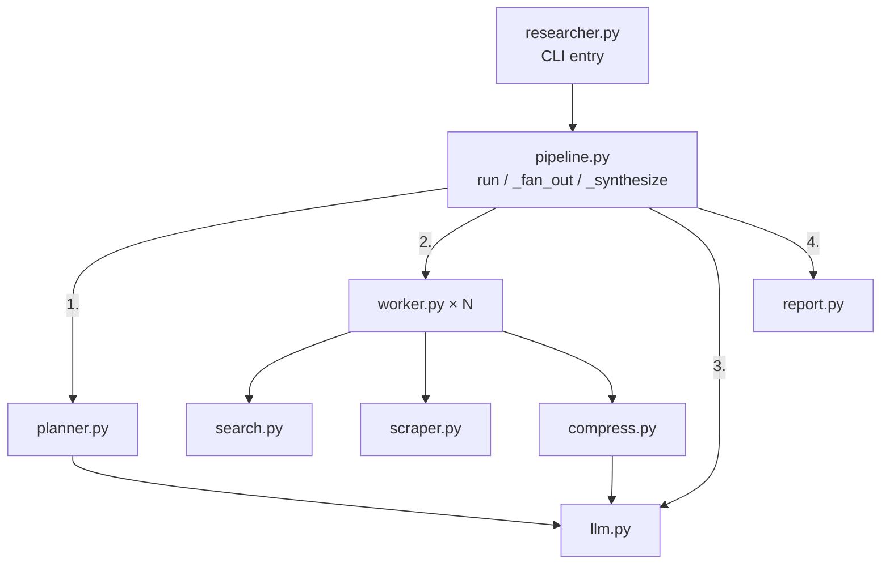
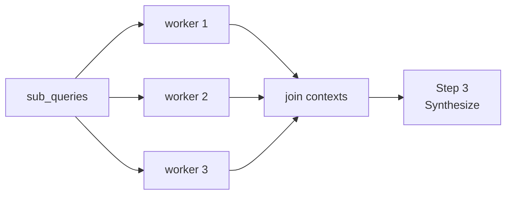
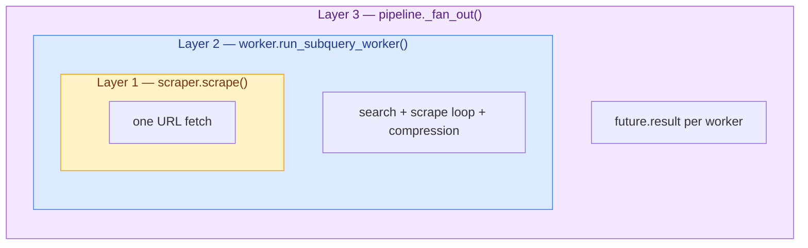

# Implementation

**A walk through the pipeline in execution order: orchestration, planning, the parallel fan-out, what happens inside a worker, and synthesis.**

---

## Start at `pipeline.py`

`ResearchPipeline.run()` is the whole control flow. Read it and you've read the architecture — everything else in this page elaborates one line of it.

```python title="pipeline.py — run()"
def run(self, query: str) -> Report:
    sub_queries = generate_sub_queries(self.llm, query, self.config.max_sub_queries)  # 1. plan
    contexts = self._fan_out(sub_queries)                                             # 2. research
    context = "\n\n".join(c for c in contexts if c)
    content = self._synthesize(query, context)                                        # 3. synthesize
    return Report(query, sub_queries, content, self.llm.cumulative_usage, timing)     # 4. return
```

The model never decides what runs next — this function does. The pipeline delegates to one module per concern:

<div align="center">



</div>

There is no tool registry — each stage is a function the pipeline calls directly, not a callable the model chooses among. `llm.py` is the one shared module: every LLM-touching path (planner, embeddings, synthesis) goes through it, so cumulative token and cost tracking accumulates in one place.

The rest of this page follows the numbered steps in order.

---

## Step 1 — Plan: `generate_sub_queries`

One LLM call, one structured output. The prompt asks for a JSON array of 2–4 independent sub-questions.

| | Parameter | Type | Description |
|---|---|---|---|
| **In** | `query` | string | The user's research question |
| | `max_sub_queries` | int | Cap on decomposition width (default 4) |
| **Out** | `sub_queries` | list of strings | Independent sub-questions to research in parallel |

### The defensive parse chain

The planner prompt asks for a bare JSON array. What comes back is a free-text completion, and models routinely decorate it:

```text title="What the model actually returns, some of the time"
✅ ["What are solid-state battery energy densities in 2026?", "Which companies ..."]
⚠️ Here are the sub-questions:\n```json\n["What are ...", "Which ..."]\n```
❌ 1. What are solid-state battery energy densities?\n2. Which companies ...
```

If the pipeline called `json.loads` and nothing else, the second and third responses would crash the run before any research happened — on a step that isn't even the interesting part of the pipeline. So parsing degrades through three attempts, each handling one of the shapes above:

| Attempt | Handles | How |
|---|---|---|
| 1. `json.loads` on the raw response | Clean JSON (the common case) | Accept only a non-empty list of strings |
| 2. Regex-extract the first `[...]` block, then `json.loads` that | JSON wrapped in prose or a code fence | Strips the decoration, keeps the payload |
| 3. Return `[original_query]` | No parseable array at all (e.g. a numbered list) | The user's query becomes the plan |

Each attempt also validates the result — a parsed value that isn't a non-empty list of strings falls through to the next attempt rather than being trusted.

:::tip
The final fallback is the original query as a one-item plan — not an error. The run still produces a searched, cited report, just without fan-out. Every later stage follows the same principle: degrade, don't crash.
:::

:::info Why not retry the LLM call?
- A retry costs a round-trip and can fail the same way
- The regex rescue is free and recovers the most common failure (code-fenced JSON) — the payload is usually present, just wrapped
:::

:::info Why not Pydantic or structured output?
- Pydantic validates well-formed JSON; it can't extract JSON wrapped in prose — attempts 2 and 3 would still be needed
- For a flat `list[str]`, stdlib checks are three lines; Pydantic earns its keep on nested schemas
- Provider-enforced schemas (litellm `response_format`) fix it at the source, but support is uneven across providers — and this tool is provider-agnostic by design
- If the plan ever grows beyond a list of strings, Pydantic + structured output is the right upgrade path
:::

The sub-queries now flow into step 2.

---

## Step 2 — Research: `_fan_out`

`_fan_out` launches one worker per sub-query in a `ThreadPoolExecutor`, collects results via `as_completed`, and re-orders them by index so worker completion order never changes report structure. Each worker returns a context string; a failed worker returns `""` and the other N−1 results survive.

<div align="center">



</div>

### Why ThreadPoolExecutor, not asyncio

Match the concurrency primitive to the call stack. Every I/O call in the worker path is synchronous and blocking — `requests.get()`, `litellm.completion()`, `litellm.embedding()`. Going async would mean swapping all three for async variants, a real dependency shift, for a workload of a handful of sub-queries where the wall-clock difference is negligible.

| Workload | Right primitive |
|---|---|
| Sync blocking calls, handful of tasks | `ThreadPoolExecutor` ← this design |
| Genuinely async call stack | `asyncio.gather` |
| Hundreds of concurrent tasks | asyncio — threads stop scaling well before that |

Measured: 27.1s sequential vs 8.3s parallel on a 3-sub-query run. The speedup tracks worker count because the work is I/O-bound.

:::warning
Don't preemptively switch to asyncio. The threshold where thread pools stop scaling is real, but a research tool running 2–4 sub-queries is nowhere near it.
:::

### Inside a worker: `run_subquery_worker`

Each worker runs the same fixed sequence for its sub-query: **search → scrape each result → chunk → compress**. The next three subsections follow that sequence.

| | Parameter | Type | Description |
|---|---|---|---|
| **In** | `sub_query` | string | One planner sub-question |
| **Out** | `context` | string | Joined `Source: {url}\n{chunk}` blocks — or `""` on total failure |

Every chunk is tagged with its source URL so the synthesizer can cite. The worker never raises: a failed search returns `""`, a dead URL is skipped, and a failed embedding call falls back to the first `top_k` raw chunks.

#### 2a. Search: `search.py`

| | Parameter | Type | Description |
|---|---|---|---|
| **In** | `sub_query` | string | One planner sub-question |
| | `n` | int | Results to fetch (default 3) |
| **Out** | `results` | list of dicts | `{title, url, snippet}` per result |

`search.py` defines a `SearchProvider` protocol and a `get_search_provider(name)` factory keyed on the `SEARCH_PROVIDER` env var. Swapping providers is config, not code: a new provider is one class implementing `search(query, n)` plus one factory branch, with zero changes to `worker.py` or `pipeline.py`.

The default is DuckDuckGo specifically because it needs **no API key**. The core loop depends on search for every run, so a zero-setup default matters: clone, install, add one LLM key, get a report.

#### 2b. Scrape: `scraper.py`

The worker fetches each search result URL and extracts its readable text: the page `<title>` plus all `<p>` paragraphs, joined. Plain `requests` + BeautifulSoup — no browser.

| | Parameter | Type | Description |
|---|---|---|---|
| **In** | `url` | string | One search result URL |
| **Out** | `doc` | `ScrapedDoc` or `None` | `{url, title, text}` — or `None` if any gate below rejects |

The contract is strict: `scrape()` **never raises**. A URL either yields usable text or `None`, decided by four gates in order:

| Gate | Rejects | Why |
|---|---|---|
| 1. Request succeeds | Timeouts, DNS failures, connection errors | The web is unreliable; one dead link shouldn't cost the sub-query |
| 2. Status < 400 | 404s, paywalls returning 403, server errors | An error page has no research value |
| 3. Content-type is `text/html` | PDFs, images, JSON endpoints | The parser only understands HTML |
| 4. Minimum text length | Pages with under 200 chars of extracted text (`MIN_TEXT_LENGTH`) — typically JS-rendered pages that ship an empty HTML shell | The page loaded fine but there's nothing to read — this gate catches what the first three can't |

Gate 4 is the subtle one: a JS-heavy page passes gates 1–3 (real response, status 200, valid HTML) yet contains no `<p>` content, because the text renders client-side. The length check is a cheap proxy for "did we actually get an article?"

:::info Tradeoff
A headless browser would pass gate 4 for JS pages, and a PDF extractor would remove gate 3 — the original gpt-researcher ships both. mini-researcher accepts the cut: each rejected page costs one skipped source out of several, and failure isolation (below) means it never costs the run.
:::

#### 2c. Compress: `compress.py`

Scraping 3 results for each of 4 sub-queries yields ~12 full pages — far too much for the synthesis prompt. Each scraped page is chunked, scored against its sub-query, and cut to the top-k chunks.

| | Parameter | Type | Description |
|---|---|---|---|
| **In** | `text` | string | Scraped page text |
| | `sub_query` | string | Relevance target for scoring |
| | `top_k` | int | Chunks to keep per sub-query (default 5) |
| **Out** | `relevant` | list of strings | Top-k chunks by hybrid score |

**Chunking** (`chunk_text`) is [paragraph-aware](../../concepts/context-engineering.md#chunking-strategies): pack consecutive paragraphs up to `chunk_size` (800 chars), hard-slice any single paragraph that exceeds it alone. A few lines of code instead of a LangChain text-splitter dependency.

**Scoring** (`filter_relevant_chunks`) is [hybrid BM25 + embedding scoring](../../concepts/context-engineering.md#relevance-scoring), normalized and combined at the standard weights:

| Signal | Weight | Catches |
|---|---|---|
| BM25 keyword score | 0.3 | Exact term matches (IDs, names, jargon) that don't move the cosine similarity much |
| Embedding cosine similarity | 0.7 | Semantically relevant chunks that don't share vocabulary with the query |

Embeddings for all chunks plus the query go out as **one** `embed_batch` call, not one call per chunk.

:::info Stateless by design
Same formula as a hybrid-search memory store, minus the persistence: each sub-query's chunks are scored once and discarded, so there is no index to accumulate and nothing to wrap in a store class. Plain functions are the honest shape. → [Concept: Relevance scoring](../../concepts/context-engineering.md#relevance-scoring)
:::

---

## Step 3 — Synthesize: `_synthesize`

Back in `pipeline.py`. The workers' context strings are joined and handed to the second — and last — LLM call of the run.

| | Parameter | Type | Description |
|---|---|---|---|
| **In** | `query` | string | Original research question |
| | `context` | string | All workers' context blocks, joined |
| **Out** | `content` | string | Markdown report with source citations |

If context is empty, the user prompt says so explicitly — `Context: (no relevant sources were found)` — and the synthesis system prompt contains an abstention instruction: answer "not enough information" rather than fabricate. Verified directly: a run with deliberately empty context produces an honest abstention, not a hallucinated report.

---

## Step 4 — Return: `Report`

`run()` wraps the output in a `Report` dataclass — query, sub-queries, report markdown, cumulative usage, and timing — and the CLI formats it, printing token and cost totals after every run.

---

## Failure isolation across the stages

The walk above mentioned per-stage failure handling in passing; here is the deliberate structure. Web research is unreliable at any scale — a dead URL, a failed search, or a malformed planner response must never crash the run. Three nested layers enforce this, and each catches a different failure mode.

<div align="center">



</div>

| Layer | Failure mode caught | Degrades to |
|---|---|---|
| `scrape()` (step 2b) | Dead URL, bad status, wrong content type, empty JS shell | `None` — skip this source |
| `run_subquery_worker()` (step 2) | Search provider failure, embedding failure | `""` context, or raw chunks without filtering |
| `_fan_out()` (step 2) | Anything unexpected escaping a worker | `""` for that worker — other N−1 results survive |

The planner's parse fallback chain (step 1) and the synthesis abstention guard (step 3) bookend the same principle: every stage degrades to something honest rather than throwing or fabricating.

:::warning
Keep all three layers when touching this path. They are not redundant by accident — removing one narrows what a "safe" run means with no obvious signal that it happened.
:::

---

## Configuration

All knobs are env-driven with working defaults; the CLI can override the width and depth per run.

| Setting | Default | Controls |
|---|---|---|
| `DEFAULT_MODEL` | `openai/gpt-4o-mini` | Planner + synthesis model (any litellm provider) |
| `EMBEDDING_MODEL` | `text-embedding-3-small` | Compression embeddings |
| `SEARCH_PROVIDER` | `duckduckgo` | Search backend (factory-selected) |
| `max_sub_queries` | 4 | Fan-out width (step 1) |
| `results_per_query` | 3 | URLs fetched per sub-query (step 2a) |
| `chunk_size` / `chunk_overlap` | 800 / 100 | Chunking granularity (step 2c) |
| `top_k_chunks` | 5 | Chunks surviving compression per sub-query (step 2c) |

Cost control falls out of the shape: total LLM spend is 2 completion calls + N embedding batches, and `top_k_chunks × max_sub_queries` bounds the synthesis context regardless of how much text was scraped.
