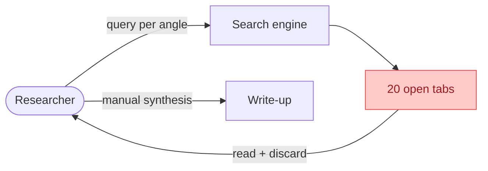
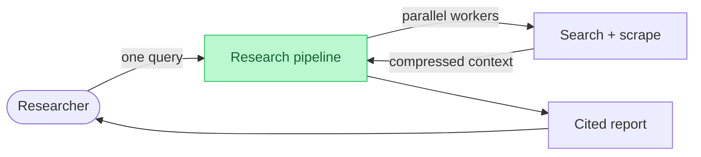
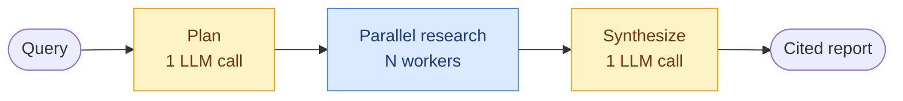
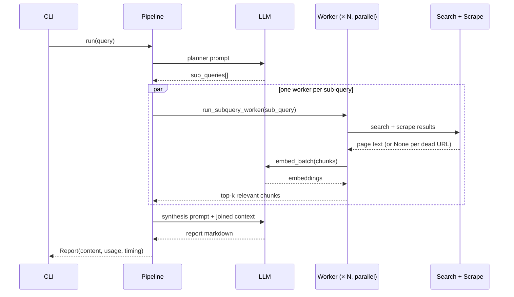

# Research report agent

:::info Prerequisite
This page applies patterns from [Agent Design Patterns](../../agent_design_patterns.md). Familiarity with Plan-and-Execute, Parallelization, and Pipeline/DAG helps, but the relevant concepts are linked inline throughout.
:::

:::note Source
This page documents [mini-researcher](https://github.com/shaokiat/agentic-cookbook/tree/main/agents/mini-researcher), a scoped-down reimplementation of [gpt-researcher](https://github.com/assafelovic/gpt-researcher)'s core loop. Give it a query; it plans sub-questions, researches them in parallel, and synthesizes a cited report.
:::

---

## The problem

Answering an open research question well means searching multiple angles, opening a dozen pages, discarding the irrelevant ones, and writing up what's left with sources. A person does this in 30+ minutes of tab-juggling. A single LLM call can't do it at all: it has no live search, and pasting whole pages in blows the context window.

**Before: one person, twenty tabs**

<div align="center">



</div>

**After: pipeline fans the work out**

<div align="center">



</div>

:::note Goal
Turn one query into a cited markdown report: plan sub-questions, search and scrape each in parallel, compress pages down to relevant chunks, synthesize once over the combined context.
:::

:::tip Success criteria
A query returns a sourced report in seconds, not a half hour of tab-juggling. When the web returns nothing useful, the system says "not enough information" instead of fabricating an answer.
:::

---

## Why a fixed pipeline and not a ReAct agent?

This is the opposite call from the [data validation agent](../data-validation-agent/index.md), and the contrast is the point.

**The workflow shape is known upfront.** Every run is plan → research → synthesize. No user instruction changes which stage runs or in what order. When the control flow is fixed, encoding it in code is more honest than asking a model to rediscover it every run. → [Pipeline / DAG](../../agent_design_patterns.md#7-pipeline--dag)

**Only the inputs vary.** The sub-questions, the URLs, the chunks — those differ per run. The model's judgment is needed in exactly two places: turning the query into sub-questions, and turning the research into a report. Both are single structured LLM calls, not open-ended loops. → [Plan-and-Execute](../../agent_design_patterns.md#2-plan-and-execute)

**Workers don't need to think.** Each sub-question follows the same search → scrape → compress path. The workers are plain functions, not agent instances deciding what to do next — fan-out doesn't require every worker to be a full agent. → [Parallelization](../../agent_design_patterns.md#6-parallelization--fan-out)

:::warning
A ReAct loop here would add latency, cost, and failure modes without adding capability. The rule from the data validation agent applies in reverse: when the tool sequence is predetermined, that's a chain — build a chain. ReAct earns its overhead only when tool order genuinely depends on runtime state. → [ReAct](../../agent_design_patterns.md#1-react-reason--act)
:::

### Where the model's judgment actually lives

| Decision | Made by | When |
|---|---|---|
| Which sub-questions to research | LLM (planner call) | Once, at start |
| Which pages to fetch | Search provider ranking | Per sub-query |
| Which chunks survive compression | BM25 + embedding scoring (code) | Per page |
| What the report says, or whether to abstain | LLM (synthesis call) | Once, at end |

Exactly two LLM calls surround the fan-out. Everything between them is deterministic code.

---

## Architecture

Four stages: plan, research in parallel, synthesize, return.

<div align="center">



</div>

| Layer | What it does |
|---|---|
| Planner | One LLM call turns the query into 2–4 independent sub-questions, with a defensive JSON-parse fallback chain |
| Workers (× N, parallel) | Per sub-question: search → scrape each result → chunk → filter to relevant chunks |
| Compression | BM25 + embedding-similarity hybrid keeps the top-k chunks per sub-query, discards the rest |
| Synthesizer | One LLM call over the combined compressed context produces a cited report — or an explicit abstention |

### Run flow

<div align="center">



</div>

All N workers run concurrently. A 3-sub-query benchmark measured 27.1s sequential vs 8.3s parallel — a 3.3× speedup, roughly the worker count, because the work is I/O-bound. → [Concurrency choice](./implementation.md#why-threadpoolexecutor-not-asyncio)

### Why compression is a load-bearing stage

Scraping 3 results for each of 4 sub-queries yields ~12 full pages. Pasting them all into the synthesis prompt would blow the context window and bury the relevant paragraphs in navigation text and boilerplate.

Each page is chunked, then scored against its sub-question two ways: BM25 keyword match (weight 0.3) and embedding cosine similarity (weight 0.7). Only the top-k chunks per sub-query reach the synthesizer. This is context compression via relevance filtering — the same hybrid-search idea used for memory retrieval, applied statelessly to throwaway scraped content. → [Memory Management](../../agent_design_patterns.md#9-memory-management)

---

## Design patterns

| Pattern | Used? | How it applies here |
|---|---|---|
| Plan-and-Execute | Yes | Planner decomposes the query upfront; execution never revisits the plan mid-run. → [Plan-and-Execute](../../agent_design_patterns.md#2-plan-and-execute) |
| Parallelization | Yes | One worker per sub-question, fanned out via thread pool, results joined before synthesis. → [Parallelization](../../agent_design_patterns.md#6-parallelization--fan-out) |
| Pipeline / DAG | Yes | Control flow is a fixed DAG decided by code — the model never chooses the next step. → [Pipeline / DAG](../../agent_design_patterns.md#7-pipeline--dag) |
| Guardrails | Yes | Output-side abstention: with empty context, the synthesis prompt instructs "not enough information" over fabrication. → [Guardrails](../../agent_design_patterns.md#10-guardrails-and-validation) |
| ReAct | No | No LLM-driven tool selection at runtime. The pipeline shape is fixed; only its inputs vary per run. |
| Tool Use | No | The model is never handed a tool schema. Search, scrape, and compress are called by code, not chosen by the model. |
| Orchestrator-Subagent | No | Workers are plain functions with no model in the loop — subagents would add ceremony without capability. |
| Memory Management | Partial | Compression borrows hybrid-search scoring, but stateless: no persistence across runs, no conversational memory. |
| Reflection | No | One synthesis pass. A critique loop is a real extension, but not part of the core shape. |

:::warning
The abstention guard is the output-side counterpart of failure isolation. Both exist so partial or total pipeline failure degrades to an honest "I don't know" — never a confident wrong answer. → [Failure isolation](./implementation.md#failure-isolation-across-the-stages)
:::

---

## When to use this design

| Signal | Good fit | Consider different |
|---|---|---|
| Workflow shape | Same stages every run | Stages depend on intermediate results |
| Model's role | Bounded, structured calls | Open-ended tool selection needed |
| Sub-tasks | Independent, parallelizable | Each step feeds the next |
| Failure tolerance | Partial results still useful | Every source must succeed |
| State | Stateless per run | Multi-turn refinement sessions |

**Simpler alternatives**

- **Single LLM call with web search tool**: fine for questions one or two searches can answer. Fails when coverage needs multiple independent angles researched in depth.
- **Search + summarize per URL**: works for "summarize this page" tasks. No decomposition, no cross-source synthesis.

**When to go more complex**

- **ReAct research agent**: use when follow-up searches must depend on what earlier searches found — iterative deepening rather than upfront decomposition. → [ReAct](../../agent_design_patterns.md#1-react-reason--act)
- **Orchestrator-Subagent team**: use when sub-tasks need different specialists (a reviewer, an editor, a fact-checker) rather than N copies of the same worker. → [Orchestrator-Subagent](../../agent_design_patterns.md#5-orchestratorsubagent)
- **Reflection pass**: use when report quality matters more than latency — critique and revise the draft before returning it. → [Reflection](../../agent_design_patterns.md#3-reflection--self-critique)

```
One-shot question              → single LLM call + search tool
Fixed stages, independent legs → this design
Next step depends on findings  → ReAct research agent
Specialist roles per sub-task  → Orchestrator-Subagent
Quality over latency           → add a Reflection pass
```

---

## What was deliberately cut

mini-researcher is a scoped-down port of gpt-researcher, and the cuts are as instructive as the keeps. The bar for adding anything back: does it teach a new concept, or just add surface area?

| Cut | Why |
|---|---|
| Multi-agent "team" mode | A different architecture (agent-per-role) layered on top — the point here is the simpler fan-out shape |
| Per-subtopic synthesis + merge | One synthesis call is the more instructive baseline |
| LLM-based source curation | A re-ranking pass on top of the BM25 + embedding filter — real, but the hybrid filter alone is the teaching point |
| 18 search providers / 8 scraper backends | One of each is enough to demonstrate the abstraction; more are additive, not architecturally different |
| MCP integration, streaming frontend | Product surface, orthogonal to the core loop |

The provider abstraction makes the cuts cheap to reverse: adding a second search provider is one class and one factory branch, with zero changes to the worker or pipeline. → [Provider abstraction](./implementation.md#2a-search-searchpy)
