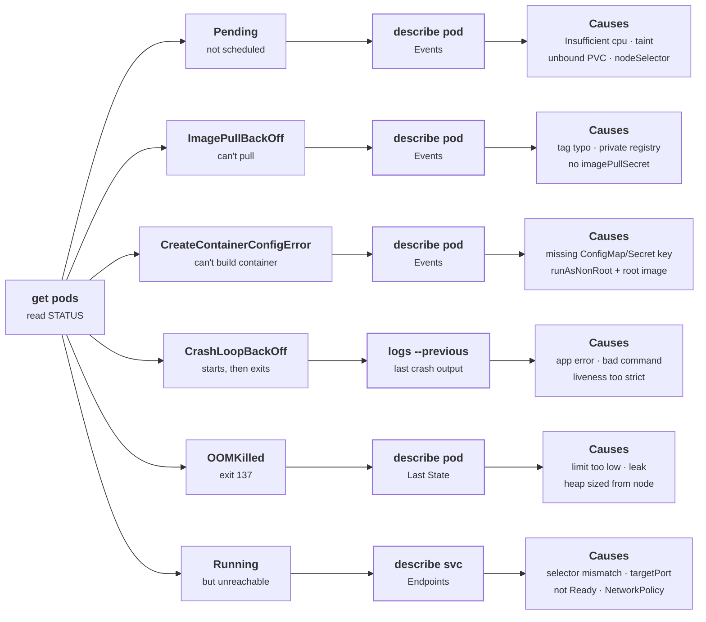

# Troubleshooting

> Docs: [Debug Pods](https://kubernetes.io/docs/tasks/debug/debug-application/debug-pods/) · [Debug Services](https://kubernetes.io/docs/tasks/debug/debug-application/debug-service/) · [Debug running Pods](https://kubernetes.io/docs/tasks/debug/debug-application/debug-running-pod/) · [Learnk8s visual guide](https://learnkube.com/troubleshooting-deployments)

## Overview

Debugging Kubernetes is a walk down the [six-step chain](../start-here/mental-model.md#life-of-a-kubectl-apply) behind every `kubectl apply`. `kubectl get pods` tells you which step broke; the `STATUS` column is the index into this page. The method is always the same: read the status, run the one command that explains that status, fix the cause, and confirm with the same command. Guessing, or restarting things to see what happens, wastes the most time in the exam and in interviews.

<div className="mermaid-scroll" style={{maxWidth: "900px", margin: "0 auto"}}>



</div>

*Figure 13-1: Troubleshooting decision tree. Amber marks the one command to run first for each status.*

## Key concepts

### Status → first command → usual causes

| Status | Stage that failed | First command | Usual causes |
|---|---|---|---|
| No Pods at all | Admission | `kubectl describe rs` (or `describe job`) | ResourceQuota exceeded, Pod Security violation, bad ServiceAccount |
| `Pending` | Scheduling | `kubectl describe pod` → Events | Requests too big, taints, nodeSelector/affinity, PVC not bound |
| `ContainerCreating` (stuck) | Volume attach, network setup | `kubectl describe pod` → Events | Missing ConfigMap/Secret volume, Multi-Attach error, CNI failure |
| `ErrImagePull` / `ImagePullBackOff` | Image pull | `kubectl describe pod` → Events | Tag typo, private registry without `imagePullSecrets`, rate limits |
| `CreateContainerConfigError` | Container config | `kubectl describe pod` → Events | Missing ConfigMap/Secret or key, `runAsNonRoot` with a root image |
| `RunContainerError` | Container start | `kubectl describe pod` | Command not found in image, bad mount path |
| `CrashLoopBackOff` | Running | `kubectl logs --previous` | App error at startup, missing config, liveness probe killing it |
| `OOMKilled` (in Last State) | Running | `kubectl describe pod` | Memory limit too low, leak |
| `Running`, `0/1` Ready | Readiness | `kubectl describe pod` → probe events | Wrong probe path/port, dependency down, too slow |
| `Running`, unreachable | Service routing | `kubectl describe svc` → Endpoints | Selector/label mismatch, wrong `targetPort`, NetworkPolicy |
| `Terminating` (stuck) | Deletion | `kubectl get pod -o yaml` → finalizers | Finalizer controller gone, node unreachable |

### Exit codes

| Code | Meaning | Usual cause |
|---|---|---|
| 0 | Clean exit | A long-running app exiting means it has nothing to do: wrong command, or a Job in a Deployment |
| 1 | App error | Read the logs |
| 126 | Command not executable | Permissions, wrong architecture binary |
| 127 | Command not found | Typo in `command`, or the binary isn't in the image |
| 137 | SIGKILL (128+9) | OOMKilled, or killed after the grace period |
| 139 | SIGSEGV (128+11) | Crash in native code |
| 143 | SIGTERM (128+15) | Normal shutdown during a rollout or scale-down |

### Timeout vs refused

| Symptom from a client Pod | Likely cause |
|---|---|
| `bad address` / `could not resolve host` | Name doesn't exist: typo, or the Service is in another namespace |
| `Connection refused` | Service has no endpoints (kube-proxy rejects), or wrong `targetPort` |
| Timeout | NetworkPolicy drop (a blocked DNS lookup looks like this too), or the app accepted but hangs |

→ See [Services & Ingress](./services-and-ingress.md) and [Network Policy](./network-policy.md).

## kubectl essentials

The core loop:

```bash
kubectl get pods -o wide                             # STATUS, RESTARTS, node, IP
kubectl describe pod <pod>                           # Events at the bottom: read them first
kubectl logs <pod> --previous                        # output of the crashed container
kubectl get events --sort-by=.lastTimestamp --field-selector type=Warning
kubectl get pod <pod> -o yaml | less                 # the full spec and status as the API sees it
```

When no Pods appear:

```bash
kubectl describe deployment <name>                   # Conditions: ReplicaFailure
kubectl describe rs -l app=<name>                    # FailedCreate events: quota, Pod Security
```

Get inside:

```bash
kubectl exec -it <pod> -- sh                         # if the image has a shell
kubectl debug -it <pod> --image=busybox:1.36 --target=<container>   # ephemeral container, shares process namespace
kubectl debug <pod> -it --copy-to=dbg --container=<container> -- sh # copy of the Pod with a shell instead of the app
kubectl debug node/<node> -it --image=busybox:1.36   # shell on the node, host fs at /host
kubectl port-forward pod/<pod> 8080:8080             # bypass Service and Ingress
kubectl run tmp --rm -it --image=busybox:1.36 --restart=Never -- wget -qO- -T 3 http://<svc>
```

## 🧪 Lab

:::tip Lab 13-1 ★★★
See [Standard lab setup](../start-here/local-setup.md#standard-lab-setup) · [How the tiers work](../start-here/local-setup.md#lab-tiers).

**Three bugs, one manifest.**

**Goal**

Save this as `broken.yaml` and apply it to namespace `lab13`. Make `wget -qO- http://web` from a Pod in the namespace return the nginx welcome page. Fix every problem using only `get`, `describe`, `logs` and `edit`/`set`/`patch`, and write down the status that led you to each fix.

```yaml
apiVersion: v1
kind: ConfigMap
metadata:
  name: web-conf
data:
  MODE: prod
---
apiVersion: apps/v1
kind: Deployment
metadata:
  name: web
spec:
  replicas: 2
  selector:
    matchLabels: {app: web}
  template:
    metadata:
      labels: {app: web}
    spec:
      containers:
      - name: nginx
        image: nginx:1.27-alpinee
        env:
        - name: MODE
          valueFrom:
            configMapKeyRef: {name: web-config, key: MODE}
        ports: [{containerPort: 80}]
---
apiVersion: v1
kind: Service
metadata:
  name: web
spec:
  selector: {app: webapp}
  ports:
  - port: 80
    targetPort: 80
```

**Verify**

```bash
kubectl -n lab13 get pods                            # 2/2 Running, 1/1 Ready each
kubectl -n lab13 run tmp --rm -it --image=busybox:1.36 --restart=Never -- wget -qO- -T 3 http://web | head -4
```

<details>
<summary>🟡 Hints</summary>

1. Start with `kubectl get pods` and look up the STATUS in the [status table](#status--first-command--usual-causes). It tells you the first command to run.
2. Two of the bugs show up as Pod statuses, one after the other. The third only shows up when you call the Service.
3. Fix at the owner: `kubectl set image` and `kubectl patch deployment`, not the Pods.
4. For the Service, compare `describe svc` → `Selector` with `get pods --show-labels`.

</details>

<details>
<summary>🟢 Guided</summary>

1. Create the lab namespace.

   ```bash
   kubectl create namespace lab13
   ```

2. Apply the broken manifest.

   ```bash
   kubectl -n lab13 apply -f broken.yaml
   ```

3. Read the status: ErrImagePull / ImagePullBackOff.

   ```bash
   kubectl -n lab13 get pods
   ```

4. Read the first Pod's events: Failed to pull image `nginx:1.27-alpinee`: not found (tag typo).

   ```bash
   kubectl -n lab13 describe pod -l app=web | grep -A3 Events -m1
   ```

5. Fix the tag on the Deployment.

   ```bash
   kubectl -n lab13 set image deployment/web nginx=nginx:1.27-alpine
   ```

6. Read the status again: CreateContainerConfigError.

   ```bash
   kubectl -n lab13 get pods
   ```

7. Find the message: configmap "web-config" not found (the ConfigMap is called web-conf).

   ```bash
   kubectl -n lab13 describe pod -l app=web | grep -i configmap
   ```

8. Point the env var at the right ConfigMap.

   ```bash
   kubectl -n lab13 patch deployment web --type=json \
     -p '[{"op":"replace","path":"/spec/template/spec/containers/0/env/0/valueFrom/configMapKeyRef/name","value":"web-conf"}]'
   ```

9. Wait for the fixed Pods.

   ```bash
   kubectl -n lab13 rollout status deployment/web
   ```

10. Call the Service: Connection refused.

    ```bash
    kubectl -n lab13 run tmp --rm -it --image=busybox:1.36 --restart=Never -- wget -qO- -T 3 http://web
    ```

11. See why: `app=webapp`, Endpoints: `<none>`.

    ```bash
    kubectl -n lab13 describe svc web | grep -E "Selector|Endpoints"
    ```

12. Fix the selector; Verify now succeeds.

    ```bash
    kubectl -n lab13 patch svc web -p '{"spec":{"selector":{"app":"web"}}}'
    ```

13. Delete everything the lab created.

    ```bash
    kubectl delete namespace lab13
    ```

</details>
:::

→ More drills in the same format: [Troubleshooting Drills](../scenarios/troubleshooting-drills.md).

## Gotchas

- **Read Events before logs.** Most failures before `Running` never produce app logs at all.
- **No Pods means look one level up.** Admission errors land on the ReplicaSet or Job, not on a Pod that doesn't exist.
- **`CrashLoopBackOff` waits grow to 5 minutes.** After a fix, `kubectl delete pod` skips the wait.
- **`--previous` or nothing.** The current container's log starts empty after each restart.
- **Events expire after about an hour.** For overnight failures, use the log system.
- **Distroless images have no shell.** `kubectl exec -- sh` fails. Use `kubectl debug --target`.
- **Fix the owner.** Editing a Pod owned by a Deployment is undone. Fix the Deployment.

## Scenario questions

**Q1 ★ A Deployment shows `0/3` ready and `kubectl get pods` shows nothing. Where are the Pods?**

<details>
<summary>Model answer</summary>

- **Clarify:** new Deployment, or did this start after a namespace change (a quota or Pod Security label)?
- **Observe:** `kubectl describe deployment` → `ReplicaFailure`. `kubectl describe rs` → `FailedCreate: exceeded quota` or `violates PodSecurity`.
- **Hypothesise:** admission rejects every Pod the ReplicaSet tries to create. Nothing exists to show.
- **Fix:** add requests the quota needs (or raise the quota), or fix the securityContext.
- **Prevent:** teach the team to go one level up when Pods are missing. Alert on `FailedCreate` events.

</details>

**Q2 ★★ A Pod is `Pending` with `0/3 nodes are available: 1 node(s) had untolerated taint {dedicated: gpu}, 2 Insufficient memory`. Explain and fix.**

<details>
<summary>Model answer</summary>

- **Clarify:** is this Pod meant for the GPU node? How much memory does it request?
- **Observe:** the message covers every node: one is tainted for GPU workloads, two lack free memory (by requests, not usage).
- **Hypothesise:** a regular Pod with a large memory request and no GPU toleration. Nowhere is legal.
- **Fix:** right-size the memory request, or add capacity. Only add a toleration if it really belongs on the GPU node.
- **Prevent:** check requests against `kubectl describe node` allocatable; let the cluster autoscaler add nodes for legitimate demand.

</details>

**Q3 ★★ A container crashes instantly and `kubectl logs --previous` is empty. What next?**

<details>
<summary>Model answer</summary>

- **Clarify:** new image or new command/args?
- **Observe:** `kubectl describe pod` → Last State exit code. 127 is command not found, 126 not executable, 0 means the process simply finished.
- **Hypothesise:** the process dies before writing anything: wrong entrypoint, a missing binary, or a script that exits.
- **Fix:** start a copy with a shell and inspect it: `kubectl debug <pod> -it --copy-to=dbg --container=<name> -- sh`, then run the command by hand.
- **Prevent:** smoke-test images in CI by running their real entrypoint.

</details>

**Q4 ★★★ Users report the app is "slow sometimes". Nothing is crashing. How do you approach it?**

<details>
<summary>Model answer</summary>

- **Clarify:** which endpoints, how slow, since when, all users or some? Is there a pattern: time of day, after deploys?
- **Observe:** `kubectl top pods` against requests and limits, restart counts, readiness flapping in events, HPA activity (`kubectl describe hpa`), and whether slow requests come from particular Pods or nodes.
- **Hypothesise:** CPU throttling from limits; one bad node; Pods flapping in and out of endpoints; cold Pods after HPA scale-out without warm-up; a slow dependency.
- **Fix:** follow the evidence. Throttling → remove or raise CPU limits (→ [Resources & Scaling](./resources-and-scaling.md)); cold starts → readiness that waits for warm-up; one bad node → cordon and drain.
- **Prevent:** per-Pod latency metrics and tracing. `kubectl` shows the present; intermittent problems need history.

</details>

## Summary

- **STATUS picks the command.** Pending and pull errors → describe; crashes → logs `--previous`; unreachable → describe svc.
- **Events explain everything before `Running`.** Logs explain everything after.
- **Missing Pods mean admission.** Describe the ReplicaSet.
- **Exit code 137 is a kill, usually OOM.** 127 is a missing command.
- **Walk the chain in order.** Admission, scheduling, pull, start, readiness, Service. Stop at the first broken link.
