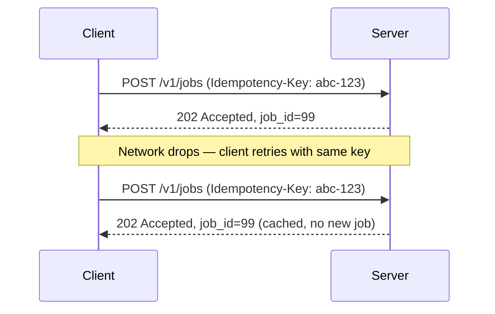

# API Fundamentals

> Assumed knowledge for the rest of this series. Covers HTTP, REST conventions, request/response anatomy, and status codes.

**Official docs:**
- [MDN HTTP Overview](https://developer.mozilla.org/en-US/docs/Web/HTTP/Overview)
- [MDN HTTP Methods](https://developer.mozilla.org/en-US/docs/Web/HTTP/Methods)
- [MDN HTTP Status Codes](https://developer.mozilla.org/en-US/docs/Web/HTTP/Status)
- [MDN HTTP Headers](https://developer.mozilla.org/en-US/docs/Web/HTTP/Headers)
- [REST architectural constraints (Fielding dissertation summary)](https://restfulapi.net/)

---

## HTTP Request Anatomy

Every HTTP request has four parts:

```
POST /v1/predict?debug=true HTTP/1.1          ← method + path + query string + version
Host: api.company.com                          ← headers (key: value)
Content-Type: application/json
Authorization: Bearer eyJhbGc...

{                                              ← body (optional, JSON for APIs)
  "features": [0.1, 0.4, 0.9],
  "threshold": 0.7
}
```

| Part | Where it lives | FastAPI reads it via |
|---|---|---|
| Path segment | `/v1/predict/{model_id}` | Path parameter |
| Query string | `?debug=true&limit=10` | Query parameter |
| Header | `Authorization: Bearer ...` | `Header()` |
| Body | JSON payload | `BaseModel` / `Body()` |
| Cookie | `Cookie: session=...` | `Cookie()` |

## HTTP Response Anatomy

```
HTTP/1.1 200 OK                               ← version + status code + reason
Content-Type: application/json
X-Request-ID: abc-123                         ← response headers

{                                              ← response body
  "prediction": 0.92,
  "model_version": "v2"
}
```

## HTTP Methods

| Method | Meaning | Has body | Idempotent | Safe |
|---|---|---|---|---|
| `GET` | Read a resource | No | Yes | Yes |
| `POST` | Create / trigger action | Yes | No | No |
| `PUT` | Replace a resource entirely | Yes | Yes | No |
| `PATCH` | Partially update a resource | Yes | No | No |
| `DELETE` | Remove a resource | Optional | Yes | No |
| `HEAD` | Same as GET but no body | No | Yes | Yes |
| `OPTIONS` | What methods does this endpoint support? | No | Yes | Yes |

**Idempotent** — calling it N times has the same effect as calling it once.  
**Safe** — calling it doesn't change server state.

### Commonly asked questions

**Why is POST not idempotent?**  
`POST` typically creates a new resource each time. Calling `POST /v1/jobs` twice creates two jobs — the second call produces a different outcome than the first. Retrying a failed `POST` blindly can cause duplicates.

**Why is PUT idempotent?**  
`PUT` replaces the entire resource with whatever you send. Calling `PUT /v1/models/42` three times with the same body always leaves the model in the same state — there's no accumulation. The result is always "model 42 looks exactly like this payload."

**Why is PATCH not idempotent?**  
`PATCH` applies a delta, not a replacement. The outcome depends on the resource's current state. `PATCH /v1/models/42` with `{"threshold": "+0.1"}` produces a different result each time. However, `PATCH` with an absolute value (`{"threshold": 0.7}`) *is* idempotent in practice — the spec doesn't guarantee it, but your implementation can make it so.

**Is there a performance difference between PATCH and PUT? Why not just use PUT for idempotency?**  
You can use `PUT` for idempotency, and for simple resources it's a reasonable choice. The spec-level difference ([RFC 9110 §9.3.4 PUT](https://www.rfc-editor.org/rfc/rfc9110#section-9.3.4), [RFC 5789 PATCH](https://www.rfc-editor.org/rfc/rfc5789)):

| | `PUT` | `PATCH` |
|---|---|---|
| Payload | Full resource every time | Only changed fields |
| Idempotency | Guaranteed by spec | Not guaranteed — depends on implementation |
| Partial update | Not supported — omitted fields are cleared | Native |

The bandwidth difference is negligible for small resources. The real reason to prefer `PATCH` is **partial ownership** — if a client only manages a subset of fields (e.g. a dashboard that updates `threshold`), `PUT` forces a `GET → merge → PUT` round trip, which introduces a race condition when two clients write concurrently. `PATCH` avoids that.

:::info Best practice
Use `PUT` when a client always owns the full resource. Use `PATCH` when clients update subsets independently.
:::

**How do you make a POST idempotent?**  
Use an **idempotency key** — a client-generated UUID sent in a request header (e.g. `Idempotency-Key: 550e8400-e29b-41d4-a716`). The server stores the key and its response on first execution; on retry it returns the cached response without re-running the operation.



The key must be generated by the client before the request — the same key must be reused on retries of the same logical operation. Keys are typically stored in Redis with a TTL (e.g. 24 hours). Full implementation details are covered in Tier 3 — Reliability Patterns.

### Common patterns in ML APIs

```
POST /v1/predict          → run inference (not idempotent — logs are written)
GET  /v1/models           → list available models
GET  /v1/models/{id}      → get a specific model
PUT  /v1/models/{id}      → replace model config
PATCH /v1/models/{id}     → update specific fields (e.g. threshold)
DELETE /v1/models/{id}    → remove a model
POST /v1/jobs             → submit async inference job
GET  /v1/jobs/{id}        → poll job status
```

## HTTP Status Codes

### 2xx — Success

| Code | Name | When to use |
|---|---|---|
| `200` | OK | Successful GET, default for most responses |
| `201` | Created | Resource successfully created (POST) |
| `202` | Accepted | Request accepted, processing async (job submitted) |
| `204` | No Content | Success with no body (DELETE, some PATCHes) |

### 3xx — Redirection

| Code | Name | When to use |
|---|---|---|
| `301` | Moved Permanently | Endpoint renamed — redirect permanently |
| `302` | Found | Temporary redirect |
| `304` | Not Modified | Cached response still valid (ETag match) |

### 4xx — Client Errors

| Code | Name | When to use |
|---|---|---|
| `400` | Bad Request | Malformed request the server can't process |
| `401` | Unauthorized | Missing or invalid credentials |
| `403` | Forbidden | Authenticated but not authorised for this resource |
| `404` | Not Found | Resource doesn't exist |
| `405` | Method Not Allowed | Right path, wrong method |
| `409` | Conflict | State conflict (e.g. duplicate resource) |
| `410` | Gone | Resource existed but was permanently deleted |
| `422` | Unprocessable Entity | Structurally valid but semantically wrong (Pydantic validation) |
| `429` | Too Many Requests | Rate limit exceeded |

### 5xx — Server Errors

| Code | Name | When to use |
|---|---|---|
| `500` | Internal Server Error | Unhandled exception — generic server fault |
| `502` | Bad Gateway | Upstream service returned an invalid response |
| `503` | Service Unavailable | Server temporarily down or overloaded |
| `504` | Gateway Timeout | Upstream service didn't respond in time |

### 401 vs 403 — the key distinction

- `401 Unauthorized` — I don't know who you are. Provide credentials.
- `403 Forbidden` — I know who you are, but you're not allowed here.

:::info Best practice
A logged-in user hitting an admin route should get `403`, not `401`.
:::

## HTTP Headers

### Common request headers

| Header | Purpose | Example |
|---|---|---|
| `Content-Type` | Format of the request body | `application/json` |
| `Accept` | Format the client wants back | `application/json` |
| `Authorization` | Auth credentials | `Bearer eyJhbGc...` |
| `X-Request-ID` | Client-generated trace ID | `550e8400-e29b...` |
| `X-API-Key` | API key auth | `sk-...` |

### Common response headers

| Header | Purpose | Example |
|---|---|---|
| `Content-Type` | Format of the response body | `application/json` |
| `X-Request-ID` | Echo back trace ID for debugging | `550e8400-e29b...` |
| `Retry-After` | Seconds until rate limit resets | `60` |
| `WWW-Authenticate` | Tells client what auth scheme to use | `Bearer realm="api"` |
| `Location` | URL of newly created resource (201) | `/v1/models/42` |

## REST Conventions

REST (Representational State Transfer) is a set of constraints for designing HTTP APIs. The key rules in practice:

**Resource-oriented URLs** — nouns, not verbs.
```
✓  POST /v1/predictions          (create a prediction)
✗  POST /v1/runPrediction
```

**Nested resources for relationships.**
```
GET /v1/models/{model_id}/versions      → list versions of a model
GET /v1/models/{model_id}/versions/{v}  → get a specific version
```

**Use the right method for the intent** — don't `GET /delete-model?id=5`.

**Consistent error shape** — return the same error schema everywhere so clients can handle errors generically:
```json
{
  "detail": "Model 42 not found",
  "code": "MODEL_NOT_FOUND",
  "request_id": "550e8400"
}
```

## Sync vs Async APIs

| Pattern | How it works | When to use |
|---|---|---|
| Synchronous | Request blocks until response | Fast operations < 500ms |
| Async (polling) | `POST` returns job ID; client polls `GET /jobs/{id}` | Slow inference, batch jobs |
| Webhook | Server calls client URL when done | Event-driven pipelines |
| SSE / WebSocket | Server pushes updates | Token streaming, live dashboards |

:::info Best practice
For ML APIs, inference that takes > 1–2 seconds is a candidate for the async polling pattern — don't make clients hold a connection open for a long-running model.
:::
