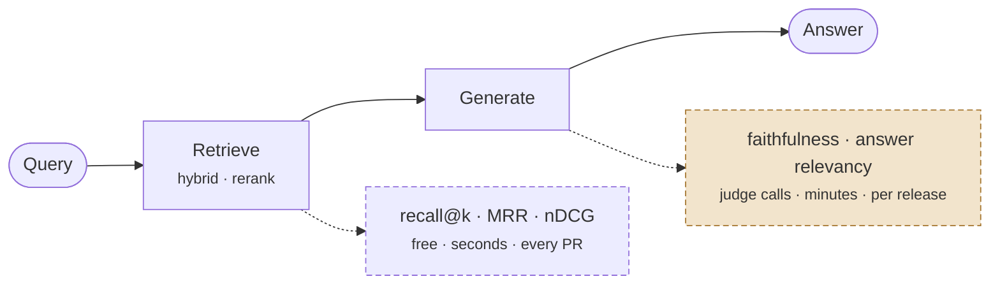

# Evaluation & Guardrails

> **Customer framing:** A customer asks how you know the assistant is good enough to put in front of their support team. "It looked right when I tried it" is not an answer. Here is what to measure offline, what to enforce at runtime, and when to stop.

**Official docs:**
- [RAGAS metrics](https://docs.ragas.io/en/stable/concepts/metrics/) · [RAGAS testset generation](https://docs.ragas.io/en/stable/concepts/test_data_generation/)
- [TREC evaluation measures](https://trec.nist.gov/pubs/trec16/appendices/measures.pdf)
- [Anthropic evals cookbook](https://github.com/anthropics/anthropic-cookbook/tree/main/misc/building_evals)

---

## Two failure points, one output

A RAG answer can be wrong because retrieval missed, or because the generator ignored what it got. From the outside both look identical. Evaluation exists to tell them apart, because the fixes are completely different.

Measure left to right. 🟧 amber metrics cost money per run — earn the right to need them.

| Retrieval is wrong | Generation is wrong |
|---|---|
| Fix chunking, hybrid search, reranking, `ef_search` | Fix the prompt, the model, chunk ordering |
| Measured with recall@k, MRR, nDCG | Measured with faithfulness and answer relevancy |
| Cheap and deterministic to measure | Needs a judge model, costs money per run |

Measure in that order. Retrieval metrics are free, run in seconds, and catch most failures.

---

## Retrieval metrics first

You need a set of questions with the chunk IDs that should have been retrieved. That is it. No judge model, no API bill.

| Metric | Question it answers | Use it for |
|---|---|---|
| **Recall@k** | Did the right chunk make the top k at all? | The main number. If this is low, nothing downstream matters. |
| **MRR** | How high up was the first correct chunk? | Comparing rerankers |
| **nDCG@k** | Are the good chunks ranked above the mediocre ones? | Tuning fusion weights and reranker choice |
| **Hit rate** | Fraction of questions with at least one relevant chunk | A blunt dashboard number for non-engineers |

**Measure recall at two points**: after retrieval — and the pair tells you which half to fix:

| recall@50 *(before rerank)* | recall@5 *(after rerank)* | Diagnosis |
|---|---|---|
| 0.95 | 0.60 | The reranker is dropping good chunks |
| 0.60 | 0.55 | The reranker is irrelevant. You have a retrieval problem. |
| 0.95 | 0.90 | Healthy. Move on to generation metrics. |

Before-rerank recall is the ceiling; after-rerank recall is what the model actually sees.

:::info Best practice
Gate every pull request that touches the pipeline on recall@k. It runs in seconds and it is the cheapest regression net you will ever build.
:::

---

## Generation metrics with RAGAS

RAGAS decomposes answers into claims and scores them with a judge LLM. Use it when free-text answers make exact match meaningless and you need per-component attribution.

| Metric | What it scores | Component |
|---|---|---|
| **Faithfulness** | Fraction of claims in the answer supported by the retrieved context | Generator |
| **Answer relevancy** | Does the answer address the question asked | Generator |
| **Context precision** | Are the retrieved chunks mostly relevant, and ranked well | Retriever |
| **Context recall** | Did retrieval cover everything the reference answer needs | Retriever |

RAGAS takes a dataset of question, answer, contexts, and ground truth, and returns one score per metric. Read the combinations, not the individual numbers:

| Pattern | Diagnosis |
|---|---|
| Low context recall, high faithfulness | Retrieval missed. The model faithfully answered from the wrong chunks. |
| High context recall, low faithfulness | The model is inventing on top of correct context. Prompt or model problem. |
| High faithfulness, low answer relevancy | Grounded but evasive. Usually an over-cautious prompt. |
| Low everything | Parsing or chunking. Go back to ingestion. |

:::warning
Every RAGAS metric is one or more LLM calls. A 100-question set with four metrics is several hundred judge calls per run. It is a release gate, not a pre-commit hook.
:::

---

## Building the eval set

Hand-written first, synthetic second. Thirty questions you wrote after reading real user queries beat three hundred generated ones.

Where Meridian's questions come from:

1. Support tickets where a human had to search the docs. These are the real distribution.
2. Every production failure, added the day it is reported. Non-negotiable.
3. Deliberate hard cases: multi-hop, exact document codes, negation, questions the corpus genuinely cannot answer.
4. Synthetic expansion once the hand-written set is stable, to broaden coverage.

Include unanswerable questions and assert refusal. A system that never refuses is a system that hallucinates, and you will not see it until a customer does.

Four fields per question: the question, the chunk IDs that should be retrieved, the ground-truth answer, and the tenant. Keep it per-tenant where isolation matters. A question that retrieves correctly for a large tenant can retrieve nothing for a small one.

---

## How much eval is enough

The real question behind "is it ready to ship".

| Question | Answer |
|---|---|
| Starting size | 30 to 50 hand-written questions, weighted toward hard ones |
| Why not fewer | Under about 20, score noise swamps the signal. One bad question moves the mean by 5 points. |
| Why not 500 on day one | You will rewrite the pipeline three times first. Grow the set from real failures. |
| When to grow | Every production failure becomes a permanent test case |
| Retrieval metrics cadence | Every PR touching parsing, chunking, embeddings, retrieval, or the index |
| RAGAS cadence | Release candidates, plus weekly on a sample of real production traffic |
| Absolute score targets | Meaningless across corpora. Set a baseline, gate on regression from it. |

Ship criteria, stated plainly:

- Recall@k above the baseline you set, with no regression on the eval set.
- Faithfulness above your escalation threshold on the release-candidate run.
- A working escalation path for everything below that threshold.

You ship with a known failure rate and a route for the failures. You do not ship on a perfect score, because there is no such thing.

:::info Best practice
When someone asks "how do you know it is good enough", the answer is a number, a baseline, and an escalation path. Not a demo.
:::

---

## Faithfulness and the escalation threshold

Offline metrics tell you the system works on average. Guardrails handle the specific answer in front of a user right now.

Score groundedness at runtime and route on it:

| Score band | Action |
|---|---|
| High | Answer with citations |
| Middle | Answer, but hedge and surface sources prominently |
| Low | Do not answer. Escalate to a human, and pass the retrieved chunks along. |
| No retrieval hits | Refuse immediately, do not generate |

Two things make this affordable. Use a small NLI model or a cheap judge model rather than your generation model. And sample rather than scoring every answer, once you trust the distribution: score 100 percent while the thresholds are new, then drop to a sample plus every escalation.

Calibrate the thresholds on the eval set. Pick the point where escalation catches most genuinely wrong answers without escalating a quarter of your traffic, because an assistant that escalates constantly is worse than no assistant.

:::danger
Escalation without a destination is just a slower failure. Wire it to a real queue with a real owner before you turn it on.
:::

---

## What to log

Every answer: question, tenant, retrieved chunk IDs and scores, reranker scores, cited chunks, groundedness score, latency per stage, escalation flag.

That log is your next eval set. Low-groundedness answers and empty-retrieval queries are the two highest-value review queues you have.

→ See [Production](./production.md#what-to-monitor) for the dashboard cut of this, and [Evaluation & Observability](../../genai-agents/concepts/evaluation-observability.md) for the agent-level view.

---

## Where evaluation stops

RAGAS will not tell you whether the corpus is missing the document entirely, whether the tone suits the customer, or whether the answer is useful. A monthly read of 20 real conversations catches all three, and no metric replaces it.
