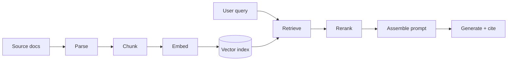

# RAG

> **Customer framing:** A customer has thousands of internal documents and wants their support team to ask questions in plain English, with answers they can trace back to a source. Here is the architecture and the tradeoffs.

**Official docs:**
- [pgvector](https://github.com/pgvector/pgvector)
- [OpenAI embeddings guide](https://platform.openai.com/docs/guides/embeddings)
- [RAGAS](https://docs.ragas.io/en/stable/)
- [Anthropic contextual retrieval](https://www.anthropic.com/news/contextual-retrieval)

---

## Running example

Every page in this section uses the same system: **Meridian Support Assist**, an assistant over per-customer documentation for a B2B vendor.

| Property | Value |
|---|---|
| Corpus | Runbooks, policy PDFs, resolved support tickets |
| Size | ~400k chunks across 120 tenants |
| Isolation | Each tenant sees only its own corpus. Leakage is a contract breach. |
| Latency target | First token in under 2 seconds |
| Deployment | Cloud for most tenants, airgapped on-prem for three regulated ones |

The numbers are made up. The shape is not.

---

## RAG is a retrieval problem

The generator is rarely the reason an answer is wrong. If the right chunk never reaches the prompt, no model and no prompt rescues it. Tune retrieval first, and only then argue about the wording of the system prompt.

| Stage | Page |
|---|---|
| Parse, chunk, embed, index | [Ingestion & Indexing](./ingestion-and-indexing.md) |
| Retrieve, rerank, assemble, generate | [Retrieval & Generation](./retrieval-and-generation.md) |
| Measure it, then guard it at runtime | [Evaluation & Guardrails](./evaluation.md) |
| Latency, scale, isolation, on-prem | [Production](./production.md) |

---

## Four places an answer goes wrong

| Failure | Symptom | Where to look |
|---|---|---|
| Bad parse | Answer cites a table that reads as scrambled numbers | [Parsing](./ingestion-and-indexing.md#parsing-comes-first) |
| Chunk boundary | Answer is half right and stops mid-thought | [Chunking](./ingestion-and-indexing.md#chunking) |
| Retrieval miss | Assistant says the corpus has nothing, but it does | [Hybrid search](./retrieval-and-generation.md#hybrid-search) |
| Generator ignored context | Answer is fluent, confident, and unsupported | [Faithfulness](./evaluation.md#faithfulness-and-the-escalation-threshold) |

Each failure has a metric attached to it. Guessing which one you have is the expensive way to debug a RAG system.

:::info Best practice
Before tuning anything, build an eval set of 30 real questions. Debugging without one is guessing with extra steps.
:::

---

## Do you need RAG at all

| Situation | Use |
|---|---|
| Corpus fits in the context window and rarely changes | Stuff the whole thing into the prompt with caching |
| Corpus is large, changes often, answers need citations | RAG |
| The question is "how many orders shipped late last month" | SQL, not RAG. Vector search over structured data is a downgrade. |
| You need the model to speak a different style or format | Fine-tuning or a better prompt. RAG adds knowledge, not behaviour. |
| Users search by exact code, SKU, or error string | Keyword search first, RAG only if free-text questions also matter |

Prompt caching keeps eating the low end of this table. A 200k-token corpus that changes monthly is no longer obviously a RAG problem. The case for RAG is corpus size, freshness, and per-answer citation.

:::warning
Most failed RAG projects were search problems that nobody measured as search problems. If your users' questions are keyword lookups, ship keyword search and go home.
:::
