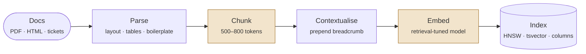

# Ingestion & Indexing

> **Customer framing:** A customer hands you 40 GB of PDFs, exported HTML, and a ticket database, and asks how long until the assistant works. The answer depends almost entirely on what happens before a single embedding is computed.

**Official docs:**
- [pgvector README](https://github.com/pgvector/pgvector) · [HNSW and IVFFlat indexing](https://github.com/pgvector/pgvector#indexing)
- [Unstructured document parsing](https://docs.unstructured.io/open-source/core-functionality/partitioning)
- [LangChain text splitters](https://python.langchain.com/docs/concepts/text_splitters/)
- [OpenAI embeddings](https://platform.openai.com/docs/guides/embeddings) · [MTEB retrieval leaderboard](https://huggingface.co/spaces/mteb/leaderboard)
- [Postgres row-level security](https://www.postgresql.org/docs/current/ddl-rowsecurity.html)

---

## The ingestion pipeline

Everything here runs offline, once per document. Retrieval can only ever be as good as what this leaves behind.

🟧 amber stages are one-way doors — changing either forces a full rebuild of the corpus

| Stage | Decides | Cost of getting it wrong |
|---|---|---|
| Parse | Whether the text is even correct | Unrecoverable. A bad parse produces a confident wrong embedding. |
| Chunk | The unit of retrieval and the unit of context | Full re-chunk and re-embed |
| Contextualise | Whether a chunk means anything on its own | Cheap to add later, largest single recall win |
| Embed | The semantic half of [hybrid search](./retrieval.md#why-hybrid-search) | Full re-embed of every chunk |
| Index | Recall vs latency, and what you can filter on | Rebuild only. The knobs are tunable in place. |

The one thing worth internalising: **cost rises left to right, and so does the damage.** A parsing bug is invisible at every later stage and survives every amount of retrieval tuning. Spend your time at the left.

→ The query-time counterpart is [the retrieval pipeline](./retrieval.md#the-retrieval-pipeline).

---

## Parsing comes first

No retrieval tuning recovers from a bad parse. A mis-parsed table does not produce an empty embedding, it produces a confident wrong one. Budget more time here than on chunking.

| Source | What breaks | What to do |
|---|---|---|
| Native PDF | Reading order in two-column layouts, repeated headers and footers | Layout-aware parser, strip repeating lines per page |
| Scanned PDF | OCR errors baked into the text silently | OCR with per-character confidence, quarantine low-confidence pages |
| HTML | Nav bars, cookie banners, and footers embedded into every chunk | Extract the main content node, drop boilerplate before chunking |
| DOCX, PPTX | Nothing much. Structure is in the file already. | Use headings and slide titles as chunk metadata |
| Tickets, DB rows | Nothing. It is already structured. | Template each row into a short document, keep the ID |

**Tables are the hard part.** Linearising a table to plain text destroys the row-column binding, so "Enterprise plan, 30 day retention" becomes three loose words in a bag. Three options, in order of effort:

1. Serialise each table to markdown and keep it in one chunk. Cheap, works up to roughly 30 rows.
2. Emit one chunk per row with the header prepended: `Plan: Enterprise | Retention: 30 days | SLA: 4h`. Survives chunking, retrieves precisely.
3. Keep tables in Postgres as real rows and query them alongside the vector search. Correct, and more plumbing.

Whatever parser you use, the two settings that matter are the layout model over raw text extraction, and table structure inference so tables come back as HTML rather than soup. In `unstructured` those are `strategy="hi_res"` and `infer_table_structure=True`.

:::warning
Read the parsed output of ten random documents with your own eyes before building anything on top of it. This single habit catches more RAG failures than any metric.
:::

---

## Chunking

A chunk is the unit of retrieval and the unit of context. Those two pull in opposite directions: small chunks retrieve precisely, large chunks answer completely.

| Strategy | How | Use when |
|---|---|---|
| Fixed-size | N tokens, fixed overlap | Baseline. Uniform prose with no structure. |
| Recursive | Split on paragraph, then sentence, then token, until under the limit | Default choice for mixed documents |
| Structural | Split on markdown headings or HTML sections | Docs with real headings. Best quality per unit of effort. |
| Semantic | Split where consecutive sentence embeddings diverge | Long unstructured transcripts. Costs an embedding pass. |
| Document-aware | Per row, per slide, per function | Tables, code, slide decks |

<svg className="ml-diagram wide" viewBox="0 0 580 230" role="img" aria-label="The same passage split three ways: fixed-size cuts mid-sentence, recursive respects paragraphs, structural follows headings">
  <text x="8" y="20" fontSize="11" fontWeight="600" className="box-text">Source</text>
  <rect x="8" y="28" width="564" height="20" rx="3" className="box-fill" opacity="0.45" />
  <text x="16" y="42" fontSize="9.5" className="axis-label">## API Keys — Keys must be rotated every 90 days. ## Provisioning — New tenants get a sandbox first.</text>

  <text x="8" y="80" fontSize="11" fontWeight="600" className="overfit-label">Fixed-size</text>
  <rect x="120" y="66" width="150" height="20" rx="3" className="box-fill" />
  <rect x="274" y="66" width="150" height="20" rx="3" className="box-fill" />
  <rect x="428" y="66" width="144" height="20" rx="3" className="box-fill" />
  <text x="272" y="103" textAnchor="middle" fontSize="9.5" className="overfit-label">cuts mid-sentence · headings orphaned</text>

  <text x="8" y="134" fontSize="11" fontWeight="600" className="box-text">Recursive</text>
  <rect x="120" y="120" width="196" height="20" rx="3" className="box-fill" />
  <rect x="320" y="120" width="130" height="20" rx="3" className="box-fill" />
  <rect x="454" y="120" width="118" height="20" rx="3" className="box-fill" />
  <text x="346" y="157" textAnchor="middle" fontSize="9.5" className="axis-label">breaks on paragraphs · headings still orphaned</text>

  <text x="8" y="188" fontSize="11" fontWeight="600" className="class1-label">Structural</text>
  <rect x="120" y="174" width="220" height="20" rx="3" className="box-accent" />
  <rect x="344" y="174" width="228" height="20" rx="3" className="box-accent" />
  <text x="346" y="211" textAnchor="middle" fontSize="9.5" className="class1-label">one chunk per section · breadcrumb comes free</text>
</svg>

Start at 500 to 800 tokens with 10 to 15 percent overlap, then move it based on eval scores, not taste.

**Always prepend context to the chunk.** "It must be rotated every 90 days" is unretrievable and unusable on its own. Prefixed with `Meridian Support Assist > Security Policy > API Keys`, it is both.

:::info Best practice
Prepend the document title and section breadcrumb to every chunk before embedding. Three lines of code, and usually the largest single recall win available. → An LLM-written version of this is [contextual retrieval](./retrieval.md#1-contextual-retrieval), which measures even better.
:::

---

## Embeddings

| Decision | Rule |
|---|---|
| Model family | Pick a retrieval-tuned model, not a general sentence encoder. Check MTEB retrieval, not the overall average. |
| Hosted or self-hosted | Self-host if you are airgapped or re-embedding often. Hosted otherwise. |
| Dimensionality | Higher recall, linearly higher memory and index cost |
| Max input | Must exceed your chunk size plus the breadcrumb, or you silently truncate |
| Asymmetric prefixes | Some models need `query:` and `passage:` prefixes. Skipping them quietly costs recall. |

Index memory is easy to estimate and easy to forget:

> 400,000 chunks × 1536 dims × 4 bytes ≈ **2.4 GB** of raw vectors, plus **30–50%** again for the HNSW graph.

Matryoshka models let you truncate 1536 dimensions to 512 and keep most of the recall. That is a 3x cut in index memory for a few points of recall, and it is usually the right trade at corpus scale.

:::danger One-way door
Changing the embedding model means re-embedding the entire corpus and rebuilding every index. Decide it once, deliberately, and write down why.
:::

---

## Metadata and multi-tenant isolation

Anything you filter on must be a column, not a key inside a JSON blob. Filtering is part of the query plan, and the planner cannot help you if the value is buried.

Minimum useful metadata per chunk: `tenant_id`, `doc_id`, `source_uri`, `section_path`, `updated_at`, `acl_group`.

| Isolation model | Blast radius of a bug | Ops cost | Use when |
|---|---|---|---|
| Shared table, `tenant_id` filter | Every tenant | Low | Many small tenants, and RLS is on |
| Schema per tenant | One tenant | Medium | Tens of tenants, per-tenant retention rules |
| Database per tenant | One tenant | High | Regulated or airgapped tenants |

Meridian runs shared tables for the 117 cloud tenants and separate databases for the three on-prem ones.

**Enforce isolation in the database, not the application.** Turn on row-level security and write one policy binding `tenant_id` to the session. One forgotten `WHERE tenant_id = ...` in one code path is a cross-tenant leak, and there is always one code path.

**Pre-filter versus post-filter is not a detail.** A tenant holding 1% of the corpus gets far fewer than `k` results — sometimes zero — if the ANN index searches globally and the filter is applied afterwards. → [Selectivity breaks ANN, not BM25](./retrieval.md#selectivity-breaks-ann-not-bm25)

---

## Choosing the vector store

| Option | Filtering | Hybrid search | Ops burden | Pick it when |
|---|---|---|---|---|
| **pgvector** | Native SQL, RLS | Needs `tsvector` plus manual fusion | Lowest if you already run Postgres | The data already lives in Postgres. Default. |
| **Qdrant** | Strong payload filters, pre-filtered search | Built in | Medium, self-hostable | Filter-heavy workloads, on-prem |
| **Weaviate** | Good | Built in, tunable alpha | Medium | You want hybrid without writing fusion |
| **Pinecone** | Good, namespaces per tenant | Sparse plus dense | None, it is managed | You want zero ops and accept lock-in |

Under roughly 10 million vectors, pgvector with HNSW is fast enough and you keep joins, transactions, backups, and RLS. Reach for a dedicated store when you outgrow one node or need pre-filtered search that Postgres cannot plan well.

---

## HNSW vs IVFFlat

Both are approximate. Recall is a dial you set, not a property you receive.

<svg className="ml-diagram wide" viewBox="0 0 560 220" role="img" aria-label="HNSW searches a layered graph, descending from a sparse top layer to the dense base layer">
  <text x="8" y="34" fontSize="10" className="axis-label">layer 2</text>
  <line x1="70" y1="30" x2="540" y2="30" className="axis-line" strokeDasharray="3 4" />
  <circle cx="120" cy="30" r="4" className="pt-blue" /><circle cx="300" cy="30" r="4" className="pt-blue" /><circle cx="470" cy="30" r="4" className="pt-blue" />
  <text x="556" y="34" textAnchor="end" fontSize="9" className="axis-label">few nodes, long hops</text>

  <text x="8" y="104" fontSize="10" className="axis-label">layer 1</text>
  <line x1="70" y1="100" x2="540" y2="100" className="axis-line" strokeDasharray="3 4" />
  <circle cx="110" cy="100" r="4" className="pt-blue" /><circle cx="190" cy="100" r="4" className="pt-blue" /><circle cx="300" cy="100" r="4" className="pt-blue" /><circle cx="380" cy="100" r="4" className="pt-blue" /><circle cx="470" cy="100" r="4" className="pt-blue" />

  <text x="8" y="174" fontSize="10" className="axis-label">layer 0</text>
  <line x1="70" y1="170" x2="540" y2="170" className="axis-line" />
  <circle cx="100" cy="170" r="3.5" className="pt-blue" /><circle cx="150" cy="170" r="3.5" className="pt-blue" /><circle cx="200" cy="170" r="3.5" className="pt-blue" /><circle cx="250" cy="170" r="3.5" className="pt-blue" /><circle cx="300" cy="170" r="3.5" className="pt-blue" /><circle cx="350" cy="170" r="3.5" className="pt-blue" /><circle cx="400" cy="170" r="3.5" className="pt-blue" /><circle cx="450" cy="170" r="3.5" className="pt-blue" /><circle cx="500" cy="170" r="3.5" className="pt-blue" />
  <text x="556" y="174" textAnchor="end" fontSize="9" className="axis-label">every vector</text>

  <path d="M470 30 L 300 30 L 300 100 L 380 100 L 380 170 L 400 170" className="margin-line" strokeWidth="2" fill="none" markerEnd="url(#h)" />
  <circle cx="470" cy="30" r="6.5" className="sv-ring" strokeWidth="2" />
  <text x="470" y="16" textAnchor="middle" fontSize="9.5" className="highlight-label">entry</text>
  <circle cx="400" cy="170" r="6.5" className="sv-ring" strokeWidth="2" />
  <text x="400" y="196" textAnchor="middle" fontSize="9.5" className="highlight-label">nearest neighbour</text>
  <text x="280" y="212" textAnchor="middle" fontSize="9.5" className="axis-label">greedy descent — coarse hops first, refine at the bottom</text>

  <defs><marker id="h" markerWidth="7" markerHeight="7" refX="5.5" refY="2.5" orient="auto"><path d="M0,0 L5,2.5 L0,5 z" fill="var(--ml-green)" /></marker></defs>
</svg>

HNSW builds that layered graph once and walks it per query. `ef_search` is how many candidates it keeps in flight during the walk — the dial. IVFFlat instead clusters vectors around k-means centroids and scans only the nearest `probes` lists.

| | HNSW | IVFFlat |
|---|---|---|
| Structure | Navigable small-world graph | Inverted lists around k-means centroids |
| Build time | Slow | Fast |
| Memory | High, graph lives in RAM | Low |
| Query speed at high recall | Faster | Slower |
| Needs data before build | No | Yes, it clusters existing rows |
| Handles heavy inserts | Yes | Degrades, needs rebuilds |
| Knobs | `m`, `ef_construction`, `ef_search` | `lists`, `probes` |

| Knob | Set it to | When |
|---|---|---|
| `m` | 16 | Build time. Fine for most corpora. |
| `ef_construction` | 64 | Build time. Raise only if recall plateaus low. |
| `ef_search` | 40 → 200 | **Runtime dial.** Buys recall, costs latency. First thing to tune when retrieval misses. |
| `lists` *(IVFFlat)* | `rows / 1000`, or `sqrt(rows)` past a million | Build time |
| `probes` *(IVFFlat)* | `sqrt(lists)` | Runtime dial |

:::info Best practice
Choose HNSW unless build time or memory forces your hand. Then measure recall against exact search on 200 queries and set `ef_search` from the curve, not from a blog post.
:::

---

## Keeping the index current

| Change | Cheapest correct move |
|---|---|
| New document | Insert chunks. HNSW absorbs inserts fine. |
| Edited document | Delete chunks by `doc_id`, insert new ones. Never patch in place. |
| Deleted document | Hard delete, then confirm it is gone from retrieval. Tombstones leak. |
| Changed chunking strategy | Full rebuild |
| Changed embedding model | Full rebuild, blue-green |

Blue-green is the only rebuild pattern worth writing down: build the new index into a second table, verify recall on the eval set, swap the two names in a single transaction, keep the old table for a day.

Right-to-be-forgotten requests are a deletion path with a deadline. Make sure it reaches the index, the embedding cache, and the retrieval logs.

→ See [Production](./production.md#freshness-and-deletion) for the ingestion pipeline as a scheduled job.

→ Next: [Retrieval](./retrieval.md).
