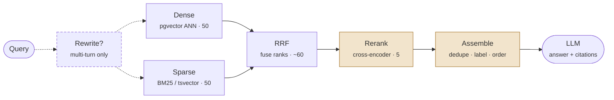

# Retrieval

> **Customer framing:** A customer reports that the assistant cannot find a policy by its exact document code, but answers fine when asked in plain English. Here is why pure vector search does that, and what to put in front of it.
>
> This page ends where the shortlist does. What happens to those chunks is [Generation & Grounding](./generation.md).

**Official docs:**
- [pgvector querying](https://github.com/pgvector/pgvector#querying) · [Postgres full-text search](https://www.postgresql.org/docs/current/textsearch.html)
- [BM25 / Okapi (Robertson & Zaragoza)](https://www.staff.city.ac.uk/~sbrp622/papers/foundations_bm25_review.pdf) · [Reciprocal Rank Fusion (paper)](https://plg.uwaterloo.ca/~gvcormac/cormacksigir09-rrf.pdf)
- [Sentence Transformers cross-encoders](https://sbert.net/examples/applications/cross-encoder/README.html) · [Cohere Rerank](https://docs.cohere.com/docs/rerank-overview)
- [HyDE (paper)](https://arxiv.org/abs/2212.10496)
- [Anthropic tool use](https://docs.claude.com/en/docs/agents-and-tools/tool-use/overview) · [Anthropic contextual retrieval](https://www.anthropic.com/engineering/contextual-retrieval)

---

## The retrieval pipeline

Everything below is one path. Meridian Support Assist runs it on every turn that needs documentation.

<div className="mermaid-scroll" style={{maxWidth: "900px", margin: "0 auto"}}>



</div>

<div style={{maxWidth: "900px", margin: "0 auto 1.5rem", textAlign: "center", fontSize: "0.85rem", opacity: 0.75}}>

🟦 recall — decides if the right chunk is in the candidate set &nbsp;·&nbsp; 🟧 precision — decides what happens to it &nbsp;·&nbsp; dashed — optional stage

</div>

Every stage exists to fix one specific failure. If you cannot name the failure, drop the stage.

| Stage | Fixes | Cost |
|---|---|---|
| Query rewrite *(optional)* | Turn three of a chat retrieving nothing | 1 small LLM call |
| Dense | Paraphrases, synonyms, plain-English questions | Embedding call plus ANN |
| Sparse | Exact IDs, error codes, rare proper nouns | One SQL index scan |
| RRF | Neither list alone being trustworthy | Free, ~10 lines |
| Rerank | Top-5 ordering being wrong even when recall is fine | 15 ms GPU, 200 ms+ CPU |
| Prompt assembly | Lost-in-the-middle, duplicate chunks, uncitable answers | Free |

Note the shape: **recall is won on the left, precision on the right.** Dense plus sparse plus a wide shortlist decides whether the right chunk is in the candidate set at all. Reranking and assembly only decide what happens to it afterwards. No reranker recovers a chunk retrieval never returned.

---

## Why hybrid search

A customer reports that the assistant answers "how often do we rotate API keys?" perfectly, but returns nothing for `POLICY-4471`. Both questions point at the same chunk.

That is the signature of dense-only retrieval. Embeddings encode meaning, and an identifier has none. Dense search fails in a predictable set of cases:

| Query | Why dense misses it |
|---|---|
| `POLICY-4471` | Identifiers carry no semantics. The embedding is close to noise. |
| `ERR_TLS_CERT_EXPIRED` | Rare token, poorly represented in the embedding space |
| "plans that do **not** include SSO" | Embeddings handle negation badly. "Includes SSO" scores high. |
| "Novak retention rule" | Rare proper noun, swamped by the surrounding common words |

Keyword search has always been good at exactly these. And it fails at exactly what dense is good at:

| Query | Why keyword misses it |
|---|---|
| "how do I stop someone seeing another tenant's data?" | Document says "row-level security". Zero term overlap. |
| "turn off notifications" | Document says "disable alerts". Zero term overlap. |
| "what happens when my card is declined?" | Document says "payment failure handling" |

The two methods fail on disjoint sets. That is the whole argument for running both.

:::info Best practice
Hybrid with RRF is the highest-value change you can make *at the retrieval stage*, and it costs about 30 lines. Do it before you consider a different embedding model. Better chunking still outranks it — see [Contextual retrieval](#1-contextual-retrieval) below.
:::

---

## Dense search: meaning

Embed the query with the same model that embedded the chunks, then take the nearest neighbours in vector space. "Disable alerts" and "turn off notifications" land near each other because the model was trained to put them there, not because they share words.

| | |
|---|---|
| **Postgres** | `ORDER BY embedding <=> $query` over an HNSW index |
| **Metric** | Match it to the model. Most modern embeddings are normalised, which makes cosine and inner product equivalent — take inner product, it is cheaper. |
| **Buys you** | Synonyms, paraphrases, cross-lingual matches, questions phrased nothing like the source |
| **Costs you** | An embedding call per query, an ANN index to maintain, and a full re-index every time you change model |

---

## Sparse search: terms

Sparse retrieval scores documents on the query terms they actually contain. The vector is vocabulary-sized and almost entirely zeros, hence "sparse".

**Sparse is the category, BM25 is the ranker.** TF-IDF, BM25, and learned models like SPLADE are all sparse — they differ in how they weight terms, not in what they produce. BM25 is what you will actually run, so the words get used interchangeably. The distinction matters the day you evaluate SPLADE, which learns term weights and expands the query while keeping the sparse index and the same RRF fusion downstream.

### TF-IDF, the idea underneath

Two things multiplied together:

> **score** = how often the term appears **in this chunk** × how rare it is **across the corpus**

| Half | Intuition |
|---|---|
| **TF** — term frequency | A chunk saying "rotation" eight times is more about rotation than one saying it once |
| **IDF** — inverse document frequency | A term in every document tells you nothing. "The" is worthless; `POLICY-4471`, in 1 chunk of 400,000, is nearly a unique key. |

IDF is why sparse search nails identifiers: the rarer the term, the louder it scores. That is the exact inverse of dense retrieval, which represents rare tokens worst.

Two flaws, though. TF grows linearly forever, so a chunk repeating "rotation" fifty times outranks one that explains it. And long documents accumulate matches by sheer length.

### BM25, the fix

Same idea, both flaws patched. The default sparse ranker everywhere, for thirty years.

> **score** = TF-IDF, but term frequency **saturates** and long chunks are **penalised**

| Knob | What it does | Default |
|---|---|---|
| `k₁` | **Saturation.** The 20th occurrence of a term adds almost nothing over the 5th. | 1.2 |
| `b` | **Length normalisation.** Stops long chunks matching by sheer size. | 0.75 |

IDF is untouched — rare terms still score loudest. Leave both knobs alone; tuning them is far down the list.

**Where to run it:**

| Engine | Ranker | Trade |
|---|---|---|
| Postgres `tsvector` + GIN | `ts_rank_cd`, not quite BM25 | No extra service, shares the tenant filter with the dense half. Default. |
| Elasticsearch / OpenSearch | Real BM25 | A second system to run, and the metadata filter written twice |
| `pg_search` extension | Real BM25 | BM25 inside Postgres, at the cost of an extension |

Move off `ts_rank_cd` when eval shows it losing on your corpus, not before.

---

## Combining them with RRF

Now you have two ranked lists of 50 and one problem: the scores are incomparable. A cosine similarity of 0.82 and a BM25 score of 14.3 live on different scales, and both scales shift per query. Min-max normalising them is a tuning treadmill that breaks every time your corpus changes.

Reciprocal Rank Fusion sidesteps it by throwing the scores away and fusing **ranks**.

> Each chunk scores **1 / (60 + its rank)** in every list it appears in. Add those up. Sort.

A chunk ranked 1st contributes 1/61, ranked 2nd 1/62, ranked 40th 1/100. Appearing in both lists means two contributions.

| Chunk | Dense rank | BM25 rank | Fused score | Final |
|---|---|---|---|---|
| A | 1 | 40 | 0.0164 + 0.0100 = **0.0264** | 2 |
| B | 3 | 2 | 0.0159 + 0.0161 = **0.0320** | **1** |
| D | — | 1 | **0.0164** | 3 |
| C | 2 | — | **0.0161** | 4 |

Read row B: a chunk that both retrievers like moderately beats a chunk either one loves alone. That is the behaviour you want — agreement across independent signals is stronger evidence than one confident vote.

Three properties that matter in production:

1. **Scale-free.** Swap embedding models or switch `ts_rank_cd` for BM25 and the fusion code is untouched.
2. **`k` flattens the head.** Rank 1 and rank 2 score almost the same (0.0164 vs 0.0161). A small `k` trusts each retriever's top hit heavily; a large one treats the whole list as roughly equal evidence. 60 is the paper's value and a fine default.
3. **Extensible.** A third retriever is one more list. Nothing else changes.

If eval shows one retriever consistently stronger, weight its contribution. Start equal.

The fused list is the shortlist. Pass roughly 50 to 60 candidates to the reranker below.

---

## Metadata: the filter both retrievers share

The `WHERE tenant_id = ...` in every query above is not plumbing. It is the third retrieval signal.

Ingestion decides **what** is attached and indexes it as real columns. Retrieval decides **how** each field is used. → [Metadata & multi-tenant isolation](./ingestion-and-indexing.md#metadata-and-multi-tenant-isolation)

| Field | Role at retrieval |
|---|---|
| `tenant_id`, `acl_group` | **Hard gate.** Enforced by RLS, never by the application. |
| `doc_type` | **Optional gate.** "Search only runbooks", set by the caller. |
| `updated_at` | **Soft boost.** Recency, not exclusion. |
| `doc_id`, `section_path`, `source_uri` | **Carried, never filtered.** Dedupe, labels, citations. |

### Apply the gate to both retrievers, before fusion

| Where the filter lands | Result |
|---|---|
| Both halves, pre-fusion | Correct |
| Dense only | Sparse leaks forbidden chunks into the fused list |
| After fusion | Shortlist silently shrinks, sometimes to zero |

One Postgres predicate covers both halves. A split stack — vector store plus Elasticsearch — writes it twice in two dialects, and the drift between them is the real ops cost of that architecture, not the second service.

### Selectivity breaks ANN, not BM25

Under a gate matching 1% of the corpus, the two halves fail asymmetrically:

| | Behaviour |
|---|---|
| **Sparse (GIN)** | Fine. Index intersection is what the planner is for. |
| **Dense (HNSW)** | Degrades. The graph spans *all* vectors — it walks to the global top 50, discards 49 that fail the gate, returns 1. |

So a small tenant gets a full sparse list and an empty dense one, and RRF quietly becomes keyword-only. The fix is pushing the gate into the graph walk (`hnsw.iterative_scan` in pgvector, pre-filtered search elsewhere).

:::warning
Test as your smallest tenant. Nothing errors — the dense half just stops contributing. The symptom is one tenant reporting that paraphrased questions stopped working.
:::

### Recency boosts, it does not gate

`WHERE updated_at > now() - interval '1 year'` deletes a 2019 policy that is still correct.

RRF already fuses ranks, so recency is just a third run: rank the candidates by `updated_at`, fuse it alongside dense and sparse at `w ≈ 0.3`. It breaks ties instead of deciding the ranking, superseded docs stay findable, and the answer can say they are superseded — which is what `updated_at` in the [chunk label](./generation.md#building-the-prompt) is for.

---

## Query transformation

Optional, and pay for it only when eval shows you need it.

| Technique | What it does | Cost | Worth it when |
|---|---|---|---|
| Conversational rewrite | Turns "what about the enterprise one?" into a standalone query | One small LLM call | Always, for multi-turn chat |
| Multi-query | Generates 3 paraphrases, retrieves each, fuses | 1 call plus 3 retrievals | Recall is the bottleneck |
| HyDE | Writes a hypothetical answer, embeds that instead of the question | One call | Questions phrased very differently from the corpus |

Conversational rewriting is not optional in a chat product. Without it, turn three retrieves nothing useful and users blame the model.

---

## Reranking

Retrieval and ranking are different jobs, and the difference is entirely in when the query meets the chunk.

<svg className="ml-diagram wide" viewBox="0 0 620 210" role="img" aria-label="Bi-encoder embeds query and chunk separately; cross-encoder reads them together">
  <text x="155" y="16" textAnchor="middle" fontSize="12" fontWeight="600" className="box-text">Bi-encoder — retrieval</text>
  <rect x="55" y="34" width="90" height="26" rx="4" className="box-fill" />
  <text x="100" y="51" textAnchor="middle" fontSize="11" className="box-text">query</text>
  <rect x="165" y="34" width="90" height="26" rx="4" className="box-fill" />
  <text x="210" y="51" textAnchor="middle" fontSize="11" className="box-text">chunk</text>
  <path d="M100 60 V 84" className="flow-line" strokeWidth="1.5" markerEnd="url(#a)" />
  <path d="M210 60 V 84" className="flow-line" strokeWidth="1.5" markerEnd="url(#a)" />
  <rect x="55" y="88" width="90" height="24" rx="4" className="box-fill" />
  <text x="100" y="104" textAnchor="middle" fontSize="10" className="box-text">model</text>
  <rect x="165" y="88" width="90" height="24" rx="4" className="box-fill" />
  <text x="210" y="104" textAnchor="middle" fontSize="10" className="box-text">model</text>
  <path d="M100 112 V 136" className="flow-line" strokeWidth="1.5" markerEnd="url(#a)" />
  <path d="M210 112 V 136" className="flow-line" strokeWidth="1.5" markerEnd="url(#a)" />
  <text x="100" y="150" textAnchor="middle" fontSize="15" className="box-text">▦</text>
  <text x="210" y="150" textAnchor="middle" fontSize="15" className="box-text">▦</text>
  <text x="155" y="174" textAnchor="middle" fontSize="11" className="box-text">cosine distance</text>
  <text x="155" y="196" textAnchor="middle" fontSize="10.5" className="axis-label">chunk vectors precomputed → indexable</text>

  <line x1="310" y1="10" x2="310" y2="200" className="axis-line" strokeDasharray="4 4" />

  <text x="465" y="16" textAnchor="middle" fontSize="12" fontWeight="600" className="box-text-accent">Cross-encoder — reranking</text>
  <rect x="375" y="34" width="180" height="26" rx="4" className="box-accent" />
  <text x="465" y="51" textAnchor="middle" fontSize="11" className="box-text-accent">query + chunk together</text>
  <path d="M465 60 V 84" className="flow-line" strokeWidth="1.5" markerEnd="url(#a)" />
  <rect x="375" y="88" width="180" height="24" rx="4" className="box-accent" />
  <text x="465" y="104" textAnchor="middle" fontSize="10" className="box-text-accent">model</text>
  <path d="M465 112 V 150" className="flow-line" strokeWidth="1.5" markerEnd="url(#a)" />
  <text x="465" y="174" textAnchor="middle" fontSize="11" className="box-text-accent">relevance score</text>
  <text x="465" y="196" textAnchor="middle" fontSize="10.5" className="axis-label">one pass per pair → shortlist only</text>

  <defs>
    <marker id="a" markerWidth="7" markerHeight="7" refX="5.5" refY="2.5" orient="auto">
      <path d="M0,0 L5,2.5 L0,5 z" fill="var(--mermaid-edge)" />
    </marker>
  </defs>
</svg>

The bi-encoder never sees the two together, which is exactly why every chunk vector can be computed once at ingestion and put in an index. It is also why its precision is capped. The cross-encoder reads the pair, so it scores far better and can index nothing — every candidate costs a forward pass at query time. Hence a shortlist.

**Retrieve 50, rerank, keep 5.** The shortlist is wide because the reranker fixes ordering, not recall. If the right chunk is not in the 50, reranking cannot save you. `bge-reranker-v2-m3` and Cohere Rerank are the usual picks.

Where the time actually goes, for a 400k-chunk corpus. Indicative, not benchmarks: measure your own.

| Step | Typical | Driven by |
|---|---|---|
| Embed the query | 10 to 30 ms | Hosted API round trip, or local model |
| ANN search | 5 to 50 ms | `ef_search`, corpus size, filter selectivity |
| Cross-encoder rerank, 50 candidates | 15 to 40 ms on GPU, 200 ms plus on CPU | Batch size, chunk length, model size |
| Generation, first token | 300 ms to 1.5 s | Prompt length, model, prefix cache hits |

Reranking on CPU is the usual surprise. It can cost more than retrieval and generation combined.

→ See [Production](./production.md#latency-budget) for the full waterfall and how to cut it.

**Params worth tuning, in order:** shortlist size (`k` before rerank), final `k` after rerank, then `ef_search`. A fixed similarity threshold is fragile, since score distributions shift per query type. If you need a "no answer" signal, take it from the reranker score on the top result, and calibrate it on your eval set.

---

## Agentic and multi-hop retrieval

Single-pass RAG assumes one query embedding can express the whole information need. Multi-hop questions break that assumption. "Which tenants on the Enterprise plan are affected by the retention change we shipped in March?" needs the plan list and the change record, and no single embedding sits near both.

| Pattern | How it works | Cost vs single-pass | Use when |
|---|---|---|---|
| Single-pass hybrid plus rerank | One retrieval, one generation | Baseline | Almost always. Start here. |
| Query decomposition | Split into sub-questions, retrieve per sub-question, fuse, answer once | 1 extra call, N retrievals | Eval shows compound questions failing |
| Iterative retrieval | Retrieve, judge sufficiency, refine the query, retrieve again | 2 to 4 round trips | Research-style questions, exploratory corpora |
| Retrieval as a tool | The model decides whether and what to search, possibly several times | Unbounded unless capped | Mixed traffic where many turns need no retrieval at all |

Retrieval as a tool is the one worth understanding, because it removes the fixed pre-retrieval. "Thanks, that worked" no longer triggers a pointless vector search, and a hard question can trigger three.

The tool definition is where the work goes: the description has to tell the model *when* to search, not just that it can. "Search this tenant's documentation — use for any factual question about their setup, policies, or runbooks" gets used correctly; "searches documents" gets used on every turn or none. Take a `query` plus an optional section filter, and nothing else.


Two things to cap, always: total retrieval calls per turn, and total tokens accumulated across hops. Without both, an iterative loop will happily spend a dollar answering a question worth a cent.

:::warning
Agentic retrieval multiplies latency and cost by the number of hops and makes failures harder to reproduce. Adopt it when your eval set shows multi-hop failures, not because the architecture diagram looks better.
:::

→ See [Agent Design Patterns](../../genai-agents/agent_design_patterns.md) for the loop shapes this sits inside, and [Context Engineering](../../genai-agents/concepts/context-engineering.md) for managing what accumulates across hops.


---

## Further enhancements

The pipeline above is the baseline, and it is what the major vendors ship as their default. Two things are worth adding on top, in this order. Both add a *layer*, not a parameter.

### 1. Contextual retrieval

The highest-leverage change on this list, and it is not on the diagram at all — it happens at ingestion.

The problem: chunks lose their context. A chunk reading "Keys must be rotated every 90 days" does not say which product, which plan tier, or which policy document it came from. Both retrievers see an orphan. Dense embeds an ambiguous sentence, BM25 indexes terms with no `POLICY-4471` anywhere near them.

The fix: before indexing, ask a cheap model to write 50 to 100 tokens situating each chunk in its parent document, and prepend that to the chunk. Index the combined text — **in both the embedding and the tsvector**. The two retrievers below stay untouched.

```
<document>{{WHOLE_DOCUMENT}}</document>
<chunk>{{CHUNK_CONTENT}}</chunk>

Give a short context to situate this chunk within the document,
for the purpose of improving search retrieval of the chunk.
Answer with only that context, nothing else.
```

Anthropic's ablation on the same corpus, measuring top-20 retrieval failure rate:

| Setup | Failure rate |
|---|---|
| Embeddings only | 5.7% |
| + BM25 (hybrid) | 4.6% |
| + contextual chunking | 2.9% |
| + reranking | **1.9%** |

Read the middle row. **Contextual chunking bought more than adding BM25 did.** Fix your chunks before you tune `k₁`.

The cost is one LLM call per chunk, once, at ingestion. Prompt caching makes it cheap because the parent document is the same across every chunk in it. Re-running it is the price of re-ingesting a document, which you were doing anyway.

→ [Anthropic: Contextual Retrieval](https://www.anthropic.com/engineering/contextual-retrieval) · implement it in [Ingestion & Indexing](./ingestion-and-indexing.md)

### 2. Late interaction, when reranking is the bottleneck

Only relevant once your rerank step shows up in the latency budget.

Bi-encoders are fast and indexable but compress a chunk to one vector. Cross-encoders are precise but cannot be indexed, which is why they only see a shortlist of 50. Late interaction sits between: ColBERT-style models keep one vector *per token* and score a query against a chunk by matching tokens, so most of the work is precomputed at index time.

| | Indexable | Precision | Cost |
|---|---|---|---|
| Bi-encoder (dense, above) | Yes | Baseline | Cheapest |
| Late interaction (ColBERT) | Yes, at ~10x storage | Close to cross-encoder | Middle |
| Cross-encoder (rerank, above) | No | Best | Most, and CPU-bound |

The trade is storage for latency. Adopt it when the rerank row in the latency table is your worst offender and a GPU is not an option — not because the ranking looks better on paper.

→ [ColBERT (paper)](https://arxiv.org/abs/2004.12832)

:::warning Add one at a time
Every enhancement here costs latency, money, or storage, and each one was measured on someone else's corpus. Add one, measure on your eval set, keep it only if it moves. → See [Evaluation & Guardrails](./evaluation.md)
:::

---

→ Next: [Generation & Grounding](./generation.md), where the top 5 chunks become an answer.
